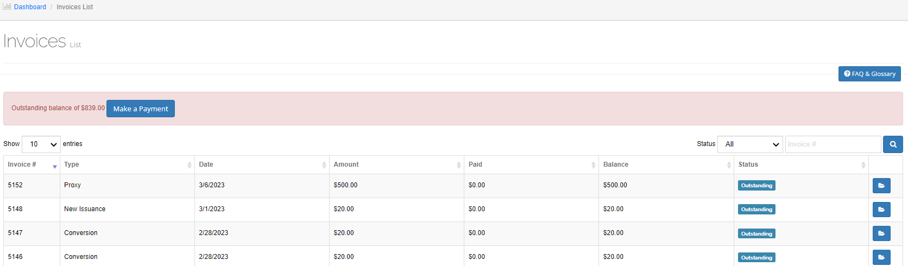
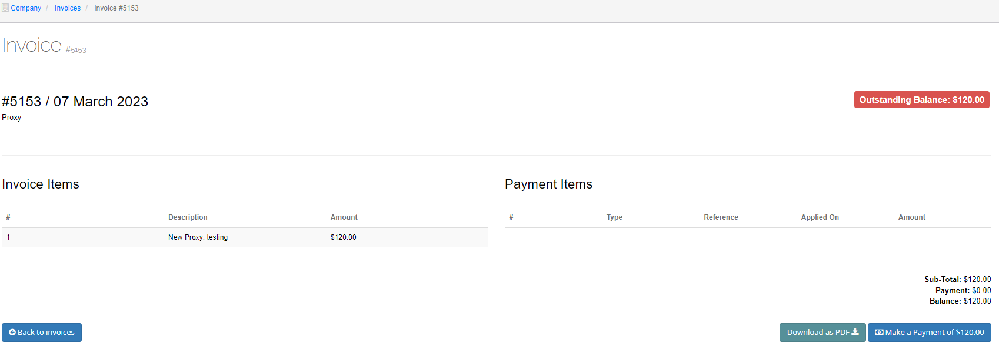
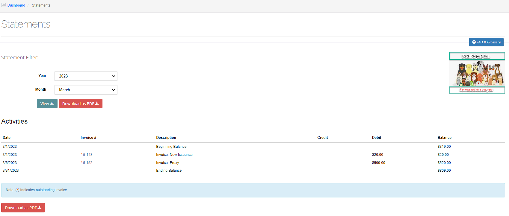
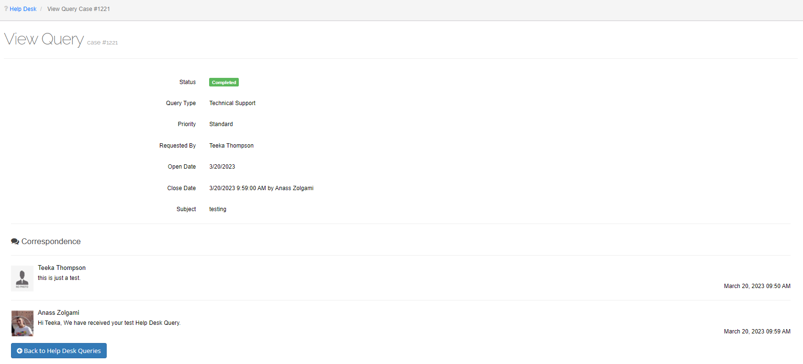

#######
Billing
#######

This option has six additional options:

- Add Invoice
- Payment Management
- Invoices
- Statements
- Payments
- Billing Plans

Add an Invoice
==============

Use this option to add invoices.

1. From the main menu, select **Add Invoice**.

   | The Add invoice screen opens.

   Figure 104. Add invoice screen.

2. Click **Select** in the **Company** field.

   | The Select Company popup window opens.

3. Highlight the company from the list and click **Select**.

   | The name of the selected company shows in the **Company** field.

4. Click **Select** in the **Billing Account** field.

   | The Select Billing Account popup window opens.

5. Highlight the company from the list and click **Select**.

   | The name and address of the selected company shows in the **Billing Account** field.

6. Fill in all required fields.

7. To add a line item, select +Line.

   | A line is added to the Line Items section.

8. Select the type of fee from the drop-down list of the added line.
9. If applicable, enter a description of the invoice fee in the Description field.
10. Enter the dollar amount of the line item in the $ Amount field.
11. To delete a line item, click the delete icon in the line item that you want to delete.
12. Select **Save**.

   | The Invoice detail screen opens and displays the recently added invoice information.

Invoices
========

Use this option to create an invoice, view invoice balances, payments, notes, and delete invoices.

Create an Invoice
~~~~~~~~~~~~~~~~~

To create an invoice, please see **Add an Invoice**.

View an Invoice
~~~~~~~~~~~~~~~

1. From the main menu, select **Invoices**.

   | The Invoice list screen opens.

   Figure 105. Invoice list screen.

2. To view an invoice, click the folder icon in the row that you want to view.

   | The Invoice detail screen opens.

   Figure 106. Invoice detail screen.

Download or Email the Invoice
~~~~~~~~~~~~~~~~~~~~~~~~~~~~~

1. In the Invoice Balance section, select **Invoice** and download the invoice. (See **Download a Document** for instructions.)
2. To send the invoice via email, select **Email**.

Payments
========

Use this option to export an Excel payment spreadsheet to your desktop and make a payment.

Export Payment Information
~~~~~~~~~~~~~~~~~~~~~~~~~~

1. From the main menu, select **Payments**.

   | The Payments list screen opens.

.. figure:: _static/pdf_images/page_89_image_2.png
   :alt: Payments list screen.

   Figure 107. Payments list screen.

2. Select **Export** and save the Payments list to your desktop.

Make a Payment
--------------

1. Select **Payments** from the main menu.

   | The Payments list screen opens.

2. Click the credit folder icon in the row that you want to make a payment.

   | The Payment management screen opens.

.. figure:: _static/pdf_images/page_90_image_1.png
   :alt: Payment management screen.

   Figure 108. Payment management screen.

3. In the Invoices section, tick the box next to the invoice that you want to pay.

   | Note: You can select multiple invoices.

4. In the Payments section, click the green down arrow and select **Pay Selected Invoices**
   from the drop-down list.

.. figure:: _static/pdf_images/page_90_image_2.png
   :alt: Payments section, Pay Selected Invoices option.

   Figure 109. Payments section, Pay Selected Invoices option.

The **Apply Payment to Specific Invoices** window opens and displays the selected invoice(s).

.. figure:: _static/pdf_images/page_90_image_3.png
   :alt: Apply Payment to Specific Invoices popup window.

   Figure 110. Apply Payment to Specific Invoices popup window.

5. Click in the **Apply Date** field and select the date to apply the payment from the popup
   calendar.

   | The default value is today's date.

6. Enter the amount that you want to pay in the **Apply Amount** field.

   | This field automatically populates with the invoice amount.

7. Select **Apply**.

   | The window closes and the payment(s) is applied to the oldest invoices first. The
   Total Balance in the Invoices section reflects the payment(s) made.

View Credit Details
-------------------

1. In the Payments section of the Payment management screen, click the green down
   arrow and select **View Credit Detail** from the drop-down list.

   | The Payment Credit (# and Balance $) window opens.

.. figure:: _static/pdf_images/page_92_image_1.png
   :alt: Payment section, View Credit Detail option.

   Figure 111. Payment section, View Credit Detail option.

This window displays the payment credit detail, logs, applied invoices, and allows
you to delete applied invoices and delete credit.

Delete an Applied Invoice
-------------------------

1. Click the delete icon in the row that you want to delete.

   | The Confirmation popup dialog box opens and asks if you want to continue with
   deleting this payment.

2. Select **OK**.

   | The payment is deleted from the Applied to Invoices section.

3. Select **Close**.

Delete a Credit Payment
-----------------------

1. Enter the reason for deleting a credit in the **Reason** field.
2. Select **Delete Credit**.

   | The Confirmation popup dialog box opens and asks if you want to continue with
   deleting this payment credit.

3. Select **OK**.

   | The popup window closes, and the Payment management screen opens and
   displays the Payments section with the selected credit payment deleted from the
   payments table.

Payment Management
==================

Use this option to manage invoices and payments.

Add a New Account
-----------------

Use this option to add a new billing account.

1. Select **Payment Management** from the main menu.

   | The Select Billing Account window opens.

   Figure 112. Payment Management, Select Billing Account popup window.

2. Select **Add New Account**.

   | The Add Billing Account popup window opens.

.. figure:: _static/pdf_images/page_93_image_2.png
   :alt: Payment Management, Add a New Account popup window.

   Figure 113. Payment Management, Add a New Account popup window.

3. Select the type of account from the **Account Type** drop-down list.
4. Enter the account name in the **Name 1** field.
5. Enter how to sort the name(s) in the **Sort Name** field.

   | You can sort by last name, first name, etc.

6. Select **Create**.

   | The name(s) is sorted by the option you entered in the Sort Name field.

7. Enter the individual's contact information in the **Address 1**, **City**, and **Country** fields.
8. If applicable, click **Validate US Address** to validate the address.

   | The Validate Address window opens and shows valid addresses from Google and Bing.

9. Select the appropriate address and click **OK**.

The window closes and the information is added to the contact information.

10. Scroll down to the Receive information via drop-down list and select how you want to
receive information.

11. Select **Save**.

   | The window closes and the information is added in the Payment management
   screen.

.. figure:: _static/pdf_images/page_95_image_1.png
   :alt: Payment management screen, new account added.

   Figure 114. Payment management screen, new account added.

Select a Different Billing Account
----------------------------------

1. In the Billing Account section of the Payment management screen, click **Select Billing
Account**. (See figure above.)

   | The Select Billing Account window opens.

2. Select the appropriate billing account from the list and then click **Select**.

   | The window closes, and the new billing account is added to the Billing Account
   section.

Add a Credit Payment
--------------------

1. Select **+Credit**.

   | The Add Credit popup window opens.

.. figure:: _static/pdf_images/page_95_image_2.png
   :alt: Payment Management, Add Credit popup window.

   Figure 115. Payment Management, Add Credit popup window.

2. Fill in all required fields.
3. Enter any additional payment information in the Note field.
4. Select **Save**.

   | The window closes, and the information is added in the Payments section.

Statements
==========

1. From the main menu, select **Statements**.

   | The Statements screen opens.

.. figure:: _static/pdf_images/page_95_image_3.png
   :alt: Statements screen.

   Figure 116. Statements screen.

2. Click **Select** to add a billing account.

   | The Select Billing Account screen opens.

Highlight the account from the list and click **Select**.

   | The billing account information is added to the *Statement Filter* section.

.. note::
   To add a new account, see Add a New Account.

You can filter statements by month and year or start and end dates. The default value is month & year.

To filter by month and year:

a. Keep the *Month & Year* box checked and select the year from the *Year* field drop-down list.
b. Select the month from the *Month* field drop-down list.
c. Select **View**.

   | The statement information appears in the *Activities* section.

To filter by start and end dates:

a. Deselect the *Month & Year* checkbox.
b. Click in the *Start* field and select the statement's start date from the popup calendar.
c. Click in the *End* field and select the statement's end date from the popup calendar.
d. Select **View**.

   | The statement information appears in the *Activities* section.

To download the statement:

o Select **Download as PDF** and download the statement to your desktop. (See Download a Document for instructions.)

To email a statement:

a. Select **Email**.

   | The Email Information window opens.
b. Enter the email address in the *To* field.

   | The Subject field is automatically populated with the statement's dates and the statement is attached just below this field.
c. Select **Send**.

To download month end statements for all accounts:

a. Click in the *Year* field and select the statement year from the popup calendar.
b. Click in the *Month* field and select the statement month from the popup calendar.
c. Select **Download as PDF** and download the statement to your desktop.

Billing Plans
=============

Use this option to add a billing plan.

1. Select **Billing Plans** from the main menu.

   | The Select Billing Account screen opens.

2. Highlight the billing account from the list and click **Select**.

.. figure:: _static/pdf_images/page_97_image_1.png
   :alt: Billing Plans screen.

   Figure 117. Billing Plans screen.

3. To inactivate a plan, deselect the *Enable Billing* checkbox.

   | The Billing Plans section heading displays Inactive.

To add a new plan:

a. Select **+Add Plan**.

   | An Add Billing Plan section appears.

.. figure:: _static/pdf_images/page_98_image_1.png
   :alt: Billing Plans, Add Billing Plan section.

   Figure 118. Billing Plans, Add Billing Plan section.

b. If you do not want this billing plan to be active, deselect the *Is Active* checkbox.

   | The default value for this field is active.

c. Select the type of billing from the *Billing Type* drop-down list.

   | Additional fields appear.

.. figure:: _static/pdf_images/page_99_image_1.png
   :alt: Add Billing Plan section.

   Figure 119. Add Billing Plan section.

d. Fill in all required fields.
e. Select **Save**.

   | The Add Billing Plan section closes, and the billing plan is added to the Billing Plans section, as shown in the figure below.

.. figure:: _static/pdf_images/page_100_image_1.png
   :alt: Added Billing Plan.

   Figure 120. Added Billing Plan.

To edit a billing plan:

a. Click the edit icon in the row that you want to edit.

   | The Edit Billing Plan section appears.

b. This section is like the Add Billing Plan section. (See Figure 118Figure 119. Add Billing Plan section. for more information.)

c. Edit the relevant fields and then select **Save**.