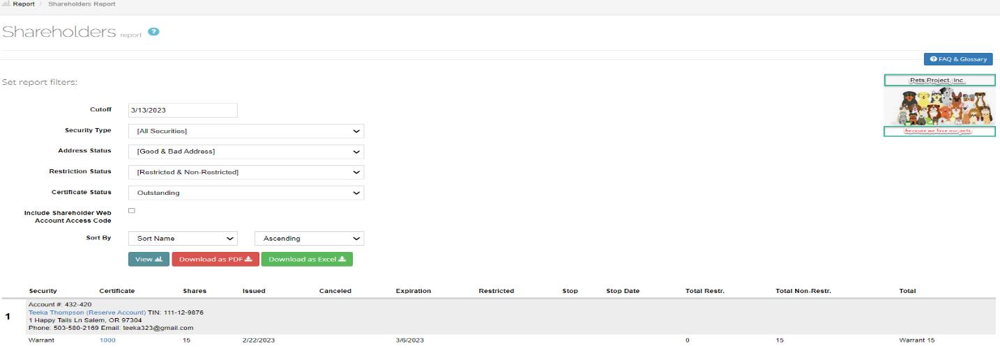

*******
Billing
*******

The Billing options are:

- :ref:`Invoices`
- :ref:`Payments`
- :ref:`Statements`

Invoices
========

Use this option to view invoice details and make a payment if you have an outstanding balance.

.. figure:: _static/pdf_images/page_83_image_1.png
   :alt: Billing, Invoices List screen.

   Figure 149. Billing, Invoices, List screen.

View an Invoice
---------------

1. Click the view details icon in the row that you want to view.

   | The *Invoice (invoice #)* screen opens.

   Figure 150. Billing, Invoices Invoice # screen.

2. Select **Download as PDF** to save the invoice details to your desktop or select **Back to Invoices** to go back to the Invoice List screen.

Outstanding Balance
-------------------

| If you have an outstanding balance, the **Invoices List** screen displays the balance.

| You can make a partial or full payment on the Invoices List screen or open an invoice and make a payment from there.

.. figure:: _static/pdf_images/page_84_image_1.png
   :alt: Invoices List with outstanding balance.

   Figure 151. Invoices List with outstanding balance.

**Pay Outstanding Balance**
^^^^^^^^^^^^^^^^^^^^^^^^^^^

1. Select **Make a Payment**.

   | The **Make a Payment** popup window opens.

.. figure:: _static/pdf_images/page_84_image_2.png
   :alt: Make a Payment popup window.

   Figure 152. Make a Payment popup window.

2. For a partial payment enter the payment amount in the **Total Outstanding Balance** field.
3. Select the payment type from the **Payment** drop-down list.
4. Select **Save**.

**Pay an Invoice**
^^^^^^^^^^^^^^^^^^

1. Click the view details icon in the invoice row that you want to pay.

   | The *Invoice #* screen opens.

.. figure:: _static/pdf_images/page_86_image_1.png
   :alt: Billing, Invoices, Invoice # screen.

   Figure 153. Billing, Invoices, Invoice # screen.

2. Select **Make a Payment of $**.

   | The *Make a Payment* (Figure 152) popup window opens.

3. For a partial payment enter the payment amount in the **Total Outstanding Balance** field.
4. Select the payment type from the **Payment** drop-down list.
5. Select **Save**.
6. Select **Download as PDF** to save the paid invoice to your desktop or select **Back to Invoices** to return to the Invoices List screen.

Payments
--------

Use this option to view payment information.

.. note::

   This is a read-only screen.

.. figure:: _static/pdf_images/page_86_image_2.png
   :alt: Billing, Payments, Payments List screen.

   Figure 154. Billing, Payments, Payments List screen.

Statements
==========

Use this option to view and download billing statements.

.. figure:: _static/pdf_images/page_87_image_1.png
   :alt: Billing Statements, Statements screen.

   Figure 155. Billing Statements, Statements screen.

1. Use the statement filter fields to view a specific statement period.

2. Select **View**.

   | The information displays in the **Activities** section.

3. Select **Download as PDF** to save the statement to your desktop.