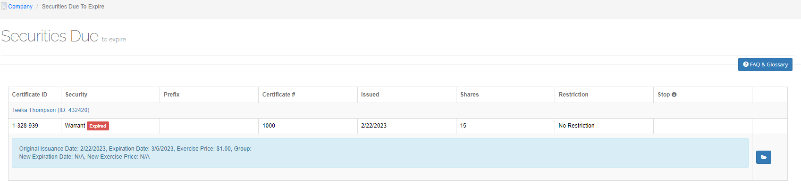

###########
Cash Payout
###########

This option has one option:

Buybacks
========

1. Select **Buybacks** from the main menu.

    |nbsp| The Buybacks Payout screen opens.

.. figure:: _static/pdf_images/page_78_image_1.png
   :alt: Buybacks payout screen.

   Figure 89. Buybacks payout screen.

2. Tick the **Company Filter** checkbox.

    |nbsp| The Select Company screen opens.

3. Highlight the company from the list and then select **Next**.
4. Select the type of buybacks from the **Pending & Clear Pending** drop-down list.
5. Select **Export Excel Report** to download the report to your desktop. (See :ref:`Download a Document` for instructions.)
6. Click the **void and replace icon** (in the Action column) in the row that you want to void/replace.

    |nbsp| The Replace/Transfer To screen opens.

   Figure 90. Replace/Transfer To screen.

7. If the information in the **Void & Replace** and the **Replacement/Transfer To** sections are correct, select **Submit**.

    |nbsp| The *Confirmation* popup dialog box appears and asks if you want to continue.

8. Select **OK**.

    |nbsp| The Voided and Replacement Details screen opens and displays the transaction details in the **Voided** and **Replaced By** sections.

Update a Payment
----------------

1. Click the **update payment icon**.

    |nbsp| The *Update Cash Payment (ID: #)* popup window opens.

2. Select the payment type from the **Payment Type** drop-down list.
3. Enter the reference number in the **Reference Number** field.
4. Click in the **Date Payment** field and select the payment date from the popup calendar.
5. If applicable, fill in the rest of the optional fields and select **Save**.

Clear a Payment
---------------

1. Click the **clear payment icon**.

    |nbsp| The *Clear Payout (ID: #)* popup window opens.

2. Fill in the required fields.
3. Select **Save**.

Reset Transaction to Original State
-----------------------------------

Delete all issued certificates, the invoice, and reset the transaction back to pending. Use this to redo a transaction that was completed incorrectly.

.. note::

    This will affect your month-end report if the invoice was created during the previous month.

1. Select **Reset Transaction to Original State**.

    |nbsp| The *Confirmation* popup dialog box opens.

2. Select **OK**.

