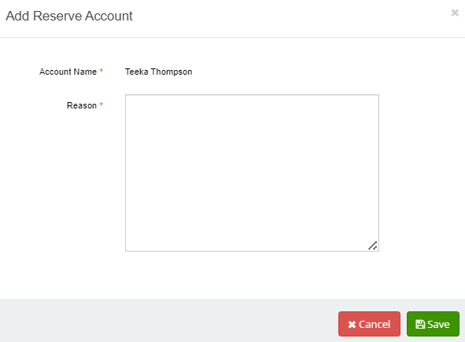
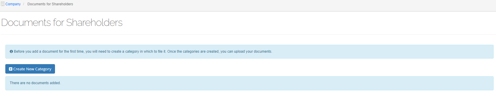
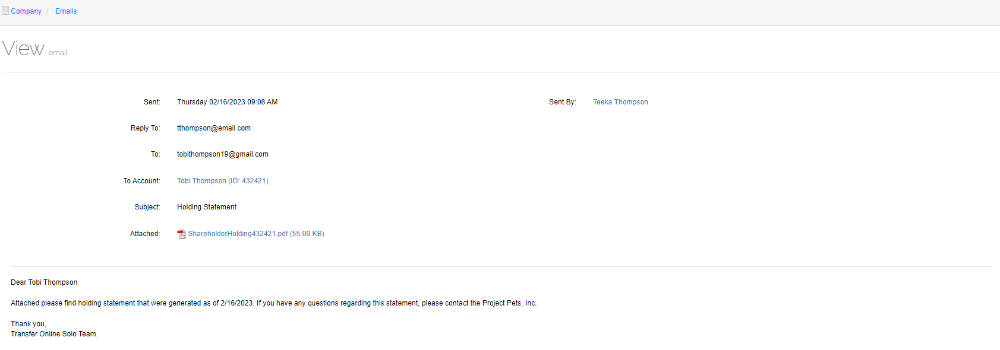

*******************
Company Information
*******************

If you are just getting started and have not linked your account to any shareholder, the dashboard will automatically open after you sign into your account.

Options available under **Company Information** include:

- :ref:`Dashboard`
- :ref:`General`
- :ref:`Authorized Shares`
- :ref:`Security Types`
- :ref:`Reserved Shares`
- :ref:`History`
- :ref:`Shareholders`
- :ref:`Web Account Users`
- :ref:`Administrators`
- :ref:`News`
- :ref:`Documents`
- :ref:`Emails`
- :ref:`Activity List`

.. warning::

   Some options may not be available. For example, if you did not add administrators when you signed up, the Administrators option may not appear in the main menu.

Dashboard
=========

The **Dashboard** allows you to find information quickly.

.. figure:: _static/pdf_images/page_9_image_1.png
   :alt: Dashboard.

   Figure 3. Dashboard.

Manage Shareholders
-------------------

Use this option to:

- Check shareholder details,
- Assign certificates,
- Answer shareholder queries, and
- Provide shareholders with web account access.

Select **View More** to:

- open the *Shareholder List* screen and view shareholder details,
- add a new shareholder account, And
- send statements to shareholders.

   Figure 4. Shareholder List screen.

This screen is linked to the **Shareholders** option located in the main menu. For more information on this option, see :ref:`Shareholders`.

Create Reports
--------------

| Use this option to run detailed reports on your company shares and shareholders, download reports, or email reports to investors and company contacts.
| Select **View More** to open the *Current Balance Report* screen.

.. figure:: _static/pdf_images/page_10_image_2.png
   :alt: Current Balance Report screen.

   Figure 5. Current Balance Report screen.

| This screen is linked to the Reports option located in the main menu.
| For more information on this option, see :ref:`Reports`.

Manage Stocks
-------------

| Use this option to:

- View a complete list of all your transactions,
- Their full details, As well as
- Perform a range of transactions.

| Select **View More** to open the **Transaction History** screen.

    Figure 6. Transaction History screen.

| This screen is linked to the **Transaction History** option in the main menu.
| For more information on this option see :ref:`Transaction History`.

- | You can click on a dashboard heading such as **Shareholders with Highest Ownership** to open
  | additional options.

- | You can also delete sections that you do not want to see on your :hoverxref:`Dashboard <index:Dashboard>` by clicking the **X** in
  | the red box as indicated in **Figure 7.** below.

.. figure:: _static/pdf_images/page_11_image_2.png
    :alt: Dashboard, delete icon.

    Figure 7: Dashboard, delete icon.

If you delete a section, you can always add it back to the dashboard:

1. Click the **settings tool**
2. Tick the **desired checkbox**.
3. Click **>** to collapse the **Settings** box.

    Figure 8: Settings.

General
=======

Use this option to:

- View the company's general information.
- Upload a site logo.
- Upload reports and certificate logos.
- View the latest transactions,
- Add/edit notes, And
- Edit address information.

.. figure:: _static/pdf_images/page_12_image_1.png
   :alt: General, Company Account General screen.

   Figure 9: General, Company Account General screen.

.. note::

    Many of the options on this screen are linked to other :ref:`Company Information` options.

Change Company Name
-------------------

Before you change the company name make sure that you have the authority to change it.

1. Click the **edit icon** next to the company name (see figure above).

   | The *Change Company Name* screen opens.

    Figure 10: General, Change Company Name screen.

2. Fill in all required fields.
3. Select **Save.**

   | The *Company History* screen opens and displays the Previous Name, Effective Date, and who performed the name change.

.. figure:: _static/pdf_images/page_13_image_1.png
   :alt: Authorized Shares screen.

   Figure 11. General, Company History screen.

Edit Company Information
========================

1. From the *Company Account General* screen (Figure 9), click the edit icon in the **Corporate Information** section.

   | The fields become editable, and the save and delete icons appear in the section heading.

2. Add/update the necessary information and then select the save icon.

Upload a Logo for Reports & Certificate Layout
==============================================

1. From the *Company Account General* screen (Figure 9) click the edit icon to upload your logo.

   | Your logo is uploaded into the **Logo for Reports & Certificate Layout** section.

2. To delete the logo, click the delete icon.

Upload a Site Logo
==================

1. Click the edit icon to upload your site logo.

   | Your logo is uploaded into the **Site Logo** section.

2. To delete the logo, click the delete icon.

Latest Transactions
--------------------

* Click on a transaction to download it to your desktop.

   Figure 12. Authorized Shares screen.

*****************
Authorized Shares
*****************

Use this option to view the maximum number of authorized shares that your company has for
each security type, view the history of each type, and edit/delete information.

Edit Authorized Shares
------------------------

1. Click the edit icon in the row that you want to edit.

   | The **Authorized Shares** and **Par Value** fields become editable.

2. Make the necessary edits and select the save icon.

3. To cancel the edits, select the cancel icon.

Delete Authorized Shares
========================

1. To delete a row, click the delete icon.

   | The *Confirmation* popup dialog box opens and asks if you want to continue to delete these authorized shares.

2. Click **OK**.

   | The authorized shares are deleted from the list.

**************
Security Types
**************

Use this option to add, edit, or delete security types.

.. figure:: _static/pdf_images/page_15_image_1.png
    :alt: Company Information, Security Types screen.

    Figure 13. Company Information, Security Types screen.

Add a New Security Type
=======================

1. Scroll down and select **Add New Security Type**.

   | The *Add Certificate/Security Type* popup window opens.

.. figure:: _static/pdf_images/page_15_image_2.png
   :alt: Add Certificate/Security Type popup window.

   Figure 14. Add Certificate/Security Type popup window.

2. Fill in all required fields.

   | Additional fields may appear depending on the security type selected.

3. If the shares are e-shares, tick **Are the shares electronic shares** checkbox.

4. Select **Save**.

   | The popup closes, and the *Certificate Template (ID #)* popup window opens.

   Figure 15. Certificate Template popup window.

.. Note::

   The information in the **Legal Information** field is default language and editable. However, you cannot remove all the text. This information is required.

5. To add a title to the left side or right side of the certificate, enter the title in the appropriate title field.

6. To add a signature, click **Upload Signature**.

7. Select **Pick Template**.

   | The *Choose Template* popup window opens.

.. figure:: _static/pdf_images/page_16_image_2.png
       :alt: Choose Template popup window.

       Figure 16. Choose Template popup window.

8. Select the color and style of the certificate and then click **OK**.

   | The template closes and the new template displays in the box below the Download Example button.

9. If you want to save the example, select **Download Example**.
10. Select **Save Changes**.

    | The newly created certificate is added to the **Security Types** screen.

Edit a Security Type
====================

1. Click the edit icon next to the security type that you want to edit.

   | The fields become editable.

.. figure:: _static/pdf_images/page_17_image_1.png
   :alt: Company Information, Security Types screen edit icon.

   Figure 17. Company Information, Security Types screen edit icon.

.. figure:: _static/pdf_images/page_17_image_2.png
   :alt: Example of editable fields.

   Figure 18. Example of editable fields.

2. Edit the information and then select the save icon.

Edit a Certificate
==================

1. Click the edit icon next to the certificate that you want to edit.

   | The *Certificate Template* popup window opens. (See Figure 15.)

2. Edit the appropriate fields and/or upload signatures.
3. Select **Pick Template** if you want to change the certificate color and style.
4. When done select **Save Changes**.

Delete a Security Type
======================

1. Click the delete icon next to the security type that you want to delete.

   | The Confirmation popup dialog box opens and asks if you want to continue.

.. figure:: _static/pdf_images/page_18_image_1.png
   :alt: Company Information, Security Types screen, delete icon.

   Figure 19. Company Information, Security Types screen delete icon.

2. Click **OK**.

   | The security type and certificate associated with it is deleted.

Reserved Shares
===============

Use this option to view a list of shareholders who have reserved shares in your company reserve shares for shareholders and link to a reserve account.

     Figure 20. Company Information, Reserved Shares screen.

Reserve Shares for a Shareholder
================================

-   Select **Reserve Shares for Shareholders**.

    | The *Issue New Reserved Shares* screen opens and displays 4 steps.

.. figure:: _static/pdf_images/page_19_image_1.png
     :alt: Company Information, Reserved Shares screen.

     Figure 21. Company Information, Issue New Reserved Shares screen, Step 1: Basic Information.

.. _Step 1: Basic Information:

Step 1: Basic Information
-------------------------

1. Verify that the **Transaction Date** is accurate.

   | The default value is today's date.

2. If applicable select **Upload Document** and upload any relevant documents.
3. Select **Next**.

   | The screen displays *Step 2: Issue Reserved Shares*.

    .. figure:: _static/pdf_images/page_19_image_2.png
       :alt: Company Information, Issue New Reserved Shares screen, Step 2: Issue Reserved Shares.

       Figure 22. Company Information, Issue New Reserved Shares screen, Step 2: Issue Reserved Shares.

.. _Step 2: Issue Reserved Shares:

Step 2: Issue Reserved Shares
-----------------------------

1. Select **Choose**.

   | The *Add Reserve Certificate* popup window opens.

.. figure:: _static/pdf_images/page_20_image_1.png
   :alt: Add Reserve Certificate popup window.

   Figure 23. Add Reserve Certificate popup window.

2. Click **Select** to select the shareholder.

   | The *Select Reserve Account/Shareholder* popup window opens.

 .. figure:: _static/pdf_images/page_20_image_1.png
     :alt: Select Reserve Account/Shareholder popup window.

     Figure 24. Select Reserve Account/Shareholder popup window.

3. Search for the account/shareholder using the search criteria fields.

.. note::

   If you need to add a new account/shareholder, see :ref:`step 6 a-f (below) <steps6a-f>`.

4. Highlight the account/shareholder and then click **Select**.

   | The popup closes and the account/shareholder is added in the *Select Reserve Shareholder* field.

5. Fill in all required fields and then select **Issue**.

.. _steps6a-f:

6. **To add a new account:**

   a. Select **Add New Reserve Account**.

      | The *Add New Reserve Account* popup window opens.

      .. figure:: _static/pdf_images/page_19_image_2.png
         :alt: Add New Reserve Account popup window

         Figure 25. Add New Reserve Account popup window.

   b. Fill in all required fields.

   c. Click **Create** to fill in the **Sort Name** field.

   d. When all required fields are entered, select **Save**.

      | The popup window closes and the *Add Reserve Certificate* popup window
      | reopens with the name of the shareholder listed in the **Select Reserve Shareholder** field.

      .. figure:: _static/pdf_images/page_20_image_1.png
         :alt: Add New Reserve Account popup window.

         Figure 26. Add Reserve Certificate popup window.

   e. Fill in the required fields.
   f. Select **Issue**.

      | The popup window closes and the reserved information is added to the **Issue Reserved Shares** list.

7. When all shareholders have been added, select **Next**.

   | The screen displays *Step 3: Pay for Transaction*.

.. figure:: _static/pdf_images/page_22_image_1.png
   :alt:  Company Information, Issue New Reserved Shares screen, Step 3: Pay for Transaction.

   Figure 27. Company Information, Issue New Reserved Shares screen, Step 3: Pay for Transaction.

Step 3: Pay for Transaction
---------------------------

The screen displays the total amount owed for this transaction.

1. Select the payment type from the **Payment** drop-down list.
2. Select **Finish**.

   | The screen displays *Step 4: Complete Summary*.

.. figure:: _static/pdf_images/page_22_image_2.png
   :alt: Company Information, Issue New Reserved Shares screen, Step 4: Complete Summary.

   Figure 28. Company Information, Issue New Reserved Shares screen, Step 4: Complete Summary.

Step 4: Complete Summary
------------------------

1. Click **Download Transaction Report** to download and save the report to your desktop.
2. Click **Download Copies of Issued Certificates** to download and save the issued certificates.
3. Select **Complete**.

   | The *Transaction History* screen opens and displays the newly issued shares.

Link to a Reserve Account
=========================

1. Select **Link to Reserve Account**.

   | The *Select Account/Shareholder* popup window opens.

.. figure:: _static/pdf_images/page_23_image_1.png
   :alt: Select Account, Shareholder popup window.

   Figure 29. Select Account, Shareholder popup window.

2. If necessary, search for the account/shareholder using the search criteria fields.

   | If you need to add a new account, see steps :ref:`6a-f (below) <steps6a-f_issue_reserved_shares>`.

3. Highlight the account/shareholder and click **Select**.

   | The **Add Reserve Account** popup window opens.

   Figure 30. Add Reserve Account popup window.

4. Enter the reason for adding the reserved account in the **Reason** field.
5. Select **Save**.

.. _steps6a-f_issue_reserved_shares:

6. To add a new account:

   a. Select **Add New Account**.

      | The *Add New Account* popup window opens.

      .. figure:: _static/pdf_images/page_24_image_1.png
         :alt: Add New Account popup window.

         Figure 31. Add New Account popup window.

   b. Fill in all required fields.

   c. Click **Create** to fill in the **Sort Name** field.

   d. When all required fields are entered, select **Save**.

      | The *Add Reserve Account* popup window opens. (See Figure 30.)

   e. Enter the reason for adding the reserved account in the **Reason** field.

   f. Select **Save**.

      | The popup window closes and the account/shareholder is added to the
      | Reserved Shares list.

7. | To delete an account/shareholder from the Reserved Shares table, click the delete icon
   | in the row that you want to delete.

   | The *Confirmation* popup dialog box opens.

8. Click **OK**.

   | The popup closes and the account/shareholder is removed from the table.

History
=======

Use this option to change the company name.

.. note::

   Before you perform this action, you must make sure that you have the authority to do so.

.. figure:: _static/pdf_images/page_24_image_2.png
   :alt: Company Information, Company History screen.

   Figure 32. Company Information, Company History screen.

1. Click **Change Company Name**.

   | The *Change Company Name* screen opens.

.. figure:: _static/pdf_images/page_25_image_1.png
   :alt: Company, Information Change Company Name screen.

   Figure 33. Company Information, Change Company Name screen.

2. Fill in all required fields.
3. Select **Save**.

   | The process automatically updates your certificates with the new company name. When the process is complete, the *Company History* screen displays the previous name, effective date, and how the action was performed.

Shareholders
============

Use this option to add a new shareholder account, send statements to all shareholders, and view shareholder information.

   Figure 34. Company Information, Shareholders List screen.

Add a New Shareholder Account
-----------------------------

1. Select **Add New Shareholder Account**.

   | The *Add New Account* popup window opens.

.. figure:: _static/pdf_images/page_26_image_1.png
   :alt: Add New Account popup window.

   Figure 35. Add New Account popup window.

2. Fill in all required fields.
3. Click **Create** to fill in the **Sort Name**  field.
4. When all fields are filled in, select **Save**.

   | The popup closes, and the shareholder is added to the list.

Send Statements to all Shareholders
-------------------------------------

1. Select **Send Statement to all Shareholders**.

  | The *Send Account Statements* screen opens.

  .. figure:: _static/pdf_images/page_26_image_2.png
     :alt: Company Information, Emails Send Account Statements screen.

     Figure 36. Company Information, Emails Send Account Statements screen.

2. Verify that all required fields are correct.
3. If necessary, add or change the wording in the email body.

.. note::

    If a shareholder does not have an email address, the shareholder is listed in the **Shareholders Missing Emails** field. You can click on the shareholder and add the email address at this time or add the email later. (See :ref:`View Shareholder Details` for more information.)

4. To send a test email, select **Send Test Email to** (email address).
5. Select **Send** to send the email to the shareholders.

View Shareholder Details
========================

* Click the view details icon in the row that you want to view.

  | The *Shareholder Detail* screen opens.

.. figure:: _static/pdf_images/page_27_image_1.png
   :alt: Shareholder Detail screen.
   :name: Figure 37

   Figure 37. Company Information, Shareholders, Shareholder Detail screen.

Contact a Shareholder
---------------------

1. Select **Contact Shareholder**.

   | The *Email Information* popup window opens with the **Reply To** field automatically populated.

.. figure:: _static/pdf_images/page_27_image_2.png
     :alt: Email Information popup window.

     Figure 38. Email Information popup window.

2. Fill in all required fields.

   | The email body auto-fills in the salutation and shareholder's name.

3. Enter your message in the box and then select **Send**.

Edit Shareholder Details
------------------------

1. Click the edit icon in the section that you want to edit.

   | The fields become editable.

.. figure:: _static/pdf_images/page_28_image_1.png
   :alt: Shareholder Detail screen, editable fields, Cancel and Save icons.

   Figure 39. Shareholder Detail screen, editable fields, Cancel and Save icons.

2. Edit the fields and then select the save icon to save the changes or the cancel icon to cancel editing.

Email a Statement
-----------------

1. Click **Email Statement**.

   | The *Email Information* popup window opens with the fields automatically populated.

   .. figure:: _static/pdf_images/page_28_image_2.png
      :alt: Shareholder Detail screen, Email Information popup window.

      Figure 40. Shareholder Detail screen, Email Information popup window.

2. Verify that all required fields are accurate.

3. If necessary, add or change the wording in the email body.

4. Select **Send**.

Download Status Reports
=======================

1. Click the download icon next to the status report that you want to view.

    | You must download the information and open it from your desktop to view it.

.. figure:: _static/pdf_images/page_29_image_1.png
   :alt: Shareholder Detail, screen download report icons.

   Figure 41. Shareholder Detail, screen download report icons.

2. Save the status report(s) to your desktop.

View Certificate Information
============================

- Click the view details icon for the certificate that you want to view.

.. figure:: _static/pdf_images/page_29_image_2.png
   :alt: Shareholders Detail, screen view details icon.

   Figure 42. Shareholders Detail, screen view details icon.

   | The Certificate Detail screen opens. For more information on this screen see View Certificates.

.. figure:: _static/pdf_images/page_29_image_3.png
   :alt: Certificates View, Certificates screen.

   Figure 43. Certificates View, Certificates screen.

Create a Web Account for this Shareholder
=========================================

1. Click **Create a web account for this shareholder and email him/her the activation link**.

   | The *Add New Web User to manage (shareholder name)* popup window opens.

.. figure:: _static/pdf_images/page_30_image_1.png
   :alt: Add New Web User to manage (shareholder name), popup window.

   Figure 44. Add New Web User to manage (shareholder name), popup window.

2. Verify that all information is correct and make any changes if necessary.
3. Select **Save**.

   | The popup window closes and the shareholder is added to the **Web Account Detail** section.

Web Account Users
=================

Use this option to add web account users and view web account details.

.. figure:: _static/pdf_images/page_30_image_2.png
   :alt: Company Information Web, Account Users screen.

   Figure 45. Company Information Web, Account Users screen.

Add Web Account User
---------------------

The Shareholder List screen opens.

.. figure:: _static/pdf_images/page_31_image_1.png
    :alt: Company Web Account Users Shareholders List screen.

    Figure 46. Company, Web Account Users, Shareholders List screen.

1. Select **Add New Shareholder Account**.

   The Add New Account popup window opens.

   Figure 47. Add New Account popup window.

2. Fill in all required fields.
3. Select **Save**.

   | The name is added to the Shareholders List.

View Web Account Details
------------------------

1. From the **Web Account Users** screen (Figure 45) click the view details icon in the row you want to view.

   | The *Web Account Details* screen opens.

.. figure:: _static/pdf_images/page_32_image_1.png
   :alt: Company Information Web Account Users Web Account Details screen.

   Figure 48. Company Information, Web Account Users, Web Account Details screen.

2. Click the view details icon in the shareholder row that you want to view.

   | The *Shareholder Details* screen opens (:numref:`Figure 37 <Figure 37>`). See :ref:`View Shareholder Details` for more information.

Link to Another Shareholder Account
-----------------------------------

1. From the Web Account Details screen (Figure 48) click **Link to another Shareholder Account**.

   The Select Account/Shareholder popup window opens.

.. figure:: _static/pdf_images/page_32_image_2.png
   :alt: Select Account/Shareholder popup window.

   Figure 49. Select Account/Shareholder popup window.

2. Highlight the shareholder and then click **Select**.

   | The shareholder is added to the Linked to Accounts section.

.. figure:: _static/pdf_images/page_33_image_1.png
   :alt: Web Account Details screen Linked to Accounts section.

   Figure 50: Web Account Details screen, Linked to Accounts section.

3. To remove a shareholder from the **Linked to Accounts** list, click the **remove** icon.

Administrators
==============

Use this option to add administrators and view administrator details.

.. figure:: _static/pdf_images/page_33_image_2.png
    :alt: Company Information Administrator List screen.

    Figure 51: Company Information, Administrator List screen.

Add an Administrator
--------------------

1. Click **Add Administrator**.

   | The *Add Administrator* screen opens.

.. figure:: _static/pdf_images/page_33_image_3.png
    :alt: Company Information, Administrators, Add Administrator screen.

    Figure 52: Company Information, Administrators, Add Administrator screen.

2. Fill in all required fields.

3. Select the administrator's permissions in the **Permissions** section.

4. Select **Save**.

   | The administrator is added to the Administrator List.

View Administrator Details
--------------------------

- Click the *view details* icon in the row that you want to view.

  | The *Administrator Details* screen opens.

.. figure:: _static/pdf_images/page_34_image_1.png
    :alt: Company Information Administrators Administrator Details screen.

    Figure 53. Company Information, Administrators, Administrator Details screen.

**Resend Activation Link**
^^^^^^^^^^^^^^^^^^^^^^^^^^

- Click **Resend Activation Link**.

  | The *Activation Link Reset Successfully* message displays in a green bar above the resend button.

**Remove an Administrator**
^^^^^^^^^^^^^^^^^^^^^^^^^^^^

1. Scroll to the bottom of the *Administrator Details* screen and select **Remove (admin name) from Administrators**.

   | The *Confirmation* popup dialog box opens.

2. Select **OK**.

   | The dialog box closes and the administrator is removed from the **Administrator List**.

News
====

Use this option to add company news.

.. figure:: _static/pdf_images/page_34_image_2.png
    :alt: Company Information, Company News screen.

    Figure 54: Company Information, Company News screen.

Add News
========

1. Click **Add News**.

   The *Add News screen* opens.

.. figure:: _static/pdf_images/page_35_image_1.png
   :alt: Company Information, News, Add News screen.

   Figure 55. Company Information, News, Add News screen.

2. Tick the **Enable Comments** checkbox to enable comments.
3. To upload a thumbnail click **Upload Thumbnail** and upload your thumbnail image from your desktop.
4. Fill in all required fields.
5. Select **Save**.

   The screen closes and the information is added to the *Company News* screen as shown in the **Figure 56** below.

.. figure:: _static/pdf_images/page_35_image_2.png
   :alt: News added to the Company News screen.

   Figure 56. News added to the Company News screen.

6. Click **Read More** to view the company news.

Documents
=========

Use this option to create categories to upload documents to.

.. note::

   Before you add a document for the first time you will need to create a category first.

   Figure 57. Company Information, Documents for Shareholders screen.

Create a Document Category
--------------------------

1. Click **Create New Category*.

   | The *Add Category* popup opens.

.. figure:: _static/pdf_images/page_36_image_2.png
    :alt: Add Category popup window.

    Figure 58. Add Category popup window.

2. Fill in the required field.
3. Select **Save**.

   | The popup closes, and the category displays below the create button.

    Figure 59. Example created category.

Add a Document to a Category
----------------------------

1. Click **Document** next to a category.

   The *Add New Document* pop window opens.

.. figure:: _static/pdf_images/page_36_image_2.png
   :alt: Update Document popup window.

   Figure 60. Add New Document popup window

2. Click **Upload Document** and upload the document from your desktop.
3. Fill in all required fields.
4. Select **Save.**

   |  The popup closes, and the document is nested under the category.

   Figure 61. Document added to category.

Edit a Document in a Category
-----------------------------

You must edit the document from your desktop first and then upload it.

1. Click the ``edit icon`` next to the document that you want to edit.

   | The *Update Document* popup window opens. (See Figure 62.)

.. figure:: _static/pdf_images/page_37_image_1.png
   :alt: Update Document popup window.

   Figure 62. Update Document popup window.

2. Click **Upload Document** and upload your edited document.
3. If applicable, enter a new title in the *Document Title* field.
4. Select **Save**.

Delete a Document in a Category
-------------------------------

1. Click the delete icon next to the document that you want to delete.

   | The *Confirmation* popup dialog box opens. (See Figure 63.)

2. Select **OK**.

   | The document is deleted from the category.

Emails
======

Use this option to create new emails, send statements to shareholders, and view shareholder email details.

.. figure:: _static/pdf_images/page_37_image_2.png
   :alt: Company Information, Emails, Email List screen.

   Figure 63. Company Information, Emails, Email List screen.

Send a New Email
================

1. Select **New Email**.

   | The *New Email* screen opens with the **Reply To** field automatically populated.

.. figure:: _static/pdf_images/page_38_image_1.png
   :alt: Company Information, Emails New Email screen.

   Figure 64. Company Information, Emails New Email screen.

2. Fill in all required fields.
3. To attach a document, click the attached icon and upload the document from your desktop.
4. Enter the email text in the text box and then select **Send**.

   | The newly sent email is listed in the **Email List**.

Email Statements to All Shareholders
====================================

1. Select **Send Statement To All Shareholders**.

   | The *Send Account Statements* screen opens.

.. figure:: _static/pdf_images/page_38_image_2.png
   :alt: Company Information, Emails Send Account Statements screen.

   Figure 65. Company Information, Emails Send Account Statements screen.

2. Verify that the required fields are accurate.

   | The email text box is automatically populated but is editable.

3. If applicable, add or edit the text.
4. To send a test email, select **Send Test Email to (name/email)**.
5. If a test email is not necessary, select **Send**.

View Email Details
==================

1. Click the view details icon in the row that you want to view.

   | The View Email screen opens.

.. figure:: _static/pdf_images/page_39_image_1.png
   :alt: Company Information, Emails View Email screen.

   Figure 66. Company Information, Emails View Email screen.

2. Select **Back to Emails** to return to the Email List screen.

Activity List
=============

Use this option to view a list of all actions undertaken by your company and add activities.

.. figure:: _static/pdf_images/page_39_image_2.png
   :alt: Company Information, Activity List screen.

   Figure 67. Company Information, Activity List screen.

Add an Activity
=================

1. Select **Add Activity**.

   | The Add Activity screen opens.

   Figure 68. Company Information, Activity List, Add Activity screen.

2. Fill in all required fields.
3. Select **Save**.

   | The screen closes and the activity is added to the activity list.

