##############
Transfer Agent
##############

Dashboard
=========

See :ref:`Dashboard <dashboard_section>`

General
=======

.. figure:: _static/pdf_images/page_21_image_17.png
   :alt: Transfer Agent Information section.

   Figure 17. Transfer Agent Information section.

2. Edit the relevant information and select the save icon to save the changes.

Edit Logo for Reports
---------------------

1. Click the edit icon in the Logo for Reports section.

   | Your desktop window opens.

2. Upload your logo for your reports. (See Upload a Document for instructions.)

   | Your logo is uploaded in the Logo for Reports box.

3. To remove the logo, click the remove icon.

Edit Site Logo
--------------

1. Click the edit icon in the Site Logo section.

   | Your desktop window opens.

2. Upload your site logo. (See Upload a Document for instructions.)

   | The logo is uploaded into the box, and the logo and certificate layout are immediately updated.

3. To remove the logo, click the remove icon.

Activity List
=============

The Activity List allows you to view all transactions, the dates when they occurred, and who performed them.

.. figure:: _static/pdf_images/page_22_image_1.png
   :alt: Activity List.

   Figure 18. Activity List.

Log Transaction
===============

The Log Transaction menu allows you to add a new issuance, add reserved shares issuance, add a transfer, add a conversion, and add a retirement.

.. note::

   You must add companies first before you can add the above options.

Add New Issuance
----------------

Use this option to add a fast transaction or transfer to a fast account.

1. Select **+Add New Issuance** from the main menu.

   .. note::

      If you started this transaction before completing it, you may get a Continue where you left off screen.

2. Select **Yes** if you are continuing with the transaction. Otherwise, select **No**.

   | The Add New Issuance log screen opens.

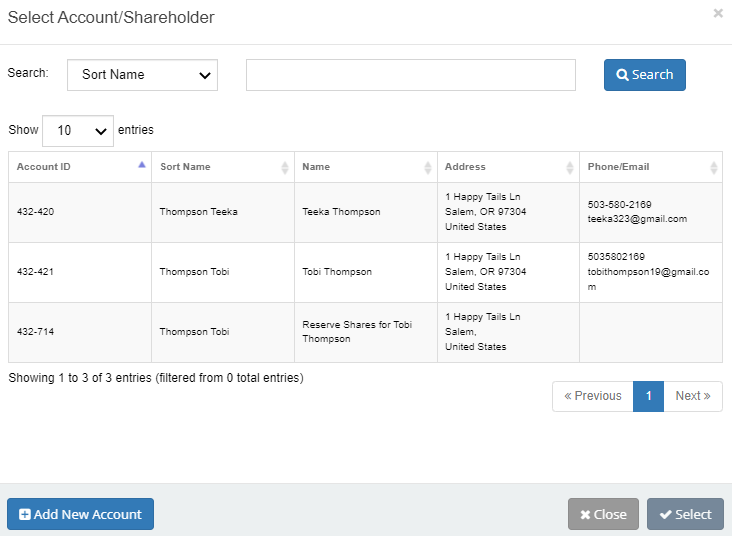

   Figure 19. Add New Issuance log screen, Step 1: Is Fast Transfer.

Step 1: Is Fast Transfer
------------------------

1. Select the type of transfer from the Is Fast Transfer section.

2. Select **Save & Continue**.

   | The screen displays *Step 2: Select Issuer*.

.. figure:: _static/pdf_images/page_24_image_1.png
   :alt: Add New Issuance, Step 2: Select Issuer.

   Figure 20. Add New Issuance, Step 2: Select Issuer.

Step 2: Select Issuer
----------------------

1. Highlight the company from the list.

2. Select **Save & Continue**.

   | The screen displays Step 3: Information Input.

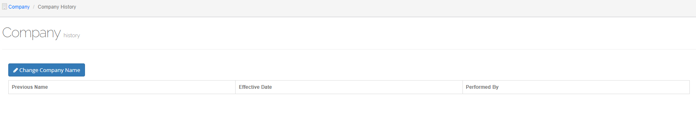

   Figure 21. Add New Issuance, Step 3: Information Input, upper screen.

Step 3: Information Input
-------------------------

1. If this is to correct a transaction previously processed, tick the **Is a correcting transaction** checkbox.

   | The **Date In** field auto-defaults to today's date/time.

2. Verify that the auto-populated fields are correct.

3. Add any necessary information, including information in the **Options**, **Package Information**, and **Miscellaneous Information** sections.

4. Scroll down to the lower part of the screen.

.. figure:: _static/pdf_images/page_25_image_1.png
   :alt: Add New Issuance, Step 3: Information Input, lower screen.

   Figure 22. Add New Issuance, Step 3: Information Input, lower screen.

5. If you want to upload a document, select **Upload Document**. (See Upload a Document for instructions.)

6. Select **Finish**.

   | The screen displays Step 4: Complete Summary.

.. figure:: _static/pdf_images/page_26_image_1.png
   :alt: Add New Issuance, Step 4: Complete Summary.

   Figure 23. Add New Issuance, Step 4: Complete Summary.

Step 4: Complete Summary
------------------------

- Select **Pending Transfer**.

  | The Logged Transaction list screen opens and displays the pending transaction in the list.

.. figure:: _static/pdf_images/page_27_image_1.png
   :alt: Add New Issuance, Logged Transaction List screen.

   Figure 24. Add New Issuance, Logged Transaction List screen.

For more information on the Logged Transaction list screen, see Transfer.

Add Reserved Shares Issuance
----------------------------

Use this option to issue reserved shares.

1. Select **Add Reserved Shares Issuance** from the main menu.

   | Note: If you started this transaction before completing it, you may get a *Continue where you left off* screen.

2. Select **Yes** if you are continuing with the uncompleted transaction. Otherwise, select **No**.

   | The *Add New Reserved Shares Issuance log* screen opens and displays Step 1: Select Issuer.

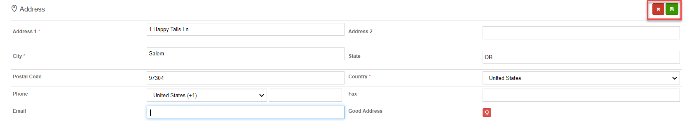

   Figure 25. Add Reserved Shares Issuance, Add New Reserved Shares Issuance log screen, Step 1: Select Issuer.

Step 1: Select Issuer
---------------------

1. Highlight the issuer from the **Select an Issuer** section.
2. Select **Save and Continue** located at the bottom of the screen.

   | The screen displays Step 2: Information Input.

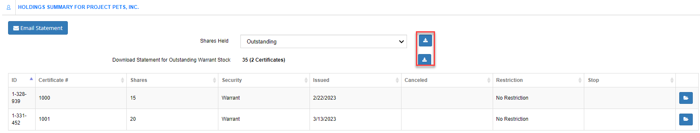

   Figure 26. Add Reserved Shares Issuance, Add Reserved Shares Issuance log, Step 2: Information Input.

Step 2: Information Input
-------------------------

1. Enter the date in the Date In field.

   | The default value is today's date.

2. Enter the item count in the SEC Item Count field.

   | The default value is 1.

3. Enter any additional information in their respective fields.
4. If you have any documents to upload, select Upload Document. (See Upload a Document for instructions.)
5. Select Finish.

   | The screen displays Step 3: Complete Summary.

Figure 27. Add Reserved Shares Issuance, Add Reserved Shares Issuance log, Step 3: Complete Summary.
-----------------------------------------------------------------------------------------------------

.. figure:: _static/pdf_images/page_30_image_1.png
   :alt: Add Reserved Shares Issuance, Add Reserved Shares Issuance log, Step 3: Complete Summary.

   Figure 27. Add Reserved Shares Issuance, Add Reserved Shares Issuance log, Step 3: Complete Summary.

Step 3: Complete Summary
------------------------

- Select Pending Transfer.

  | The Logged Transaction List opens and displays the new transaction.

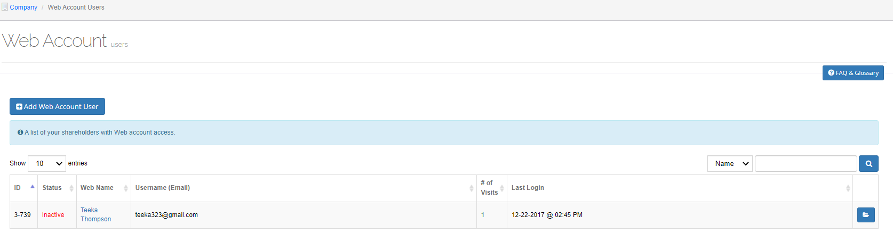

   Figure 28. Logged Transaction list.

For more information on the Logged Transaction list screen, see Transfer.

Add a Transfer
--------------

Use this option to add a transfer.

1. Select **Add Transfer** from the main menu.

   | Note: If you started this transaction before completing it, you may get a Continue where you left off screen.

2. Select **Yes** if you are continuing with the uncompleted transaction. Otherwise, select **No**.

   | The Add Transfer log screen opens and displays Step 1: Is Fast Transfer.

.. figure:: _static/pdf_images/page_31_image_1.png
   :alt: Add Transfer, Add Transfer log screen, Step 1: Is fast transfer.

   Figure 29. Add Transfer, Add Transfer log screen, Step 1: Is fast transfer.

Step 1: Is Fast Transfer
------------------------

1. Select the type of transfer from the Is Fast Transfer section.
2. Select **Save & Continue**.

   | The screen displays Step 2: Select Issuer.

'''

.. figure:: _static/pdf_images/page_32_image_1.png
   :alt: Add Transfer, Add Transfer log screen, Step 2: Select Issuer.

   Figure 30. Add Transfer, Add Transfer log screen, Step 2: Select Issuer.

Step 2: Select Issuer
---------------------

1. Highlight the company from the Select an Issuer section.
2. Select **Save & Continue**.

   | The screen displays Step 3: Information Input.

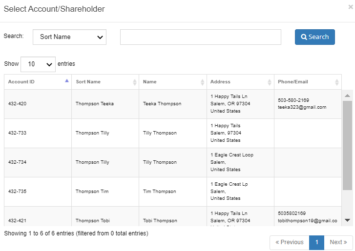

   Figure 31. Add Transfer, Add Transfer log screen, Step 3: Information Input.

Step 3: Information Input
-------------------------

1. If this is to correct a transaction previously processed, tick the **Is a correcting transaction** checkbox.
2. Enter the date in the **Date In** field.

   | The default value is today's date.

3. Enter the item count in the **SEC Item Count** field.

   | The default value is 1.

4. Enter any other information in their respective fields.
5. If you have any documents to upload, select **Upload Document**. (See **Upload a Document** for instructions.)
6. Select **Save & Continue**.

   | The screen displays Step 4: Transfer From Certificates.

.. figure:: _static/pdf_images/page_32_image_3.png
   :alt: Add Transfer, Add Transfer log screen, Step 4: Transfer From Certificates.

   Figure 32. Add Transfer, Add Transfer log screen, Step 4: Transfer From Certificates.

Step 4: Transfer From Certificates
----------------------------------

A certificate to transfer to must be chosen first.

1. Select **+Choose**.

   | The Select Certificate popup window opens.

2. Highlight the shareholder and then click **Select**.

   | The certificate is added to the Transfer From Certificates section.

3. Select **Save & Continue**.

   | The screen displays Step 5: Medallion Stamps.

.. figure:: _static/pdf_images/page_33_image_1.png
   :alt: Add Transfer, Add Transfer log screen, Step 5: Medallion Stamps.

   Figure 33. Add Transfer, Add Transfer log screen, Step 5: Medallion Stamps.

Step 5: Medallion Stamps
------------------------

A Medallion Stamp is not necessary to complete this transaction.

1. Select **+Add Medallion Stamp**.

   | The Add Medallion Stamp popup opens.

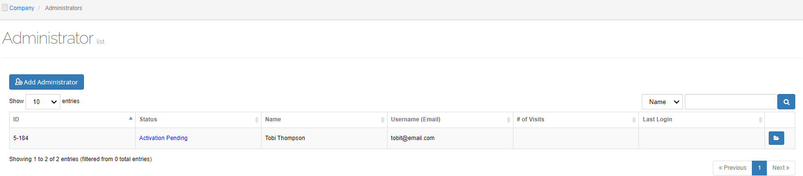

   Figure 34. Add Medallion Stamp popup window.

2. Enter the medallion number in the **Medallion Number** field.
3. Enter the location identification in the **Location ID** field.
4. Select the type of program from the **Program** drop-down list.
5. Enter the guarantor's name in the **Guarantor Name** field.
6. Enter the value of the medallion in the **Medallion Value** field.
7. Select the reason for the medallion from the **Status** drop-down field.
8. Select **Yes** if the ink scan passed or **No** if it did not pass.
9. Select **Save**.
10. Select **Finish**.

   | The screen displays Step 6: Complete Summary.

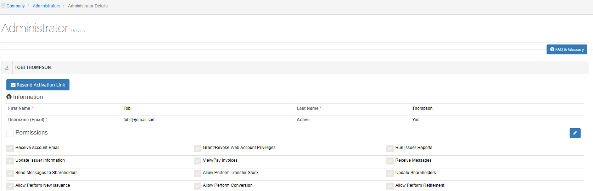

   Figure 35. Add Transfer, Add Transfer log screen, Step 6: Complete Summary.

Step 6: Complete Summary
------------------------

- Select **Pending Transfer**.

  | The Logged Transaction list screen displays the pending transfer. For more information on the Logged Transaction list screen, see **Transfer**.

Add a Conversion
----------------

Use this option to add a conversion.

1. Select **Add Conversion** from the main menu.

   Note: If you started this transaction before completing it, you may get a **Continue where you left off** screen.

2. Select **Yes** if you are continuing with the uncompleted transaction. Otherwise, select **No**.

   | The Add Conversion log screen opens and displays Step 1: Is Fast Transfer.

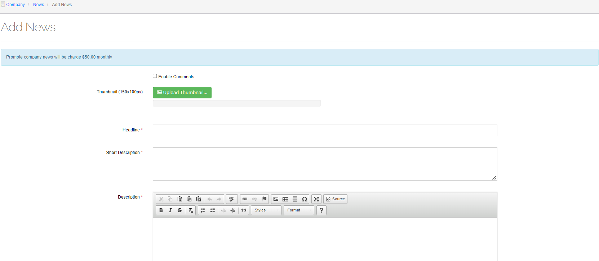

   Figure 36. Add Conversion, Add Conversion log screen, Step 1: Is fast transfer.

Step 1: Is Fast Transfer
------------------------

1. Select the type of transaction from the **Is Fast Transfer** section.
2. Select **Save & Continue**.

   | The screen displays Step 2: Select Issuer.

.. figure:: _static/pdf_images/page_35_image_2.png
   :alt: Add Conversion log, Step 2: Is fast transfer.

   Figure 37. Add Conversion log, Step 2: Is fast transfer.

Step 2: Select Issuer
---------------------

- Highlight the issuer from the **Select an Issuer** section and then select **Save & Continue**.

  | The screen displays Step 3: Information Input.

.. figure:: _static/pdf_images/page_36_image_1.png
   :alt: Add Conversion log, Step 3: Information Input.

   Figure 38. Add Conversion log, Step 3: Information Input.

Step 3: Information Input
-------------------------

1. If this is to correct a previously processed transaction, tick the **Is a correcting transaction** checkbox.
2. Enter the date in the **Date In** field.

   | The default value is today's date.

3. Enter the item count in the **SEC Item Count** field.

   | The default value is 1.

4. Enter any other information in their respective fields.
5. If you have any documents to upload, select **Upload Document**. (See **Upload a Document** for instructions.)
6. Select **Save & Continue**.

   | The screen displays Step 4: Convert From Certificates.

.. figure:: _static/pdf_images/page_37_image_1.png
   :alt: Add Conversion log, Step 4: Convert from Certificates.

   Figure 39. Add Conversion log, Step 4: Convert from Certificates.

Step 4: Convert from Certificates
---------------------------------

Note: You will need to choose the certificate you want to transfer to.

1. Select **+Choose**.

   | The Select Certificate popup window opens.

2. Highlight the shareholder and click **Select**.

   | The certificate is added to the Convert from Certificates table.

3. Select **Save & Continue**.

   | The screen displays Step 5: Medallion Stamps.

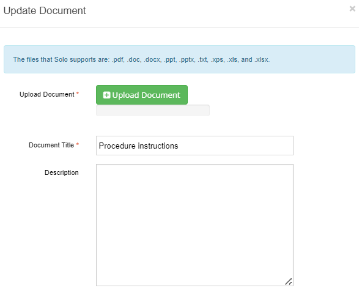

   Figure 40. Add Conversion log, Step 5: Medallion Stamps.

Step 5: Medallion Stamps
------------------------

A Medallion Stamp is not necessary to complete this transaction.

1. To add a Medallion Stamp, select **+Add Medallion Stamp**.

   | The Add Medallion Stamp popup window opens.

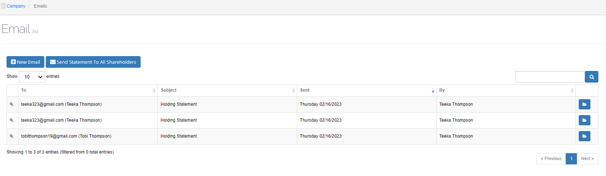

   Figure 41. Add Medallion Stamp popup window.

2. Enter the medallion number in the **Medallion Number** field.
3. Enter the location identification in the **Location ID** field.
4. Select the type of program from the **Program** drop-down list.
5. Enter the guarantor's name in the **Guarantor Name** field.
6. Enter the value of the medallion in the **Medallion Value** field.
7. Select the reason for the medallion from the **Status** drop-down field.
8. Select **Yes** if the ink scan passed or select **No** if it did not pass.
9. Select **Save**.
10. Select **Finish**.

   | The screen displays Step 6: Complete Summary.

.. figure:: _static/pdf_images/page_39_image_1.png
   :alt: Add Conversion log, Step 6: Complete Summary.

   Figure 42. Add Conversion log, Step 6: Complete Summary.

Step 6: Complete Summary
------------------------

- Select **Pending Transfer**.

  | The Logged Transaction list screen displays the pending transfer. For more information on the Logged Transaction list screen, see **Transfer**.

Add a Retirement
----------------

Use this option to add a retirement.

1. Select **Add Retirement** from the main menu.

   Note: If you started this transaction before completing it, you may get a **Continue where you left off** screen.

2. Select **Yes** if you are continuing with the uncompleted transaction. Otherwise, select **No**.

The Add Retirement Log Screen
-----------------------------

The Add Retirement log screen opens and displays Step 1: Select Issuer.

.. figure:: _static/pdf_images/page_41_image_1.png
   :alt: Add Retirement log, Step 1: Select Issuer.

   Figure 43. Add Retirement log, Step 1: Select Issuer

Step 1: Select Issuer
---------------------

- Highlight the issuer from the Select an Issuer section and then select Save & Continue.

  | The screen displays Step 2: Information Input.

*Figure 44. Add Retirement log, Step 2: Information Input.*

Step 2: Information Input
-------------------------

1. If this is to correct a transaction previously processed tick the Is a correcting transaction checkbox.
2. Enter the date in the Date In field.

   | The default value is today's date.

3. Enter the item count in the SEC Item Count field.
4. Enter any other information in their respective fields.
5. If you have any documents to upload, select Upload Document. (See Upload a Document for instructions.)
6. Select Save & Continue.

   | The screen displays Step 3: Retire From Certificates.

*Figure 45. Add Retirement log, Step 3: Retire from Certificates.*

Step 3: Retire from Certificates
--------------------------------

Note: You will first need to choose the certificate to transfer to.

1. Select Choose.

   | The Select Certificate popup window opens.

2. Highlight the certificate and then click Select.

   | The Select Certificate popup window closes, and the certificate is added to the Retire from Certificates section.

3. Select Save & Continue.

*Figure 46. Add Retirement log, Step 4: Medallion Stamps.*

Step 4: Medallion Stamps
------------------------

A Medallion Stamp is not necessary to complete this transaction.

1. If you do not wish to add a stamp, select Finish.
2. To add a Medallion Stamp, select +Add Medallion Stamp.

   | The Add Medallion Stamp popup window opens.

   Figure 47. Add Medallion Stamp popup window

3. Enter the medallion number in the Medallion Number field.
4. Enter the location identification in the Location ID field.
5. Select the type of program from the Program drop-down list.
6. Enter the guarantor's name in the Guarantor Name field.
7. Enter the value of the medallion in the Medallion Value field.
8. Select the reason for the medallion from the Status drop-down field.
9. Select Yes if the ink scan passed or select No if it did not pass.
10. Select Save.
11. Select Finish.

   | The screen displays Step 5: Complete Summary.

*Figure 48. Add Retirement log, Step 5: Complete Summary.*

Step 5: Complete Summary
------------------------

- Select Pending Transfer.

  | The Logged Transaction list screen displays the pending transfer. For more information on the Logged Transaction list screen, see Transfer.
