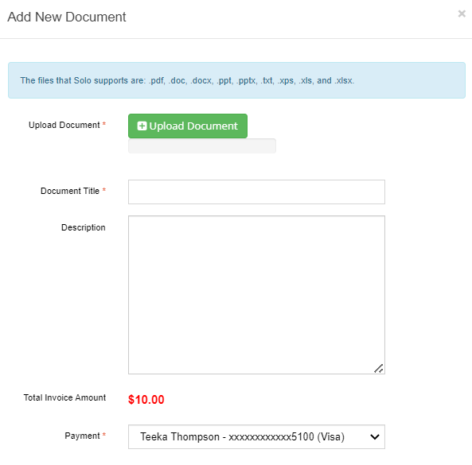
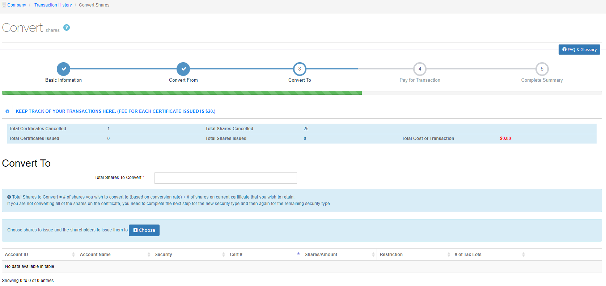
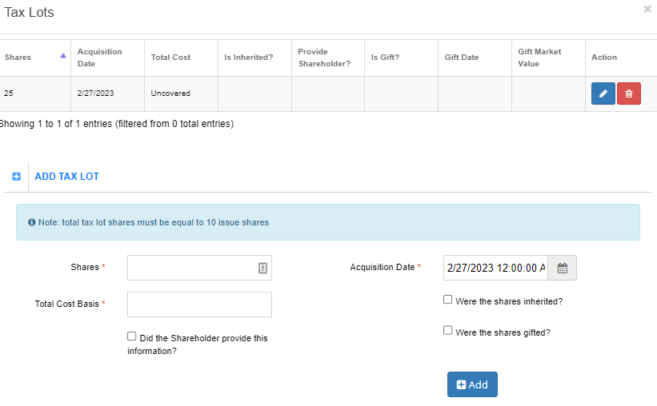
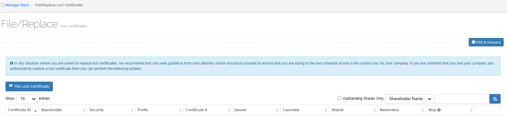
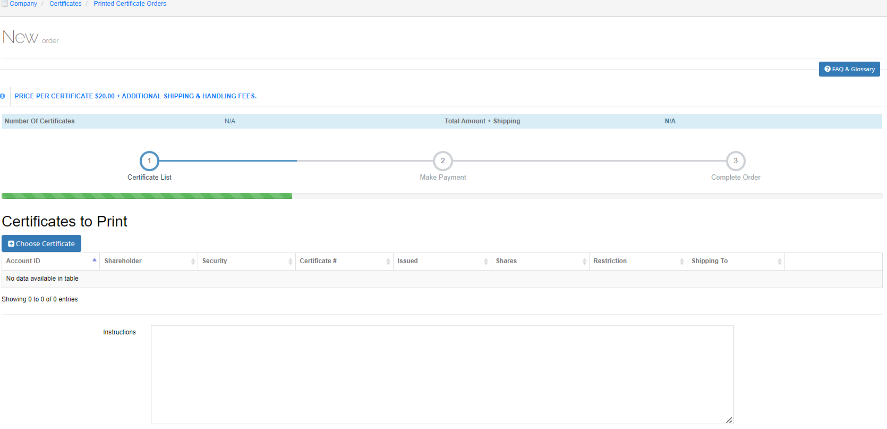
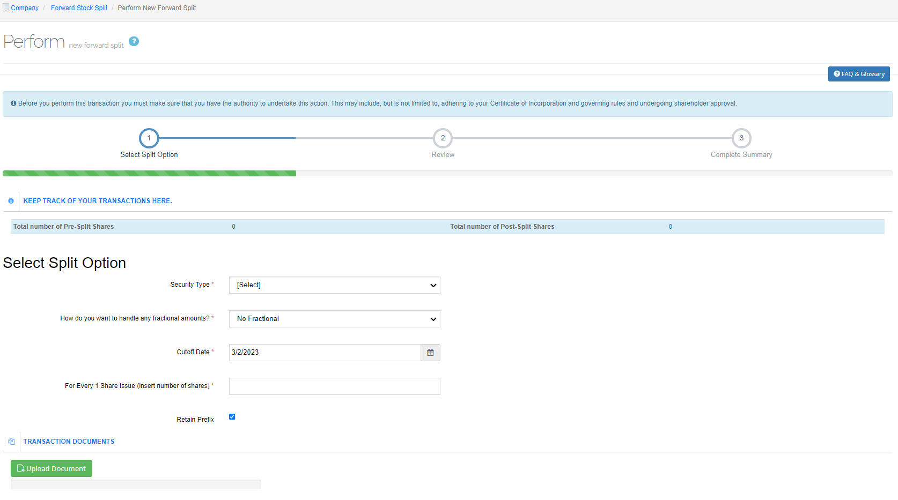
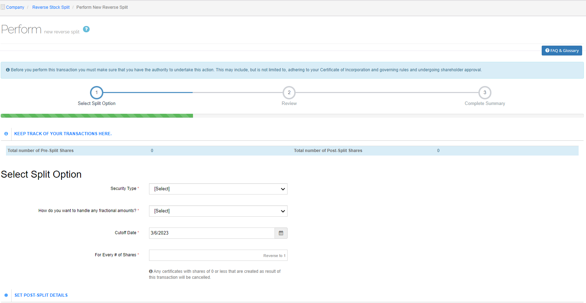
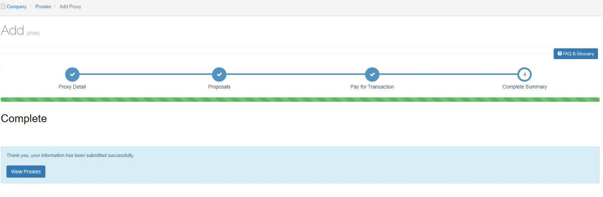
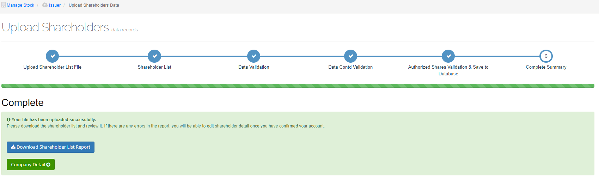

#######
General
#######


.. figure:: _static/pdf_images/page_21_image_17.png
   :alt: Transfer Agent Information section.

   Figure 17. Transfer Agent Information section.

2. Edit the relevant information and select the save icon to save the changes.

Edit Logo for Reports
---------------------

1. Click the edit icon in the Logo for Reports section.

   | Your desktop window opens.

2. Upload your logo for your reports. (See Upload a Document for instructions.)

   | Your logo is uploaded in the Logo for Reports box.

3. To remove the logo, click the remove icon.

Edit Site Logo
--------------

1. Click the edit icon in the Site Logo section.

   | Your desktop window opens.

2. Upload your site logo. (See Upload a Document for instructions.)

   | The logo is uploaded into the box, and the logo and certificate layout are immediately updated.

3. To remove the logo, click the remove icon.


Activity List
-------------

The Activity List allows you to view all transactions, the dates when they occurred, and who performed them.

.. figure:: _static/pdf_images/page_22_image_1.png
   :alt: Activity List.

   Figure 18. Activity List.

Log Transaction
---------------

The Log Transaction menu allows you to add a new issuance, add reserved shares issuance, add a transfer, add a conversion, and add a retirement.

.. note::

   You must add companies first before you can add the above options.

Add New Issuance
----------------

Use this option to add a fast transaction or transfer to a fast account.

1. Select **+Add New Issuance** from the main menu.

   .. note::

      If you started this transaction before completing it, you may get a Continue where you left off screen.

2. Select **Yes** if you are continuing with the transaction. Otherwise, select **No**.

   | The Add New Issuance log screen opens.

.. figure:: _static/pdf_images/page_23_image_1.png
   :alt: Add New Issuance log screen, Step 1: Is Fast Transfer.

   Figure 19. Add New Issuance log screen, Step 1: Is Fast Transfer.

Step 1: Is Fast Transfer
------------------------

1. Select the type of transfer from the Is Fast Transfer section.

2. Select **Save & Continue**.

   | The screen displays *Step 2: Select Issuer*.


.. figure:: _static/pdf_images/page_24_image_1.png
   :alt: Add New Issuance, Step 2: Select Issuer.

   Figure 20. Add New Issuance, Step 2: Select Issuer.

Step 2: Select Issuer
----------------------

1. Highlight the company from the list.

2. Select **Save & Continue**.

   | The screen displays Step 3: Information Input.

.. figure:: _static/pdf_images/page_24_image_2.png
   :alt: Add New Issuance, Step 3: Information Input, upper screen.

   Figure 21. Add New Issuance, Step 3: Information Input, upper screen.

Step 3: Information Input
-------------------------

1. If this is to correct a transaction previously processed, tick the **Is a correcting transaction** checkbox.

   | The **Date In** field auto-defaults to today's date/time.

2. Verify that the auto-populated fields are correct.

3. Add any necessary information, including information in the **Options**, **Package Information**, and **Miscellaneous Information** sections.

4. Scroll down to the lower part of the screen.

.. figure:: _static/pdf_images/page_25_image_1.png
   :alt: Add New Issuance, Step 3: Information Input, lower screen.

   Figure 22. Add New Issuance, Step 3: Information Input, lower screen.

5. If you want to upload a document, select **Upload Document**. (See Upload a Document for instructions.)

6. Select **Finish**.

   | The screen displays Step 4: Complete Summary.

.. figure:: _static/pdf_images/page_26_image_1.png
   :alt: Add New Issuance, Step 4: Complete Summary.

   Figure 23. Add New Issuance, Step 4: Complete Summary.

Step 4: Complete Summary
------------------------

- Select **Pending Transfer**.

  | The Logged Transaction list screen opens and displays the pending transaction in the list.


.. figure:: _static/pdf_images/page_27_image_1.png
   :alt: Add New Issuance, Logged Transaction List screen.

   Figure 24. Add New Issuance, Logged Transaction List screen.

For more information on the Logged Transaction list screen, see Transfer.

Add Reserved Shares Issuance
----------------------------

Use this option to issue reserved shares.

1. Select **Add Reserved Shares Issuance** from the main menu.

   | Note: If you started this transaction before completing it, you may get a *Continue where you left off* screen.

2. Select **Yes** if you are continuing with the uncompleted transaction. Otherwise, select **No**.

   | The *Add New Reserved Shares Issuance log* screen opens and displays Step 1: Select Issuer.

.. figure:: _static/pdf_images/page_28_image_1.png
   :alt: Add Reserved Shares Issuance, Add New Reserved Shares Issuance log screen, Step 1: Select Issuer.

   Figure 25. Add Reserved Shares Issuance, Add New Reserved Shares Issuance log screen, Step 1: Select Issuer.


Step 1: Select Issuer
---------------------

1. Highlight the issuer from the **Select an Issuer** section.
2. Select **Save and Continue** located at the bottom of the screen.

   | The screen displays Step 2: Information Input.


.. figure:: _static/pdf_images/page_29_image_1.png
   :alt: Add Reserved Shares Issuance, Add Reserved Shares Issuance log, Step 2: Information Input.

   Figure 26. Add Reserved Shares Issuance, Add Reserved Shares Issuance log, Step 2: Information Input.

Step 2: Information Input
-------------------------

1. Enter the date in the Date In field.

   | The default value is today's date.

2. Enter the item count in the SEC Item Count field.

   | The default value is 1.

3. Enter any additional information in their respective fields.
4. If you have any documents to upload, select Upload Document. (See Upload a Document for instructions.)
5. Select Finish.

   | The screen displays Step 3: Complete Summary.

Figure 27. Add Reserved Shares Issuance, Add Reserved Shares Issuance log, Step 3: Complete Summary.
-----------------------------------------------------------------------------------------------------

.. figure:: _static/pdf_images/page_30_image_1.png
   :alt: Add Reserved Shares Issuance, Add Reserved Shares Issuance log, Step 3: Complete Summary.

   Figure 27. Add Reserved Shares Issuance, Add Reserved Shares Issuance log, Step 3: Complete Summary.

Step 3: Complete Summary
------------------------

- Select Pending Transfer.

  | The Logged Transaction List opens and displays the new transaction.

.. figure:: _static/pdf_images/page_30_image_2.png
   :alt: Logged Transaction list.

   Figure 28. Logged Transaction list.

For more information on the Logged Transaction list screen, see Transfer.

Add a Transfer
--------------

Use this option to add a transfer.

1. Select **Add Transfer** from the main menu.

   | Note: If you started this transaction before completing it, you may get a Continue where you left off screen.

2. Select **Yes** if you are continuing with the uncompleted transaction. Otherwise, select **No**.

   | The Add Transfer log screen opens and displays Step 1: Is Fast Transfer.

.. figure:: _static/pdf_images/page_31_image_1.png
   :alt: Add Transfer, Add Transfer log screen, Step 1: Is fast transfer.

   Figure 29. Add Transfer, Add Transfer log screen, Step 1: Is fast transfer.

Step 1: Is Fast Transfer
------------------------

1. Select the type of transfer from the Is Fast Transfer section.
2. Select **Save & Continue**.

   | The screen displays Step 2: Select Issuer.

'''


.. figure:: _static/pdf_images/page_32_image_1.png
   :alt: Add Transfer, Add Transfer log screen, Step 2: Select Issuer.

   Figure 30. Add Transfer, Add Transfer log screen, Step 2: Select Issuer.

Step 2: Select Issuer
---------------------

1. Highlight the company from the Select an Issuer section.
2. Select **Save & Continue**.

   | The screen displays Step 3: Information Input.

.. figure:: _static/pdf_images/page_32_image_2.png
   :alt: Add Transfer, Add Transfer log screen, Step 3: Information Input.

   Figure 31. Add Transfer, Add Transfer log screen, Step 3: Information Input.

Step 3: Information Input
-------------------------

1. If this is to correct a transaction previously processed, tick the **Is a correcting transaction** checkbox.
2. Enter the date in the **Date In** field.

   | The default value is today's date.

3. Enter the item count in the **SEC Item Count** field.

   | The default value is 1.

4. Enter any other information in their respective fields.
5. If you have any documents to upload, select **Upload Document**. (See **Upload a Document** for instructions.)
6. Select **Save & Continue**.

   | The screen displays Step 4: Transfer From Certificates.

.. figure:: _static/pdf_images/page_32_image_3.png
   :alt: Add Transfer, Add Transfer log screen, Step 4: Transfer From Certificates.

   Figure 32. Add Transfer, Add Transfer log screen, Step 4: Transfer From Certificates.

Step 4: Transfer From Certificates
----------------------------------

A certificate to transfer to must be chosen first.

1. Select **+Choose**.

   | The Select Certificate popup window opens.

2. Highlight the shareholder and then click **Select**.

   | The certificate is added to the Transfer From Certificates section.

3. Select **Save & Continue**.

   | The screen displays Step 5: Medallion Stamps.

.. figure:: _static/pdf_images/page_33_image_1.png
   :alt: Add Transfer, Add Transfer log screen, Step 5: Medallion Stamps.

   Figure 33. Add Transfer, Add Transfer log screen, Step 5: Medallion Stamps.

Step 5: Medallion Stamps
------------------------

A Medallion Stamp is not necessary to complete this transaction.

1. Select **+Add Medallion Stamp**.

   | The Add Medallion Stamp popup opens.

.. figure:: _static/pdf_images/page_33_image_2.png
   :alt: Add Medallion Stamp popup window.

   Figure 34. Add Medallion Stamp popup window.

2. Enter the medallion number in the **Medallion Number** field.
3. Enter the location identification in the **Location ID** field.
4. Select the type of program from the **Program** drop-down list.
5. Enter the guarantor's name in the **Guarantor Name** field.
6. Enter the value of the medallion in the **Medallion Value** field.
7. Select the reason for the medallion from the **Status** drop-down field.
8. Select **Yes** if the ink scan passed or **No** if it did not pass.
9. Select **Save**.
10. Select **Finish**.

   | The screen displays Step 6: Complete Summary.

.. figure:: _static/pdf_images/page_34_image_1.png
   :alt: Add Transfer, Add Transfer log screen, Step 6: Complete Summary.

   Figure 35. Add Transfer, Add Transfer log screen, Step 6: Complete Summary.

Step 6: Complete Summary
------------------------

- Select **Pending Transfer**.

  | The Logged Transaction list screen displays the pending transfer. For more information on the Logged Transaction list screen, see **Transfer**.

Add a Conversion
----------------

Use this option to add a conversion.

1. Select **Add Conversion** from the main menu.

   Note: If you started this transaction before completing it, you may get a **Continue where you left off** screen.

2. Select **Yes** if you are continuing with the uncompleted transaction. Otherwise, select **No**.

   | The Add Conversion log screen opens and displays Step 1: Is Fast Transfer.

.. figure:: _static/pdf_images/page_35_image_1.png
   :alt: Add Conversion, Add Conversion log screen, Step 1: Is fast transfer.

   Figure 36. Add Conversion, Add Conversion log screen, Step 1: Is fast transfer.

Step 1: Is Fast Transfer
------------------------

1. Select the type of transaction from the **Is Fast Transfer** section.
2. Select **Save & Continue**.

   | The screen displays Step 2: Select Issuer.

.. figure:: _static/pdf_images/page_35_image_2.png
   :alt: Add Conversion log, Step 2: Is fast transfer.

   Figure 37. Add Conversion log, Step 2: Is fast transfer.

Step 2: Select Issuer
---------------------

- Highlight the issuer from the **Select an Issuer** section and then select **Save & Continue**.

  | The screen displays Step 3: Information Input.

.. figure:: _static/pdf_images/page_36_image_1.png
   :alt: Add Conversion log, Step 3: Information Input.

   Figure 38. Add Conversion log, Step 3: Information Input.

Step 3: Information Input
-------------------------

1. If this is to correct a previously processed transaction, tick the **Is a correcting transaction** checkbox.
2. Enter the date in the **Date In** field.

   | The default value is today's date.

3. Enter the item count in the **SEC Item Count** field.

   | The default value is 1.

4. Enter any other information in their respective fields.
5. If you have any documents to upload, select **Upload Document**. (See **Upload a Document** for instructions.)
6. Select **Save & Continue**.

   | The screen displays Step 4: Convert From Certificates.



   Figure 39. Add Conversion log, Step 4: Convert from Certificates.

Step 4: Convert from Certificates
---------------------------------

Note: You will need to choose the certificate you want to transfer to.

1. Select **+Choose**.

   | The Select Certificate popup window opens.

2. Highlight the shareholder and click **Select**.

   | The certificate is added to the Convert from Certificates table.

3. Select **Save & Continue**.

   | The screen displays Step 5: Medallion Stamps.

.. figure:: _static/pdf_images/page_38_image_1.png
   :alt: Add Conversion log, Step 5: Medallion Stamps.

   Figure 40. Add Conversion log, Step 5: Medallion Stamps.

Step 5: Medallion Stamps
------------------------

A Medallion Stamp is not necessary to complete this transaction.

1. To add a Medallion Stamp, select **+Add Medallion Stamp**.

   | The Add Medallion Stamp popup window opens.

.. figure:: _static/pdf_images/page_38_image_2.png
   :alt: Add Medallion Stamp popup window.

   Figure 41. Add Medallion Stamp popup window.

2. Enter the medallion number in the **Medallion Number** field.
3. Enter the location identification in the **Location ID** field.
4. Select the type of program from the **Program** drop-down list.
5. Enter the guarantor's name in the **Guarantor Name** field.
6. Enter the value of the medallion in the **Medallion Value** field.
7. Select the reason for the medallion from the **Status** drop-down field.
8. Select **Yes** if the ink scan passed or select **No** if it did not pass.
9. Select **Save**.
10. Select **Finish**.

   | The screen displays Step 6: Complete Summary.

.. figure:: _static/pdf_images/page_39_image_1.png
   :alt: Add Conversion log, Step 6: Complete Summary.

   Figure 42. Add Conversion log, Step 6: Complete Summary.

Step 6: Complete Summary
------------------------

- Select **Pending Transfer**.

  | The Logged Transaction list screen displays the pending transfer. For more information on the Logged Transaction list screen, see **Transfer**.

Add a Retirement
----------------

Use this option to add a retirement.

1. Select **Add Retirement** from the main menu.

   Note: If you started this transaction before completing it, you may get a **Continue where you left off** screen.

2. Select **Yes** if you are continuing with the uncompleted transaction. Otherwise, select **No**.


The Add Retirement Log Screen
-----------------------------

The Add Retirement log screen opens and displays Step 1: Select Issuer.

.. figure:: _static/pdf_images/page_41_image_1.png
   :alt: Add Retirement log, Step 1: Select Issuer.

   Figure 43. Add Retirement log, Step 1: Select Issuer

Step 1: Select Issuer
---------------------

- Highlight the issuer from the Select an Issuer section and then select Save & Continue.

  | The screen displays Step 2: Information Input.

*Figure 44. Add Retirement log, Step 2: Information Input.*

Step 2: Information Input
-------------------------

1. If this is to correct a transaction previously processed tick the Is a correcting transaction checkbox.
2. Enter the date in the Date In field.

   | The default value is today's date.

3. Enter the item count in the SEC Item Count field.
4. Enter any other information in their respective fields.
5. If you have any documents to upload, select Upload Document. (See Upload a Document for instructions.)
6. Select Save & Continue.

   | The screen displays Step 3: Retire From Certificates.

*Figure 45. Add Retirement log, Step 3: Retire from Certificates.*

Step 3: Retire from Certificates
--------------------------------

Note: You will first need to choose the certificate to transfer to.

1. Select Choose.

   | The Select Certificate popup window opens.

2. Highlight the certificate and then click Select.

   | The Select Certificate popup window closes, and the certificate is added to the Retire from Certificates section.

3. Select Save & Continue.

*Figure 46. Add Retirement log, Step 4: Medallion Stamps.*

Step 4: Medallion Stamps
------------------------

A Medallion Stamp is not necessary to complete this transaction.

1. If you do not wish to add a stamp, select Finish.
2. To add a Medallion Stamp, select +Add Medallion Stamp.

   | The Add Medallion Stamp popup window opens.

.. figure:: _static/pdf_images/page_44_image_1.png
   :alt: Add Medallion Stamp popup window.

   Figure 47. Add Medallion Stamp popup window

3. Enter the medallion number in the Medallion Number field.
4. Enter the location identification in the Location ID field.
5. Select the type of program from the Program drop-down list.
6. Enter the guarantor's name in the Guarantor Name field.
7. Enter the value of the medallion in the Medallion Value field.
8. Select the reason for the medallion from the Status drop-down field.
9. Select Yes if the ink scan passed or select No if it did not pass.
10. Select Save.
11. Select Finish.

   | The screen displays Step 5: Complete Summary.

*Figure 48. Add Retirement log, Step 5: Complete Summary.*

Step 5: Complete Summary
------------------------

- Select Pending Transfer.

  | The Logged Transaction list screen displays the pending transfer. For more information on the Logged Transaction list screen, see Transfer.

Transfer
--------

The Transfer option has four additional options:

- Pending
- Canceled
- Rejected
- Completed

Pending
-------

Use this option to view pending transactions, as well as perform and reject transactions.

1. Select Pending from the main menu.

   | The Logged Transaction list opens and displays all pending transactions.

.. figure:: _static/pdf_images/page_46_image_1.png
   :alt: Logged Transaction list.

   Figure 49. Logged Transaction list

2. Click the folder to view the transactions details for a specific transaction type.

   | The Logged Transaction detail screen opens and displays the pending transaction.

Reject a Pending Transaction
----------------------------

1. To reject a pending transaction, select Pending from the main menu.

   | The Logged Transaction list screen opens.

2. Select the pending transaction that you want to reject.

   | The Logged Transaction detail screen opens.


   Figure 50. Logged Transaction detail screen

3. Scroll down to the bottom of the screen and select Reject Transaction.

   | The Reject Transaction screen opens and displays Step 1: Certificates Posted.

*Figure 51. Reject Transaction screen.*

Step 1: Certificates Posted
---------------------------

1. Tick the Is Medallion Rejected if the rejection is stamp related.
2. If there is more than one certificate listed, deselect the certificates that you do not want to reject from the Reject column.
3. Enter the reason for the rejection in the Note field.
4. Select Next.

   | The screen displays Step 2: Reject Invoice.

Step 2: Reject Invoice
----------------------

1. Click Select in the Billing Account field.

   | The Select Billing Account popup window opens.

2. Highlight the billing account and click Select.

   | The billing account information is listed in the Reject Invoice section.

3. Select Finish.

   | The screen displays Step 3: Complete Summary.


   Figure 53. Reject Transaction screen, Step 3: Complete Summary.

Step 3: Complete Summary

1. Select **View Invoice Detail** to view the invoice details.

   | The invoice details are displayed.

2. Select **Generate Invoice Statement** to generate the invoice statement.

   | The invoice statement is generated.

3. Select **Done**.

Rejected
--------

Use this option to view rejected transactions.

1. Select **Rejected** from the main menu.

   | The Logged Transaction list opens and displays all rejected transactions.

.. figure:: _static/pdf_images/page_49_image_2.png
   :alt: Logged Transaction list.

   Figure 54. Logged Transaction list.

50 Transfer Online Confidential 2023

2. To view the rejected transaction, click the folder in the row that you want to view.

   | The Logged Transaction detail screen opens.

3. To edit the transaction, select **Edit**.

   | The transaction becomes editable.

4. To add a document, select **Add Document**. (See Upload a Document for instructions.)

   | The document upload interface is displayed.

5. To reject a transaction, see Reject a Pending Transaction.

Canceled
--------

Use this option to view canceled transactions.

1. Select **Canceled** from the main menu.

   | The Logged Transaction list screen opens and displays all canceled transactions.

Completed
---------

Use this option to view completed transactions.

1. Select **Completed** from the main menu.

   | The Logged Transaction list screen opens and displays all completed transactions.

2. To view a completed transaction, click the folder in row that you want to view.

   | The Logged Transaction detail screen opens and displays the transaction information.

3. To hide the company information, click ˅ to the left of the **Edit** button.

   | The company information is hidden.

4. To unhide the information, click ˄.

   | The company information is displayed again.

.. figure:: _static/pdf_images/page_50_image_1.png
   :alt: Logged Transaction detail screen.

   Figure 55. Logged Transaction detail screen.

51 Transfer Online Confidential 2023

Edit a Specific Transaction
---------------------------

1. To edit a specific transaction, click **Edit**.

   | Some fields become editable.

2. Edit the relevant fields and select **Save** to save the updated information.

   | The updated information is saved.

Download Transaction Invoice
----------------------------

To narrow the search criteria, use the drop-down menus located on the right side of the screen.

1. In the Transaction Summary section, select **Invoice**.

   | The invoice download option is provided.

2. Download your invoice. (See Download a Document for instructions.)

   | The invoice is downloaded.

3. To view more transaction summary information, select **View More**.

   | The Lookup > Transaction History option in the main menu opens.

4. To upload a document, select **Add Document** in the Documents section. (See Upload a Document for instructions.)

   | The document upload interface is displayed.

52 Transfer Online Confidential 2023

Corporate Actions
-----------------

This option has three additional options:

- Dividend
- Forward Split
- Reverse Split

Dividend
--------

Use this option to view dividend history and perform dividends.

1. Select **Dividend** from the main menu.

   | The Dividend history screen opens and displays the Dividend List.

2. To perform a dividend, select **Perform Dividend**.

   | The Perform new dividend screen opens.

.. figure:: _static/pdf_images/page_52_image_1.png
   :alt: Corporate Actions, Perform new dividend screen.

   Figure 56. Corporate Actions, Perform new dividend screen.

Note: Before you perform this transaction, make sure that you have the authority to undertake this action.

53 Transfer Online Confidential 2023

Step 1: Select Company
----------------------

- Highlight an issuer from the list and then select **Next**.

   | The screen displays Step 2: Select Dividend Details.



   Figure 57. Perform new dividend screen, Step 2: Select Dividend Details.

Step 2: Select Dividend Details
-------------------------------

1. Select the type of dividend from the Dividend Type drop-down list.

   | The dividend type selection menu is displayed.

2. Select the type of security from the Security Type drop-down list.

   | The security type selection menu is displayed.

3. Select the Record Date from the popup calendar.

   | The Record Date calendar is displayed.

4. Select the Payable Date from the popup calendar.

   | The Payable Date calendar is displayed.

5. Enter how many shares to issue for every (one) share in the For Every 1 Share Issue $ field.

   | The shares to be issued are defined.

6. If a minimum amount is to be awarded to shareholders, tick the **Award minimum amount to Shareholders** checkbox.

   | Additional fields become available if the checkbox is ticked.



   Figure 58. Dividend, Step 2: Select Dividend Details, Minimum Amount and Stock to Award sections.

7. If applicable, enter the numerical amount that every shareholder will receive in Every Shareholder Receives (numerical amount) field.

   | The specified amount to be awarded to each shareholder is entered.

8. Select the type of security from the Security drop-down list.

   | The security selection menu is displayed.

9. Select the appropriate prefix from the Prefix drop-down list.

   | The prefix selection is made.

10. If applicable, tick the **Retain Restrictions** checkbox.

    | A date field appears if the checkbox is ticked.

11. If applicable, select the restricted date from the Restriction Date/Adjusted Restriction Date popup calendar.

    | The restriction date is selected.

12. If applicable, upload a document in the Transaction Document section. (See Upload a Document for instructions.)

    | The document upload interface is provided.

13. Select **Next**.

    | The screen displays Step 3: Review.

.. figure:: _static/pdf_images/page_55_image_1.png
   :alt: Perform new dividend, Step 3: Review.

   Figure 59. Perform new dividend, Step 3: Review.

Step 3: Review
--------------

1. Scroll down to the Dividend Transaction Report section and select **Download Dividend Transaction Report** to download the report.

   | The Dividend Transaction Report download option is provided.

2. Open the report that you just saved on your desktop and ensure all information is correct.

   | The report is reviewed for accuracy.

Note: If you find an error, submit a Help Desk request and one of our System Admins will contact you. (See Help Desk for more information.)

3. If the report is accurate, select **Next**.

   | The screen displays Step 4: Billing.'''


.. figure:: _static/pdf_images/page_56_image_1.png
   :alt: Perform new dividend, Step 4: Billing.

   Figure 60. Perform new dividend, Step 4: Billing.

Step 4: Billing
===============

1. If you need to select a different billing account, click **Select Account**.

   | The Select Billing Account popup window opens.

2. Highlight the company and then click **Select**.

   | The fields in the Invoice Line Items section are automatically populated.

3. If applicable, correct any fields in the Invoice Line Items section.

4. If there are any additional charges, tick the **Additional Charges** checkbox.

   | If this field is checked, two additional fields appear.


57 Transfer Online Confidential 2023

5. Enter the reason for the additional charges in the empty field box and then the amount of the fee in the **Amount** field.

6. If there is a discount or an adjustment, tick the **Discount/Adjustment** checkbox.

   | If this field is checked, two additional fields appear.

7. Enter the reason for the discount/adjustment in the empty field box and then the amount of the discount/adjustment in the **Amount** field.

8. Enter any additional comments in the **Comments** field.

9. Select **Finish**.

   | The screen displays Step 5: Complete Summary.




   Figure 61. Perform new dividend, Step 5: Complete Summary.


58 Transfer Online Confidential 2023

Step 5: Complete Summary
========================

1. Validate that the information is correct.

2. Scroll down to the Summary section and download the documents that you want. (see Download a Document for instructions.)

3. Select **Complete**.

   | The Dividend history screen opens and displays the completed transaction.

View Dividend
=============

- To view the dividend history of a company, click the folder in the row that you want to view.

  | The Dividend detail screen opens and displays three or four tabs, depending on what the dividend is.

    The figure below is for a cash dividend.




   Figure 62. Dividend detail screen, Information tab.


59 Transfer Online Confidential 2023

Information tab
---------------

This tab displays the cash dividend and invoice information. (See Figure 62.) The Cash Dividend section is read-only and cannot be edited. You can click the on the section headings to collapse the section from view.

1. To download the invoice, scroll down to the Invoice section and select **Invoice**. (See Download a Document for instructions.)

2. To view more invoice information, select **View More** located next to the Invoice button.

   | If you selected **View More**, the Invoice detail screen opens. For more information on this screen and its sections, see View an Invoice (Billing > Invoices).

Cash Disbursement tab
---------------------

This tab displays the Disbursement, ACH Files, and Wire Files sections.

Disbursement Section
--------------------

The Disbursement section allows you to download the cash disbursement report (Excel format), view account information, update a payment, and void/replace payments.

.. figure:: _static/pdf_images/page_59_image_1.png
   :alt: Dividend detail screen, Cash Disbursement tab.

   Figure 63. Dividend detail screen, Cash Disbursement tab.

Export Excel Report
-------------------

- Select **Export Excel Report** to download the report. (See Download a Document for instructions.)

Update a Payment
----------------

1. To update a payment, select the view icon (green) in the row that you want to update.

   | The Update Cash Payment (ID: #) popup window opens.

.. figure:: _static/pdf_images/page_60_image_1.png
   :alt: Update Cash Payment popup window.

   Figure 64. Update Cash Payment popup window.

2. Select the type of payment from the Payment Type drop-down list.

3. Enter the reference number in the Reference Number field.

4. Click in the Date Payment field and select the date from the popup calendar.

5. If the payment has cleared, tick the **Is cleared** checkbox and select the date that the check cleared from the Cleared Date popup calendar.

6. Select **Save**.

   | The popup window closes, and the account item row displays the information in the Payment Reference, Payment Date, and Status columns.

Void and Replace
----------------

1. Click the void and replace icon (blue) in the row that you want to update.

   | The Replace/Transfer to screen opens.

.. figure:: _static/pdf_images/page_60_image_2.png
   :alt: Replace/Transfer to screen, Void & Replace.

   Figure 65. Replace/Transfer to screen, Void & Replace.


Click **Select Different Account** in the Replacement/Transfer To section.

   | The Select Account/Shareholder popup window opens.

Highlight the account to replace/transfer to from the list and then click **Select**.

   | The popup window closes, and the account selected is added to the Replacement/Transfer To section.

Select **Submit**.

   | The Confirmation popup dialog box opens and asks if you want to continue.

Select **OK**.

   | The Voided and Replacement Details screen displays the transaction, as shown in the figure below.

.. figure:: _static/pdf_images/page_61_image_1.png
   :alt: Voided and Replacement Details screen, Voided and Replaced By sections.

   Figure 66. Voided and Replacement Details screen, Voided and Replaced By sections.

The Dividend detail screen shows this recent transaction in the original account row. In this example Hallfork Suitemark, Inc. is voided and replaced by Minnie Van Ryder, as shown in the figure below.

.. figure:: _static/pdf_images/page_61_image_2.png
   :alt: Example of Void and Replaced disbursement.

   Figure 67. Example of Void and Replaced disbursement.

Create Group Payment
--------------------

You can group multiple payments into a single payment account.

1. Scroll down to the bottom of the Disbursement section and select **Create Group Payment**.

   | The Group Payment screen opens.


.. _group_payment_procedure:

Group Payment Procedure
-----------------------

.. figure:: _static/pdf_images/page_62_image_1.png
   :alt: Group Payment screen.

   Figure 68. Group Payment screen.

2. Click **Select a Primary Account**.

   | The *Select Account/Shareholder* popup window opens.

3. Select the account/shareholder and click **Select**.

   | The selected account/shareholder name is added in the *Primary Account* section, and the *Choose Pending Payouts* section appears.

.. figure:: _static/pdf_images/page_62_image_2.png
   :alt: Group Payment screen, Choose Pending Payouts section.

   Figure 69. Group Payment screen, Choose Pending Payouts section.

4. Tick the checkbox in the *Selected* column for each account you want to add to the group payment.

5. Scroll to the bottom of the screen and select **Review**.

   | The *Review* section appears with the selected accounts.

.. figure:: _static/pdf_images/page_62_image_3.png
   :alt: Group Payment screen, Review section.

   Figure 70. Group Payment screen, Review section.

6. You can deselect an account by deselecting the checkbox, and/or select **Back** to go back to the *Choose Pending Payouts* list and add more accounts.

7. Select **Submit**.

   | The *Confirmation* popup dialog box appears and asks if you want to continue.

8. Select **Ok**.

   | The *Group Payment Details* screen opens and displays the primary account, summary of payouts, and the voided payouts for this transaction.

ACH Files
---------

The *ACH Files* section displays any bank payments.

- To download an ACH file, click the download icon (in *Action* column) next to the file that you want to download. (See Download a Document for instructions.)

.. figure:: _static/pdf_images/page_64_image_1.png
   :alt: ACH Files section.

   Figure 71. ACH Files section.

WIRE Files
----------

The *Wire Files* section displays any wire payments.

- To download a wire file, click the download icon (in *Action* column) next to the file that you want to download. (See Download a Document for instructions.)

.. figure:: _static/pdf_images/page_64_image_2.png
   :alt: Wire Files section.

   Figure 72. Wire Files section.

Documents Tab
-------------

This tab allows you to download and view, add, and delete transaction documents.

.. figure:: _static/pdf_images/page_64_image_3.png
   :alt: Dividend Detail screen, Documents tab.

   Figure 73. Dividend Detail screen, Documents tab.

Stock Distribution Tab
----------------------

This tab allows you to view the stock distribution and download the report. It is a read-only tab.



   Figure 74. Dividend Detail screen, Stock Distribution tab.

.. note::

   Click **Export Excel Report** to download the report to your desktop. (See Download a Document for instructions.)

Fractional Share Cash Disbursement Tab
--------------------------------------

This tab displays the cash disbursement list and allows you to export the report, update a payment, and void and replace payments.

.. figure:: _static/pdf_images/page_66_image_1.png
   :alt: Dividend Detail screen, Fractional Share Cash Disbursement tab.

   Figure 75. Dividend Detail screen, Fractional Share Cash Disbursement tab.

Reverse Split
-------------

Use this option to reduce the number of available shares without changing a shareholder's equity.

1. Select **Reverse Splits** from the main menu.

   | The *Reverse Stock Split* screen opens.

.. figure:: _static/pdf_images/page_66_image_2.png
   :alt: Corporate Actions, Reverse Stock split screen.

   Figure 76. Corporate Actions, Reverse Stock split screen.

2. To perform a reverse split, select **Perform Reverse Split**.

   | The *Perform New Reverse Split* screen opens and displays *Step 1: Select Company*.

.. figure:: _static/pdf_images/page_67_image_1.png
   :alt: Perform New Reverse Split screen, Step 1: Select Company.

   Figure 77. Perform New Reverse Split screen, Step 1: Select Company.

- Highlight the issuer from the *Select an Issuer* list and then select **Next**.

  | The screen displays *Step 2: Select Split Option*.



   Figure 78. Perform New Reverse Split screen, Step 2: Select Split Option.

Select the type of security from the *Security Type* drop-down list, select the cutoff date from the *Cutoff Date* calendar, fill in all required fields, and if applicable, select **Upload Document** and upload any relevant documents. (See Upload a Document for instructions.)

Select **Next**.

  | The screen displays *Step 3: Review*.


.. figure:: _static/pdf_images/page_69_image_1.png
   :alt: Perform new reverse split screen, Step 3: Review.

   Figure 79. Perform new reverse split screen, Step 3: Review.

Step 3: Review
--------------

1. Review the transaction information.

   | If you find an error, submit a Help Desk request, or email us and one of our System Admins will contact you.

2. Select **Download Reverse Stock Split Review** to download the reverse stock split transaction spreadsheet to your desktop.

3. Select **Next**.

   | The screen displays Step 4: Billing.

.. figure:: _static/pdf_images/page_70_image_1.png
   :alt: Perform new reverse split screen, Step 4: Billing.

   Figure 80. Perform new reverse split screen, Step 4: Billing.

Step 4: Billing
---------------

1. To select a different billing account than the one listed, click **Select Account**.

   | The Select Billing Account popup window opens.

2. Select the appropriate billing account and then click **Select**.

   | You can also add a new billing account from the popup window. To add a new account:

   a. From the Select Billing Account popup window, select **Add New Account**.

      | The Add Billing Account popup window opens.

.. figure:: _static/pdf_images/page_71_image_1.png
   :alt: Add Billing Account popup window.

   Figure 81. Add Billing Account popup window.

   b. Fill out all required fields in the Account Information and Contact Information sections.

   c. Select **Save**.

      | The Add Billing Account popup closes, and the new billing account is added to the Billing Account section.

3. Enter the relevant information in the required fields of the Invoice Line Items section.

4. Tick the **Additional Charges** checkbox to add additional charges.

   | The Additional Charges and Amount fields appear.

5. If applicable, enter the reason for the charges in the **Additional Charges** field and the amount of the charge in the **Amount** field.

6. Tick the **Discount/Adjustment** checkbox to add a discount or adjustment.

   | The Discount/Adjustment and Amount fields appear.

7. If applicable, enter the reason for the discount/adjustment in the **Discount/Adjustment** field and the amount of the discount or adjustment in the **Amount** field.

8. Enter any additional information in the **Comments** field.

9. Select **Finish**.

   | The screen displays Step 5: Complete Summary.



   Figure 82. Perform new reverse split screen, Step 5: Complete Summary.

Step 5: Complete Summary
------------------------

1. Verify that the information is correct.

2. Scroll down the screen and select **Download Transaction Invoice** and download the transaction invoice to your desktop. (See Download a Document for instructions.)

3. Select **Download Cost Basis Report** to download the report to your desktop.

4. Select **Complete** to complete this transaction.

Forward Split
-------------

Use this option to increase the number of outstanding shares that a company has available.

1. Select **Forward Split** from the main menu.

   | The Forward Stock split screen opens.

.. figure:: _static/pdf_images/page_73_image_1.png
   :alt: Forward Stock split screen.

   Figure 83. Forward Stock split screen.

2. Select **Perform Forward Split**.

   | The Perform new forward split screen opens and displays Step 1: Select Company.

.. figure:: _static/pdf_images/page_73_image_2.png
   :alt: Perform new forward split screen, Step 1: Select Company.

   Figure 84. Perform new forward split screen, Step 1: Select Company.


Step 1: Select Company
----------------------

- Highlight the issuer from the Select an Issuer list and then select Next.

  | The screen displays Step 2: Select Split Option.

.. figure:: _static/pdf_images/page_74_image_1.png
   :alt: Perform new forward split screen, Step 2: Select Split Option.

   Figure 85. Perform new forward split screen, Step 2: Select Split Option.

Step 2: Select Split Option
---------------------------

1. Select the type of security from the Security Type drop-down list.

   Note: Other fields may appear based on the type of security selected.

2. Enter information in the additional fields based on the security type.
3. Fill in all required fields.
4. If you do not wish to retain the prefix, deselect the Retain Prefix checkbox.

   | An additional required field appears.

5. To upload any documents, select Upload Document in the Transaction Documents section. (See Upload a Document for instructions.)

6. Select Next.

   | The screen displays Step 3: Review.

75 Transfer Online Confidential 2023

.. figure:: _static/pdf_images/page_75_image_1.png
   :alt: Perform new forward split screen, Step 3: Review.

   Figure 86. Perform new forward split screen, Step 3: Review.

Step 3: Review
--------------

1. Review the transaction information.

   If any information is incorrect, submit a Help Desk request or email us, and we will help you with your issue.

2. Select Download Forward Stock Split Review to download the forward stock split transaction spreadsheet to your desktop. (See Download a Document for instructions.)

3. Select Next.

   | The screen opens and displays Step 4: Billing.

76 Transfer Online Confidential 2023



   Figure 87. Perform new forward split screen, Step 4: Billing.

Step 4: Billing
---------------

1. To select a different billing account than the one listed, click Select Account.

   | The Select Billing Account popup window opens.

2. Select the appropriate billing account and then click Select.

   | The billing account is shown in the Name field of the Billing Account section.

   You can also add a new billing account from the popup window. To add a new account, do the following:

   a. From the Select Billing Account popup window, click Add New Account.

      | The Add Billing Account popup window opens.

   b. Fill out all required fields in the Account Information and Contact Information sections.

   c. Select Save.

      | The new billing account is added to the Billing Account section.

3. Fill in all required fields.
4. Tick the Additional Charges checkbox to add additional charges.

   | The Additional Charges and Amount fields appear.

5. If applicable, enter the reason for the charges in the Additional Charges field and the amount of the charge in the Amount field.

6. Tick the Discount/Adjustment checkbox to add a discount or adjustment.

   | The Discount/Adjustment and Amount fields appear.

7. If applicable, enter the reason for the discount/adjustment in the Discount/Adjustment field and the amount of the discount or adjustment in the Amount field.

8. Select Finish.

   | The screen opens and displays Step 5: Complete Summary.

77 Transfer Online Confidential 2023

.. figure:: _static/pdf_images/page_77_image_1.png
   :alt: Perform new forward split screen, Step 5: Complete Summary.

   Figure 88. Perform new forward split screen, Step 5: Complete Summary.

Step 5: Complete Summary
------------------------

1. Verify that the information is correct.
2. Scroll down to the bottom of the screen and select Download Transaction Invoice and download the transaction invoice information to your desktop. (See Download a Document for instructions.)

3. Select Download Cost Basis Report to download the report to your desktop.
4. Select Complete.

78 Transfer Online Confidential 2023

Cash Payout
-----------

This option has one option:

Buybacks
---------

1. Select Buybacks from the main menu.

   | The Buybacks Payout screen opens.

.. figure:: _static/pdf_images/page_78_image_1.png
   :alt: Buybacks payout screen.

   Figure 89. Buybacks payout screen.

2. Tick the Company Filter checkbox.

   | The Select Company screen opens.

3. Highlight the company from the list and then select Next.
4. Select the ...


2. Fill in all required fields.
3. Select **Save**.

   | The popup closes, and the proposal is added below the proposal buttons.

4. Select **Publish**.

Board of Directors Proposal

1. Select **Board of Directors Proposal**.

   | The Add New Board of Directors Proposal popup window opens.

.. figure:: _static/pdf_images/page_83_image_1.png
   :alt: Add New Board of Directors Proposal popup window.

   Figure 96. Add New Board of Directors Proposal popup window.

2. Fill in all required fields.
3. To add additional Board of Directors, click the add icon and fill out all required fields.
4. Select **Save**.

   | The popup closes, and the proposal is added below the proposal buttons.

5. Select **Publish**.

Year Selection Proposal

1. Select **Year Selection Proposal**.

   | The Add New Year Selection Proposal popup window opens.

.. figure:: _static/pdf_images/page_83_image_2.png
   :alt: Add New Year Selection Proposal popup window.

   Figure 97. Add New Year Selection Proposal popup window.

2. Fill in all required fields.
3. To add additional Year Selection descriptions, click the add icon and fill out all required fields.
4. Select **Save**.

   | The popup closes, and the proposal is added below the proposal buttons.

5. Select **Publish**.

   | When your proposal select is complete and **Publish** is selected, the screen displays Step 4: Complete Summary.

.. figure:: _static/pdf_images/page_84_image_1.png
   :alt: Add proxy screen, Step 4: Complete Summary.

   Figure 98. Add proxy screen, Step 4: Complete Summary.

* To view the Proxies list screen, select **View Proxies** or select **Proxies** from the main menu. (See Figure 91. Proxies list screen.)

Edit Proxies

1. From the Proxies list screen, click the edit icon in the proxy row that you want to edit.

   | The Edit Proxy screen opens.

.. figure:: _static/pdf_images/page_84_image_2.png
   :alt: Edit proxy screen, Proxy Detail tab.

   Figure 99. Edit proxy screen, Proxy Detail tab.

Proxy Detail tab

The Proxy Detail tab is a read-only tab and displays the proxy details.

Proposals tab

1. Open the **Proposals** tab.

.. figure:: _static/pdf_images/page_85_image_1.png
   :alt: Edit proxy screen, Proposals tab.

   Figure 100. Edit proxy screen, Proposals tab.

2. Click **Edit**.

   | The Update Proposal window opens.

.. figure:: _static/pdf_images/page_85_image_2.png
   :alt: Update Proposal window.

   Figure 101. Update Proposal window.

3. Update the relevant fields and select **Save**.
4. Select **Delete** to delete the proposal.

Materials/Documents tab

* Open the **Materials/Documents** tab.

.. figure:: _static/pdf_images/page_86_image_1.png
   :alt: Edit proxy screen, Materials/Documents tab.

   Figure 102. Edit proxy screen, Materials/Documents tab.

1. To edit the proxy materials, select **Edit**.
2. Tick the **Show Public Hosting Proxy Materials/Documents** checkbox.

   | The Materials URL Path box appears.

.. figure:: _static/pdf_images/page_86_image_2.png
   :alt: Proxy Materials section.

   Figure 103. Proxy Materials section.

3. Enter the URL path (where materials/documents are located) in the **Materials URL Path** field.
4. To add a document, select **+Document**. (See **Upload a Document** for instructions.)
5. Select **Save**.

Billing

This option has six additional options:

Add Invoice
Payment Management
Invoices
Statements
Payments
Billing Plans

Add an Invoice

Use this option to add invoices.

1. From the main menu, select **Add Invoice**.

   | The Add invoice screen opens.

.. figure:: _static/pdf_images/page_87_image_1.png
   :alt: Add invoice screen.

   Figure 104. Add invoice screen.

2. Click **Select** in the **Company** field.

   | The Select Company popup window opens.

3. Highlight the company from the list and click **Select**.

   | The name of the selected company shows in the **Company** field.

4. Click **Select** in the **Billing Account** field.

   | The Select Billing Account popup window opens.

5. Highlight the company from the list and click **Select**.

   | The name and address of the selected company shows in the **Billing Account** field.

6. Fill in all required fields.


7. To add a line item, select +Line.

   | A line is added to the Line Items section.

8. Select the type of fee from the drop-down list of the added line.
9. If applicable, enter a description of the invoice fee in the Description field.
10. Enter the dollar amount of the line item in the $ Amount field.
11. To delete a line item, click the delete icon in the line item that you want to delete.
12. Select **Save**.

   | The Invoice detail screen opens and displays the recently added invoice information.

Invoices
--------

Use this option to create an invoice, view invoice balances, payments, notes, and delete invoices.

Create an Invoice
~~~~~~~~~~~~~~~~~

To create an invoice, please see **Add an Invoice**.

View an Invoice
~~~~~~~~~~~~~~~

1. From the main menu, select **Invoices**.

   | The Invoice list screen opens.

.. figure:: _static/pdf_images/page_88_image_1.png
   :alt: Invoice list screen.

   Figure 105. Invoice list screen.

2. To view an invoice, click the folder icon in the row that you want to view.

   | The Invoice detail screen opens.

.. figure:: _static/pdf_images/page_89_image_1.png
   :alt: Invoice detail screen.

   Figure 106. Invoice detail screen.

Download or Email the Invoice
~~~~~~~~~~~~~~~~~~~~~~~~~~~~~

1. In the Invoice Balance section, select **Invoice** and download the invoice. (See **Download a Document** for instructions.)
2. To send the invoice via email, select **Email**.

Make a Payment
~~~~~~~~~~~~~~

If there is an invoice balance, you can make a payment by selecting **Make Payment**. The Payment Management screen opens. See **Payment Management** for more information.

Payments
--------

Use this option to export an Excel payment spreadsheet to your desktop and make a payment.

Export Payment Information
~~~~~~~~~~~~~~~~~~~~~~~~~~

1. From the main menu, select **Payments**.

   | The Payments list screen opens.

.. figure:: _static/pdf_images/page_89_image_2.png
   :alt: Payments list screen.

   Figure 107. Payments list screen.


2. Select **Export** and save the Payments list to your desktop.

Make a Payment
--------------

1. Select **Payments** from the main menu.

   | The Payments list screen opens.

2. Click the credit folder icon in the row that you want to make a payment.

   | The Payment management screen opens.


   Figure 108. Payment management screen.

3. In the Invoices section, tick the box next to the invoice that you want to pay.

   | Note: You can select multiple invoices.

4. In the Payments section, click the green down arrow and select **Pay Selected Invoices**
   from the drop-down list.

.. figure:: _static/pdf_images/page_90_image_2.png
   :alt: Payments section, Pay Selected Invoices option.

   Figure 109. Payments section, Pay Selected Invoices option.

The **Apply Payment to Specific Invoices** window opens and displays the selected invoice(s).

.. figure:: _static/pdf_images/page_90_image_3.png
   :alt: Apply Payment to Specific Invoices popup window.

   Figure 110. Apply Payment to Specific Invoices popup window.

5. Click in the **Apply Date** field and select the date to apply the payment from the popup
   calendar.

   | The default value is today's date.

6. Enter the amount that you want to pay in the **Apply Amount** field.

   | This field automatically populates with the invoice amount.

7. Select **Apply**.

   | The window closes and the payment(s) is applied to the oldest invoices first. The
   Total Balance in the Invoices section reflects the payment(s) made.

View Credit Details
-------------------

1. In the Payments section of the Payment management screen, click the green down
   arrow and select **View Credit Detail** from the drop-down list.

   | The Payment Credit (# and Balance $) window opens.


   Figure 111. Payment section, View Credit Detail option.

This window displays the payment credit detail, logs, applied invoices, and allows
you to delete applied invoices and delete credit.

Delete an Applied Invoice
-------------------------

1. Click the delete icon in the row that you want to delete.

   | The Confirmation popup dialog box opens and asks if you want to continue with
   deleting this payment.

2. Select **OK**.

   | The payment is deleted from the Applied to Invoices section.

3. Select **Close**.

Delete a Credit Payment
-----------------------

1. Enter the reason for deleting a credit in the **Reason** field.
2. Select **Delete Credit**.

   | The Confirmation popup dialog box opens and asks if you want to continue with
   deleting this payment credit.

3. Select **OK**.

   | The popup window closes, and the Payment management screen opens and
   displays the Payments section with the selected credit payment deleted from the
   payments table.

Payment Management
~~~~~~~~~~~~~~~~~~

Use this option to manage invoices and payments.

Add a New Account
-----------------

Use this option to add a new billing account.

1. Select **Payment Management** from the main menu.

   | The Select Billing Account window opens.

.. figure:: _static/pdf_images/page_93_image_1.png
   :alt: Payment Management, Select Billing Account popup window.

   Figure 112. Payment Management, Select Billing Account popup window.

2. Select **Add New Account**.

   | The Add Billing Account popup window opens.

.. figure:: _static/pdf_images/page_93_image_2.png
   :alt: Payment Management, Add a New Account popup window.

   Figure 113. Payment Management, Add a New Account popup window.

3. Select the type of account from the **Account Type** drop-down list.
4. Enter the account name in the **Name 1** field.
5. Enter how to sort the name(s) in the **Sort Name** field.

   | You can sort by last name, first name, etc.

6. Select **Create**.

   | The name(s) is sorted by the option you entered in the Sort Name field.

7. Enter the individual's contact information in the **Address 1**, **City**, and **Country** fields.
8. If applicable, click **Validate US Address** to validate the address.

   | The Validate Address window opens and shows valid addresses from Google and Bing.

9. Select the appropriate address and click **OK**.


The window closes and the information is added to the contact information.

10. Scroll down to the Receive information via drop-down list and select how you want to
receive information.

11. Select **Save**.

   | The window closes and the information is added in the Payment management
   screen.

.. figure:: _static/pdf_images/page_95_image_1.png
   :alt: Payment management screen, new account added.

   Figure 114. Payment management screen, new account added.

Select a Different Billing Account
----------------------------------

1. In the Billing Account section of the Payment management screen, click **Select Billing
Account**. (See figure above.)

   | The Select Billing Account window opens.

2. Select the appropriate billing account from the list and then click **Select**.

   | The window closes, and the new billing account is added to the Billing Account
   section.

Add a Credit Payment
--------------------

1. Select **+Credit**.

   | The Add Credit popup window opens.

.. figure:: _static/pdf_images/page_95_image_2.png
   :alt: Payment Management, Add Credit popup window.

   Figure 115. Payment Management, Add Credit popup window.

2. Fill in all required fields.
3. Enter any additional payment information in the Note field.
4. Select **Save**.

   | The window closes, and the information is added in the Payments section.

Statements
----------

1. From the main menu, select **Statements**.

   | The Statements screen opens.

.. figure:: _static/pdf_images/page_95_image_3.png
   :alt: Statements screen.

   Figure 116. Statements screen.

2. Click **Select** to add a billing account.

   | The Select Billing Account screen opens.


Highlight the account from the list and click **Select**.

   | The billing account information is added to the *Statement Filter* section.

.. note::
   To add a new account, see Add a New Account.

You can filter statements by month and year or start and end dates. The default value is month & year.

To filter by month and year:

a. Keep the *Month & Year* box checked and select the year from the *Year* field drop-down list.
b. Select the month from the *Month* field drop-down list.
c. Select **View**.

   | The statement information appears in the *Activities* section.

To filter by start and end dates:

a. Deselect the *Month & Year* checkbox.
b. Click in the *Start* field and select the statement's start date from the popup calendar.
c. Click in the *End* field and select the statement's end date from the popup calendar.
d. Select **View**.

   | The statement information appears in the *Activities* section.

To download the statement:

o Select **Download as PDF** and download the statement to your desktop. (See Download a Document for instructions.)

To email a statement:

a. Select **Email**.

   | The Email Information window opens.
b. Enter the email address in the *To* field.

   | The Subject field is automatically populated with the statement's dates and the statement is attached just below this field.
c. Select **Send**.

To download month end statements for all accounts:

a. Click in the *Year* field and select the statement year from the popup calendar.
b. Click in the *Month* field and select the statement month from the popup calendar.
c. Select **Download as PDF** and download the statement to your desktop.

Billing Plans
-------------

Use this option to add a billing plan.

1. Select **Billing Plans** from the main menu.

   | The Select Billing Account screen opens.

2. Highlight the billing account from the list and click **Select**.

.. figure:: _static/pdf_images/page_97_image_1.png
   :alt: Billing Plans screen.

   Figure 117. Billing Plans screen.

3. To inactivate a plan, deselect the *Enable Billing* checkbox.

   | The Billing Plans section heading displays Inactive.

To add a new plan:

a. Select **+Add Plan**.

   | An Add Billing Plan section appears.

.. figure:: _static/pdf_images/page_98_image_1.png
   :alt: Billing Plans, Add Billing Plan section.

   Figure 118. Billing Plans, Add Billing Plan section.

b. If you do not want this billing plan to be active, deselect the *Is Active* checkbox.

   | The default value for this field is active.

c. Select the type of billing from the *Billing Type* drop-down list.

   | Additional fields appear.

.. figure:: _static/pdf_images/page_99_image_1.png
   :alt: Add Billing Plan section.

   Figure 119. Add Billing Plan section.

d. Fill in all required fields.
e. Select **Save**.

   | The Add Billing Plan section closes, and the billing plan is added to the Billing Plans section, as shown in the figure below.

.. figure:: _static/pdf_images/page_100_image_1.png
   :alt: Added Billing Plan.

   Figure 120. Added Billing Plan.

To edit a billing plan:

a. Click the edit icon in the row that you want to edit.

   | The Edit Billing Plan section appears.

b. This section is like the Add Billing Plan section. (See Figure 118Figure 119. Add Billing Plan section. for more information.)

c. Edit the relevant fields and then select **Save**.

Shipping
--------

This option has two additional options:

Packages Add Packages

Packages
--------

Use this option to view package details and edit package information.

- Select **Packages** from the main menu.

.. figure:: _static/pdf_images/page_101_image_1.png
   :alt: Package list screen.

   Figure 121. Package list screen.

.. note::
   To add a package here, click the *Add New Package* button and follow the instructions in the Add a Package section.

View Package Details
--------------------

1. Click the detail icon in the row that you want to view the package details.

   | The View package screen opens and displays the tracking number, date, carrier information, travel history, and the invoice number.

.. figure:: _static/pdf_images/page_102_image_1.png
   :alt: View package screen.

   Figure 122. View package screen.

2. Select **Back to Packages** to return to the Package list screen.

Edit Package Details
--------------------

1. On the Package list screen, click the edit icon in the row that you want to edit.

   | The Edit package screen opens.

.. figure:: _static/pdf_images/page_102_image_2.png
   :alt: Edit Package screen.

   Figure 123. Edit Package screen.

2. To add an item, enter the invoice number in the *Invoice Number* field.

   | When the invoice is added, a checkmark appears next to the And/Or Certificate ID field.'''


3. Select **Save**.

   | The information is saved in the *Items* section.

4. To remove an invoice in the *Items* section, click the remove icon in the row that you want
   to remove.

   | The invoice is removed from the items section.

5. Select **Back to Packages** to return to the *Package list* screen.

Add a Package
--------------

Use this option to add a package.

1. Select **Add New Package** from the main menu.

   | The *Add package* screen opens.

.. figure:: _static/pdf_images/page_103_image_1.png
   :alt: Add package screen.

   Figure 124. Add package screen.

2. Select if the package in incoming or outgoing from the *Type* drop-down list.

   | Additional fields appear depending on the selection.

Outgoing Packages
-----------------

1. Select **Outgoing** from the *Type* drop-down list.
2. Click in the *Date* field and select the date from the popup calendar.

   | The default value is today's date.

3. Enter the tracking number in the *Tracking Number* field.
4. Select the type of carrier from the *Mail Carrier* drop-down list.
5. Enter the invoice number in the *Invoice Number* field.

    | When the invoice is added, a checkmark appears next to the And/Or Certificate ID field.

6. Select **Save**.

   | The information is added to the *Items* section.

Incoming Packages
-----------------

1. Select **Incoming** from the *Type* drop-down list.
2. Click in the *Date* field and select the date from the popup calendar.

   | The default value is today's date.

3. Enter the tracking number in the *Tracking Number* field.
4. Select the type of carrier from the *Mail Carrier* drop-down list.
5. In the *Add Item* section, enter the transaction number in the *Transaction ID* field.
6. Select **Save**.

   | The information is added to the *Items* section.


Issuers
=======

The Issuers option on the task pane has no other options. You can view details of a company or add new companies. Only when you view a company, does another task pane option appear with additional options. For more information, see Company Information.

.. figure:: _static/pdf_images/page_105_image_1.png
   :alt: Company List screen.

   Figure 125. Company List screen.

View Company Details
--------------------

- Click the detail icon in the row that you want to view.

  | The Company general screen opens.

.. figure:: _static/pdf_images/page_105_image_2.png
   :alt: Company general screen, upper section.

   Figure 126. Company general screen, upper section.

.. figure:: _static/pdf_images/page_106_image_1.png
   :alt: Company general screen, lower section.

   Figure 127. Company general screen, lower section.

From here, you can view the company information, such as Issuer ID, the date when it was founded/incorporated, among other things, as well as view the logo, activity summary, notes, and address information. For more information, see Company Information.

You can also change/edit the company name, upload/delete site and reports and certificates logos, add/edit notes, and edit the company address. These options coincide with the Company Information options and are explained there.

Add a New Company
-----------------

- From the Company list screen, select **Add New Company**.

  | The Add company screen opens and displays Step 1: Corporate Information.

.. figure:: _static/pdf_images/page_107_image_1.png
   :alt: Add company screen, Step 1: Corporate information.

   Figure 128. Add company screen, Step 1: Corporate information.

Step 1: Corporate Information
-----------------------------

1. Fill in all required fields.
2. Enter the new company name in the *Company* field.
3. Enter the company's street address in the *Address 1* field.
4. Enter the name of the city in which the company resides in the *City* field.
5. Select the state in which the company resides from the *State* drop-down list.
6. Enter the zip code in which the company resides in the *Zip/Postal Code* field.
7. Select **Save and Continue**.

   | The screen displays Step 2: Contacts (Optional) information.


The PDF content has been successfully converted to RST format according to the instructions and written to the specified file. You can download the updated RST file using the link below:

[Download the RST file](sandbox:/mnt/data/segment_20_new.rst)

'''Transfer Online Confidential 2023
=========================================

.. figure:: _static/pdf_images/page_108_image_1.png
   :alt: Add company screen, Step 2: Contacts (Optional) information.

   Figure 129. Add company screen, Step 2: Contacts (Optional) information.

Step 2: Contacts (Optional) Information
---------------------------------------

1. If you do not wish to add a contact, select **Save and Continue**.

   | The screen moves to the next step without adding any contact information.

2. To add a contact, select **Add Contact**.

   | The **Add New Contact** popup window opens.

.. figure:: _static/pdf_images/page_108_image_2.png
   :alt: Add New Contact popup window.

   Figure 130. Add New Contact popup window.

3. Fill in all required fields.

4. Select **Save**.

   | The popup window closes, and the contact information is added to the table.

5. Select **Save and Continue**.

   | The screen displays Step 3: Assign to Agents.

.. figure:: _static/pdf_images/page_109_image_1.png
   :alt: Add company screen, Step 3: Assign to Agents.

   Figure 131. Add company screen, Step 3: Assign to Agents.

Step 3: Assign to Agents
-------------------------

1. Select the agent(s) to assign to this company by ticking the box next to the agent's name.

2. Select **Finish**.

   | The screen displays Step 4: Complete Summary.

.. figure:: _static/pdf_images/page_110_image_1.png
   :alt: Add company screen, Step 4: Complete Summary.

   Figure 132. Add company screen, Step 4: Complete Summary.

Step 4: Complete Summary
-------------------------

Although you will need to upload a shareholder list, you can opt to upload the list later. See **Upload Shareholder List** for more information.

Upload Shareholder List Later
-------------------------------

If you select **Upload Later**, the **Add Company** screen closes and the **Company list** screen opens and displays **Upload Shareholder List** in the **Status** column. An upload button is next to the **Status** column for you to use when you are ready to upload the list. Clicking this button will take you to the **Upload Shareholders data records** screen. For instructions, see **Upload Shareholder List**.

Activate the Issuer
---------------------

If you select **Activate** before downloading the shareholder list, you are activating this issuer, but you will not be able to upload the shareholder list after this.

Upload Shareholder List
-------------------------

- Select **Upload Shareholder List**.

  | The **Upload Shareholders data records** screen opens and displays six steps.
'''


The conversion of the provided PDF segment to RST format has been completed according to the provided guidelines, including the correct formatting of figures, actions and their results, and ensuring an extra space between headings.

You can download the completed RST file from the following link: [segment_21_new.rst](sandbox:/mnt/data/segment_21_new.rst).

'''111 Transfer Online Confidential 2023

.. figure:: _static/pdf_images/page_111_image_1.png
   :alt: Upload Shareholders data records screen, Step 1: Upload Shareholder List File.

   Figure 133. Upload Shareholders data records screen, Step 1: Upload Shareholder List File.

You will need to make sure that your shareholder details are completed and
entered in an Excel spreadsheet before you continue.

You can download a sample spreadsheet and use it to enter your information
before uploading your shareholder details. Download the instruction sheet to help
you fill out the information properly.

Step 1: Upload Shareholder List File

1. Select **Download Sample** and save it to your desktop. (See Download a Document for
   instructions.)

   | The sample file is downloaded to your desktop.

2. Select **Download Instruction Sheet** and save it to your desktop.

   | The instruction sheet is downloaded to your desktop.

3. Open the sample spreadsheet and instructions.

4. Fill out the spreadsheet and select **Upload Shareholder** to upload it to the system.

   | If the shareholder list uploaded successfully, the total number of shareholders,
   | certificates, and shares display just above the Cancel button.

5. Select **Next**.

   | The screen displays Step 2: Shareholder List.


112 Transfer Online Confidential 2023

.. figure:: _static/pdf_images/page_112_image_1.png
   :alt: Upload Shareholders data records screen, Step 2: Shareholder List.

   Figure 134. Upload Shareholders data records screen, Step 2: Shareholder List.

Step 2: Shareholder List

1. Verify that all fields are correct.

   | All fields are verified to be correct.

2. Select **Next**.

   | The screen displays Step 3: Data Validation.


113 Transfer Online Confidential 2023

.. figure:: _static/pdf_images/page_113_image_1.png
   :alt: Upload Shareholders data records screen, Step 3: Data Validation.

   Figure 135. Upload Shareholders data records screen, Step 3: Data Validation.

Step 3: Data Validation

1. Select the country from the drop-down list.

   | The default value is United States.

2. Select **Next**.

   | The screen opens and displays Step 4: Data Contd Validation.

.. figure:: _static/pdf_images/page_113_image_2.png
   :alt: Upload Shareholders data records screen, Step 4: Data Contd Validation.

   Figure 136. Upload Shareholders data records screen, Step 4: Data Contd Validation.
'''


The converted RST content has been saved successfully. You can download it from the link below:

[Download segment_22_new.rst](sandbox:/mnt/data/segment_22_new.rst)

'''
Transfer Online Confidential 2023
=================================

Step 4: Data Contd Validation
------------------------------

1. Match the security codes from the Match Security Codes drop-down list.

   Even if the default selection is correct, still select it, as it will display a green checkmark next to the field.

2. Match the restriction codes from the Match Restriction Codes drop-down list.

   Even if the default selection is correct, still select it, as it will display a green checkmark next to the field.

3. Select **Next**.

   | The screen displays Step 5: Authorized Shares Validation & Save to Database.

.. figure:: _static/pdf_images/page_114_image_1.png
   :alt: Upload Shareholders data records screen, Step 5: Authorized Shares Validation & Save to Database.

   Figure 137. Upload Shareholders data records screen, Step 5: Authorized Shares Validation & Save to Database.

Step 5: Authorized Shares Validation & Save to Database
-------------------------------------------------------

1. Enter the number of authorized shares in the Authorized Shares field.
2. Select **Finish**.

   | The screen displays Step 6: Complete Summary.

.. figure:: _static/pdf_images/page_115_image_1.png
   :alt: Upload Shareholders data records screen, Step 6: Complete Summary.

   Figure 138. Upload Shareholders data records screen, Step 6: Complete Summary.

Step 6: Complete Summary
------------------------

1. Select **Download Shareholder List Report** and download it to your desktop.
2. Open the report and review it for any errors.

   If there are errors in the report, you can edit them in the shareholder details screen.

3. To view the company details, select **View (name of company) Detail**.

   | Clicking this button opens the Company general screen. For more information on this screen, see General.

4. Select **Back to Company List** to return to the Company List screen.

Company Information
-------------------

This option does not appear on the task pane until you select the Detail button on the Company List screen of the Issuers option. (See Figure 125.)

The Company Information options are:

- General
- Security Types
- Address/Billing
- Account Reserved Shares
- Contacts & Web Users
- Name Changes
- Instructions/Alerts
- Shareholder Documents
- Timeline
- Company Documents
- Cap Table
- Billing Plans
- Authorized Shares
- Activity Logs

General
-------

This option allows you to view the company's general information, upload site, reports and certificates logos, view activities, add/edit notes, and edit address information.

.. figure:: _static/pdf_images/page_116_image_1.png
   :alt: Company general screen, upper section.

   Figure 139. Company general screen, upper section.

Note: Many of these options on this screen are linked to other Company Information options.
'''


The conversion has been successfully completed and saved to the file as requested. You can download the updated RST content using the link below:

[Download segment_23_new.rst](sandbox:/mnt/data/segment_23_new.rst)

'''Change the Company Name
--------------------------

To change the company name, select **Change Name** next to the company name (see figure above).

The Change Company current name screen opens.

.. note::
   Make sure that you have the authority to change the company name.

.. figure:: _static/pdf_images/page_117_image_1.png
   :alt: Change Company current name screen.

   Figure 140. Change Company current name screen.

1. Fill in all required fields.
2. Select **Save**.

   | The Company Name Changes screen opens and displays the previous name, effective date, who performed the name change, and comments in the Name Changes table.

.. figure:: _static/pdf_images/page_117_image_2.png
   :alt: Company Name Changes screen.

   Figure 141. Company Name Changes screen.

To add the previous name or change the current name, see Name Changes.

Edit Company Information
------------------------

1. From the Company General screen (Figure 139), click the edit icon.

   | The fields become editable, and a green **Save** button appears next to the edit button.

2. Add/update the necessary information and then select **Save**.

Upload Logo for Reports & Certificate Layout
--------------------------------------------

From the Company General screen (Figure 139), select **Upload** in the Logo for Reports & Certificate Layout section and upload your logo. (See Upload a Document for instructions.)

Your logo uploads into the Logo for Reports & Certificate layout section.

.. note::
   A **Delete Logo** button appears once a logo is uploaded.

Delete a Logo
-------------

Select **Delete Logo** in the Logo for Reports & Certificate Layout section.

The logo is deleted from the section.

Upload a Site Logo
------------------

Select **Upload** in the Site Logo section and upload your site logo. (See Upload a Document for instructions.)

.. note::
   A **Delete Logo** button appears once a logo is uploaded.

Activity Summary
----------------

The Activity Summary allows you to view linked activities or download certain ones, depending on the icon to the left of the activity.

The |link| icon is a link, which will take you to a specific screen depending on the activity.

The |download| icon is a download icon, which opens your desktop window for you to download the specific activity to your desktop.

.. figure:: _static/pdf_images/page_118_image_1.png
   :alt: Activity Summary section, link and download icons.

   Figure 142. Activity Summary section, link and download icons.

Add Company Notes
-----------------

1. Select **Add Note**.

   | The Add Note popup window opens.

.. figure:: _static/pdf_images/page_119_image_1.png
   :alt: Add Note popup.

   Figure 143. Add Note popup.

2. Click in the Note box and enter any relevant information.
3. Select **Save**.
4. To edit the note, select **Edit**.

   | The Note box becomes editable and the **Save** and **Cancel** buttons appear.

5. Make the necessary changes and then select **Save**.

Edit Company Address
--------------------

1. Select **Edit**.

   | The fields become editable and the **Save** and **Cancel** buttons appear.

2. Make the necessary changes and then select **Save**.

Address/Billing Account
-----------------------

This option allows you to edit Company Billing Information, Mailing/Billing Address information, view OFAC Results and Holdings Summary, and add Federal/State Tax Withholding. When Address/Billing Account is selected in the task pane on the left side of the screen, the Company Billing Detail screen opens and displays five tabs.

.. figure:: _static/pdf_images/page_119_image_2.png
   :alt: Company Billing detail screen, Company Billing Information tab.

   Figure 144. Company Billing detail screen, Company Billing Information tab.
'''


The RST content has been successfully converted and saved. You can download the updated RST file using the link below:

[Download segment_24_new.rst](sandbox:/mnt/data/segment_24_new.rst)

'''
Company Billing Information tab
-------------------------------

Use this tab to edit the Information, Invoice & Statement, DRS Info, Third Party Account information, and add/edit Notes sections.

Information section
-------------------

1. Select **Edit**.

   | The fields become editable and the Save and Cancel buttons appear.

2. Edit the relevant fields and select **Save**.

Invoice & Statement section
---------------------------

1. Select **Edit**.

   | The fields become editable and the Save and Cancel buttons appear.

2. Edit the relevant fields and select **Save**.

DRS Info section
----------------

1. Select **Edit**.

   | The DRS Number field becomes editable and the Generate, Save, and Cancel buttons appear.

2. To generate a DRS number, select **Generate**.

   | The DRS Number field auto populates with the DRS number.

3. Select **Save**.

Third Party Account
-------------------

1. Select **Edit**.

   | The Third-Party Account # field becomes editable and the Save and Cancel buttons appear.

2. Enter the third-party account number in the Third-Party Account # field.
3. Select **Save**.

Notes section
-------------

To add a note:

1. Select **Add Note**.

   | An Add Note popup window opens.

2. Click in the Note box and enter any relevant information.
3. Select **Save**.

To edit a note:

1. Select **Edit**.

   | The field becomes editable and the Save and Cancel buttons appear.

2. Edit any relevant information and Select **Save**.

Mailing/Billing Address tab
---------------------------

Use this tab to add or edit mailing, billing, and shipping addresses, and check payment information.

Add an address
--------------

1. Select **Add Address**.

   | The Add New Address popup window opens.

.. figure:: _static/pdf_images/page_121_image_1.png
   :alt: Mailing/Billing Address tab, Add New Address screen.

   Figure 145. Mailing/Billing Address tab, Add New Address screen.

2. Fill in all required fields.
3. Select **Validate Mailing Address**.

   | The Validate Address popup window displays addresses with that location.

4. If there are more than one address listed, select the button next to the correct address.
5. Select **OK**.

   | The popup window closes, and a green check appears next to the Address 1 field.

6. If applicable, tick the type of address (mailing, billing, shipping, or used as check payment) from the corresponding checkbox.

   | You may select more than one option.

7. Select **Save**.

Edit an Address
---------------

1. Select **Edit**.

   | The Edit Address screen opens.

2. Make the necessary edits and select **Save**.

   | The Edit Address screen closes, and the Mail Status History section displays at the bottom of the Mailing/Billing Address tab.

When changes are made to the address, the Mail Status History section displays the date the change was made, the status, and who added/edited the address, as shown in the figure below.

.. figure:: _static/pdf_images/page_122_image_1.png
   :alt: Mailing/Billing Address tab, Mail Status History section.

   Figure 146. Mailing/Billing Address tab, Mail Status History section.

Edit Status
-----------

1. Select **Edit Status** in the Address section.

   | The Add Mail Status popup window opens.

.. figure:: _static/pdf_images/page_122_image_2.png
   :alt: Add Mail Status popup window.

   Figure 147. Add Mail Status popup window.

2. Fill in all required fields.
3. If applicable, enter any notes in the Notes field.
4. Select **Save**.
'''


'''
Transfer Online Confidential 2023
==================================

OFAC Results tab
----------------

This is a read-only tab that shows the downloaded results from the Office of Foreign Assets Control (OFAC) sanctions list.

.. figure:: _static/pdf_images/page_123_image_1.png
   :alt: Address/Billing Account screen, OFAC Results.

   Figure 148. Address/Billing Account screen, OFAC Results.

Holdings Summary tab
--------------------

Use this tab to download status reports and book entries, email statements, and view certificate details.

.. figure:: _static/pdf_images/page_123_image_2.png
   :alt: Company Billing Details screen, Holdings Summary tab.

   Figure 149. Company Billing Details screen, Holdings Summary tab.

Download Status Reports and Book Entries
----------------------------------------

1. In the Filter section, click the download icon (to the right of the Shares Held/Outstanding stock fields) to download the status report. (See Download a Document for instructions.)

2. Click **Book Entry** to download the outstanding book entry statement.

Email Statements
----------------

- Select **Email Statement** or **Email DRS Statement** to email statements.

View Certificate Details
------------------------

- Click the detail folder to go to the Certificate Detail screen. See Certificate Lookup for more information.

% Tax Withholding tab
---------------------

Use this tab to add federal and/or state tax withholdings.

.. figure:: _static/pdf_images/page_124_image_1.png
   :alt: Company Billing detail screen, % Tax Withholding tab.

   Figure 150. Company Billing detail screen, % Tax Withholding tab.

Federal Tax Withholding
~~~~~~~~~~~~~~~~~~~~~~~

1. Select **Add Federal Tax Withholding**.

   | The Add Federal Tax Withholding popup window opens.

Note: This will override the default Federal Tax Rate.

.. figure:: _static/pdf_images/page_125_image_1.png
   :alt: Company Billing detail screen, Add Federal Tax Withholding popup window.

   Figure 151. Company Billing detail screen, Add Federal Tax Withholding popup window.

2. Select the company from the Company drop-down list.
3. Enter the percentage rate in the Percentage field.
4. Select **Save**.

State Tax Withholding
~~~~~~~~~~~~~~~~~~~~~

1. Select **Add State Tax Withholding**.

   | The Add State Tax Withholding popup window opens.

Note: This will override the default State Tax Rate. This rate is based on the primary mailing address.

2. Select the company from the Company drop-down list.
3. Enter the percentage rate in the Percentage field.
4. Select **Save**.

Contacts & Web Users
--------------------

This option allows you to add contacts, web users, edit contacts/web user information, and view web accounts.

.. figure:: _static/pdf_images/page_125_image_2.png
   :alt: Company Information, Contacts & Web Users screen.

   Figure 152. Company Information, Contacts & Web Users screen.
'''


The RST content has been successfully converted and saved. You can download the corrected version from the link below:

[Download segment_26_new.rst](sandbox:/mnt/data/segment_26_new.rst)

'''Add a Contact
-----------

1. Select **Add Contact**.

   | The **Add New Contact** popup window opens.

.. figure:: _static/pdf_images/page_126_image_1.png
   :alt: Company contacts & web users, Add New Contact popup window.

   Figure 153. Company contacts & web users, Add New Contact popup window.

2. Fill in all required fields.
3. Select the service date from the **Serve Date** popup calendar. (Optional)
4. Select the end of service date from the **End Serve** popup calendar. (Optional)
5. If applicable, enter the description of what the contact can perform in the **Action** field.
6. To create a web account for this contact, tick the **Create Web Account for this contact** checkbox.

   | When this option is selected, address fields and a permissions list appear on the right side of the screen.

7. Select **Save**.

Edit Contact Information
-------------------------

1. From the **Company contacts & web users** screen, select **Edit** next to the contact that you want to edit.

   | The fields become editable and the **Save** and **Cancel** buttons appear.

2. Edit the necessary fields and select **Save**.

Add a Web Account
------------------

1. Select **Add Web Account**.

   | The **Add Web Account for** (name of contact) **screen opens**.

.. figure:: _static/pdf_images/page_127_image_1.png
   :alt: Add Web Account screen.

   Figure 154. Add Web Account screen.

2. Ensure that all required fields are filled out accurately.
3. If applicable, add or delete any permissions.
4. Select **Save**.

Add Documents
--------------

- From the **Company contacts & web users** screen, click **+** next to **Documents** and upload your documents. (See **Upload a Document** for instructions.)

.. figure:: _static/pdf_images/page_127_image_2.png
   :alt: Company contacts & web users screen, Documents section.

   Figure 155. Company contacts & web users screen, Documents section.

   | Your desktop window closes, and the document is added to the **Documents** section with the date/time stamps and the name of the person who uploaded the document.

Delete a Document
------------------

- Click the down arrow next to the document that you want to delete and then select **Delete** from the drop-down list.

View Web Account
-----------------

- Select **View Web Account**.

   | The **Web Account detail** screen opens.

.. figure:: _static/pdf_images/page_128_image_1.png
   :alt: Web Account detail screen.

   Figure 156. Web Account detail screen.

For more information on this screen, see **Accounts**.
'''


Now that the conversion process is complete, following the user's specific instructions for formatting and content from the PDF to RST, the next step involves ensuring this converted content is correctly placed in the designated file.

Given the nature of this platform, direct interaction with the user's filesystem or external files (e.g., placing content into a specific directory path on the user's computer) isn't feasible. However, the successfully converted RST content has been prepared and is presented within the provided confines.

Users can manually integrate this content into their specific project or file system by copying the provided RST content and placing it into the designated `.rst` file within their working environment.

To continue with any further requests or for refinements on the conversion, please provide additional instructions or specify another document for processing.

'''
Instructions and Alerts
=======================

This option allows you to add instructions or alerts before certain transactions, as well as edit alerts.

.. figure:: _static/pdf_images/page_129_image_1.png
   :alt: Instructions/Alerts screen.

   Figure 157. Instructions/Alerts screen.

Add New Instruction and Alerts
------------------------------

1. Select **Add New Instruction**.

   | The Add New Instruction popup window opens.

.. figure:: _static/pdf_images/page_129_image_2.png
   :alt: Add New Instruction popup.

   Figure 158. Add New Instruction popup.

2. Select the type of alert from the **Alert Type** drop-down list.
3. Enter the description of the alert in the **Description** box.
4. Select **Save Changes**.

Edit Instructions and Alerts
----------------------------

1. From the Instructions/Alerts screen, select **Edit** in the row that you want to edit.

   | The Edit Instruction popup window opens.

2. Edit the necessary information and then select **Save Changes**.

Timeline
========

This option allows you to look at the company's history from when it was founded to the last transaction. This screen is a read-only screen.

.. figure:: _static/pdf_images/page_130_image_1.png
   :alt: Company timeline screen.

   Figure 159. Company timeline screen.

Cap Table
=========

Use this option to view stock details, shareholder ID information, download information via Excel or PDF, and view security types.

Details tab
-----------

When Cap Table is selected from the main menu, the Details tab automatically opens.

.. figure:: _static/pdf_images/page_130_image_2.png
   :alt: Company cap table screen, Details tab.

   Figure 160. Company cap table screen, Details tab.

- Select **Download (Excel)** to download the stock information via an Excel spreadsheet or select **Download (PDF)** to download the stock information via the PDF format. (See Download a Document for instructions.)

Summary tab
-----------

.. figure:: _static/pdf_images/page_131_image_1.png
   :alt: Company cap table screen, Summary tab.

   Figure 161. Company cap table screen, Summary tab.

- To view the security type, click on the type under the **Security** column.

  | The Security types screen opens. For more information on this screen, see Security Types.

Authorized Shares
=================

This option allows you to view the maximum number of authorized shares that your company has for each security type, view the history of each type, and to edit information.

.. figure:: _static/pdf_images/page_131_image_2.png
   :alt: Authorized shares screen.

   Figure 162. Authorized shares screen.
'''

To begin the PDF to RST conversion as per the detailed instructions and style guides provided, I'll start by analyzing the content of the provided PDF file with ID 'file-GJVtUxOK45EcvocJiSGt0Q7l'. Once the content is understood, the conversion process will involve aligning the RST formatting with the specifics as outlined - including handling headings, action results, figure formatting, and ensuring that the conversion maintains PDF fidelity.

Let's proceed with opening the PDF document to examine its contents and structure prior to commencing the conversion process.


'''RST Content Here

View Security Type History
==========================

1. Click the history icon to view the security type history.

   | The Company Authorized History popup window opens.

.. figure:: _static/pdf_images/page_132_image_1.png
   :alt: Company Authorized History window.

   Figure 163. Company Authorized History window.

2. To delete a row, click the delete icon in the row that you want to delete.

3. Select Close to close the window.

   | The Confirmation popup dialog box appears and asks if you want to continue deleting this authorized history.

4. Select OK to delete the history.

5. Select Close to close the Company Authorized History popup window.

Edit Information
================

1. Click the edit icon in the row that you want to edit.

.. figure:: _static/pdf_images/page_132_image_2.png
   :alt: Authorized Shares screen.

   Figure 164. Authorized Shares screen.

   | The fields become editable and the Cancel Editing and Save buttons appear.

2. Edit the appropriate fields and then select Save.

Security Types
==============

This option allows you to view the different security types that your company has available and the certificate templates that match them, add new security types, edit existing ones, and edit certificate details and how your certificates look.

.. figure:: _static/pdf_images/page_133_image_1.png
   :alt: Security Types screen.

   Figure 165. Security Types screen.

Add a New Security Type
-----------------------

1. Select Add new Security Type.

   | The Add Certificate/Security Type popup window opens.

.. figure:: _static/pdf_images/page_134_image_1.png
   :alt: Add Certificate/Security Type popup window.

   Figure 166. Add Certificate/Security Type popup window.

2. Select the type of security from the Security drop-down list.

   | Additional fields may appear based on your security type.

3. Enter any necessary information in their respective fields.

4. Enter the next certificate number in the Next Cert # field.

5. Select Save.

   | The Certificate Template (ID: #) popup window opens.

.. figure:: _static/pdf_images/page_134_image_2.png
   :alt: Certificate Template (ID: #) popup window.

   Figure 167. Certificate Template (ID: #) popup window.

6. Click in the Restriction Legend (Back of certificate) and enter the legend for the back of the certificate.

'''


The PDF content has been successfully converted to RST format and saved. You can download the converted RST file using the link below:

[Download the converted RST file](sandbox:/mnt/data/segment_29_new.rst)

'''
Transfer Online Confidential 2023
=================================

Select a Certificate Template
------------------------------

1. Select **Pick Template**.

   | The Choose Template popup window opens.

.. figure:: _static/pdf_images/page_135_image_1.png
   :alt: Choose Template popup.

   Figure 168. Choose Template popup.

2. Select the color of the certificate from the color options on the left side of the screen.
3. Select the style of the certificate from the style options on the right side of the screen.
4. Select **Ok**.
5. Select **Save Changes**.

   | You need to save the changes before you can see the new template.

Download the Example
--------------------

- To view a copy of your certificate, select **Download Example** and download the certificate to your desktop. (See **Download a Document** for instructions.)

Edit a Security Type
---------------------

1. From the Security types screen, click the edit icon in the security type that you want to edit.

   | The fields become editable and the Save and Cancel buttons appear.

.. figure:: _static/pdf_images/page_136_image_1.png
   :alt: Security Type screen.

   Figure 169. Security Type screen.

2. Edit the necessary information and then select **Save**.

Reserved Shares
---------------

Use this option to view a list of shareholders who have reserved shares in your company, link to a reserve account, and remove a reserved account.

.. figure:: _static/pdf_images/page_136_image_2.png
   :alt: Reserved Shares screen.

   Figure 170. Reserved Shares screen.

Link to a Reserve Account
-------------------------

1. Select **Link to Reserve Account**.

   | The Select Account/Shareholder popup window opens.

.. figure:: _static/pdf_images/page_137_image_1.png
   :alt: Select Account/Shareholder popup window.

   Figure 171. Select Account/Shareholder popup window.

2. Highlight the account/shareholder that you want to link.

   To add a new account, see **Add a New Account** (Payment Management section).

3. Scroll down and click **Select**.

   | The Select Account/Shareholder popup window closes, and the Add Reserve Account popup window opens.

.. figure:: _static/pdf_images/page_137_image_2.png
   :alt: Add Reserve Account popup window.

   Figure 172. Add Reserve Account popup window.

4. Click in the **Reason** field and enter the reason for adding the reserve account.
5. Select **Save**.
'''


The conversion has been successfully completed and saved into a designated `.rst` file. You can download the converted RST content from [this link](sandbox:/mnt/data/segment_30_new.rst).

'''138 Transfer Online Confidential 2023

Remove a Reserve Account
------------------------

1. From the Reserved shares screen, click the remove icon in the row that you want to remove.

   | The Confirmation dialog box opens and asks if you want to continue to remove this account.

2. Select **OK**.

Name Changes
------------

This option allows you to add a previous name or change the current one.

- Select **Name Changes** from the main menu.

  | The Company Name Changes screen opens.

.. figure:: _static/pdf_images/page_138_image_1.png
   :alt: Company Name Changes screen.

   Figure 173. Company Name Changes screen.

Add a Previous Name
~~~~~~~~~~~~~~~~~~~

1. Select **Add Previous Name**.

   | The Add Company previous name screen opens.

.. figure:: _static/pdf_images/page_138_image_2.png
   :alt: Add Company Previous Name screen.

   Figure 174. Add Company Previous Name screen.

2. Enter the previous name of the company in the **Previous Company Name** field.

3. Click in the **Effective Date** field and select the effective date (of previous company name) from the popup calendar.

4. Select **Add**.

Change Current Name
~~~~~~~~~~~~~~~~~~~

.. note::

   Before you perform a company name change, you must make sure that you have the authority to undertake this action.

1. Select **Change Current Name** from the Company Name changes screen (Figure 173).

   | The Change Company current name screen opens.

.. figure:: _static/pdf_images/page_138_image_3.png
   :alt: Change Company Current Name screen.

   Figure 175. Change Company Current Name screen.

1. Enter the new company name in the **New Company Name** field.

2. Click in the **Effective Date** and select the date the name will go into effect from the popup calendar.

3. Click in the **Comments** box and add any necessary information for the name change.

4. Select **Save**.

   | An Updating certificate layout message briefly appears before the Change Company Current Name screen closes. The new name is added to the Company Name Changes screen.

Shareholder Documents
---------------------

The Shareholder Documents option allows you to add and manage documents for shareholders.

- In the Issuers option, select **Shareholder Documents**.

  | The Share documents with shareholders screen opens.

.. figure:: _static/pdf_images/page_140_image_1.png
   :alt: Share Documents with Shareholders screen.

   Figure 176. Share Documents with Shareholders screen.

Edit a Category
~~~~~~~~~~~~~~~

1. Click the edit icon in the category box that you want to edit.

   | The document box flips around, the fields become editable, and the Save and Cancel buttons appear.

.. figure:: _static/pdf_images/page_140_image_2.png
   :alt: Documents box flips around, fields enabled, and Save/Cancel buttons appear.

   Figure 177. Documents box flips around, fields enabled, and Save/Cancel buttons appear.

2. Edit the Category Name and/or Description box.
'''


The PDF content has been successfully converted to RST format and saved to the specified file. You can download the RST file using the following link: [Download RST file](sandbox:/mnt/data/segment_31_new.rst).

'''Transfer Online Confidential 2023

Select **Save**.

   | The document box flips around, the Save and Cancel buttons disappear, and the
   changes are saved.

Add a Document
----------------

1. Select **Add Document**.

   | The Add New Document popup window opens.

.. figure:: _static/pdf_images/page_141_image_1.png
   :alt: Add New Document popup window.

   Figure 178. Add New Document popup window.

2. Select **Upload Document** in the Upload Document field and upload your document.
   (See Upload a Document for instructions.)

3. If necessary, edit the Document Title field.

4. Enter any comments regarding the document in the Description box.

   | The Notify Shareholders Document Uploaded checkbox is automatically
   selected.

5. If you do not want to notify shareholders of the document, deselect the box.

6. Select **Save**.

Download a Document
-------------------

- To download a copy of a document listed, select next to the document and then
select **Download** from the drop-down list. (See Download a Document for instructions.)

Edit a Document
---------------

1. Edit your document from your desktop.

2. Click the down arrow next to the document that you want to edit.

   | The Update Document popup opens.

3. Select **Upload Document** and upload your edited document. (See Upload a Document
   for instructions.)

4. If necessary, edit the Document Title field.

5. Enter any comments regarding the document in the Description box.

6. If you do not want to notify shareholders of the document, deselect the box.

7. Select **Save**.

Delete a Document
-----------------

1. Click the down arrow next to the document that you want to delete.

   | The Confirmation dialog box opens and asks if you want to continue deleting this
   document.

2. Click **OK**.

Create a New Category
----------------------

1. Select **Create New Category**.

   | The Add Category popup opens.

.. figure:: _static/pdf_images/page_142_image_2.png
   :alt: Add Category popup.

   Figure 179. Add Category popup.

2. Enter the name of the category in the Category Name field.

3. Enter any comments about the category in the Description box.

4. Select **Save**.

   | The newly created category displays in the Share Document with Shareholders
   section.

Delete a Category
-----------------

1. Select **Delete** by the category box that you want to delete.

   | The Confirmation popup dialog box opens and asks if you want to continue
   deleting this category.

2. Select **OK**.

Company Documents
-----------------

The Company Documents option allows you to make new folders and add new company
documents to these folders. You can view your folders in list (default) or tiles.

.. figure:: _static/pdf_images/page_143_image_3.png
   :alt: Company Documents screen.

   Figure 181. Company Documents screen.

View Documents in a Folder
---------------------------

1. Hover the mouse on the folder until the settings icon appears and then select **Open** from
the drop-down list.

   | The list of documents display below the Root path, as shown in the figure below. '''


I have successfully converted the PDF to RST content according to your specifications and saved the new RST content. You can download the converted RST file from the following link:

[Download segment_32_new.rst](sandbox:/mnt/data/segment_32_new.rst)

'''Transfer Online Confidential 2023
====================================

.. figure:: _static/pdf_images/page_144_image_1.png
   :alt: Root > Folder 1, documents listed.

   Figure 182. Root > Folder 1, documents listed.

To return to the root folders, click **Root**.

   | The folder closes (in this example, Folder 1) and you are returned to the root folders. (See Figure 181.)

Add a New Folder
----------------

1. Select **New Folder**.

   | New Folder displays at the bottom of the list or next to the last folder (for Tiles).

.. figure:: _static/pdf_images/page_144_image_2.png
   :alt: Add a new folder

   Figure 183. Add a new folder

2. Click in the box and enter the name of the folder.
3. Press **Enter**.

   | The folder is added to the Folders & Documents section.

Add a Document to a Folder
---------------------------

1. Open the folder that you want to add the document to.
2. Select **Add Document** and upload your document. (See Upload a Document for instructions.)

Download a Document
-------------------

1. Open the folder that you want to download a document from.
2. Hover the mouse over the document until the settings icon appears.
3. Click on the icon and select **Download** from the drop-down list and download your document to your desktop. (See Download a Document for instructions.)

Share a Document with the Company
----------------------------------

1. Open the folder and select the document that you want to share with the company.
2. Hover the mouse over the document until the settings icon appears.
3. Click on the icon and select **Share with Company** from the drop-down list.

   | The Confirmation popup dialog box opens and asks if you want to continue with sharing the document.

4. Select **OK**.

   | The dialog box closes, and the share icon appears next to the document, indicating that it has been shared with the company.

.. figure:: _static/pdf_images/page_145_image_1.png
   :alt: Company documents screen, share icon.

   Figure 184. Company documents screen, share icon.

Edit a Document Title
---------------------

1. Open the folder.
2. Hover the mouse over the document until the share icon appears.
3. Click on the icon and select **Edit** from the drop-down list.

   | The title field becomes editable.

4. Edit the title and then select **Enter** or click outside of the field to save the information.

Delete a Document
-----------------

1. Open the folder where the document resides.
2. Click on the share icon next to the document that you want to delete.

   | The confirmation popup dialog box opens and asks if you want to continue deleting this document.

3. Click **OK** to delete the document.

Edit a Folder
-------------

1. Hover on the folder that you want to edit until the settings icon appears.
2. Select **Edit** from the drop-down list.

   | The Folder field becomes editable.

3. Edit the name of the folder and the press **Enter** or click outside of the field.

Delete a Folder
---------------

1. Hover on the folder that you want to delete until the settings icon appears.
2. Select **Delete** from the drop-down list.

   | The folder, with all its contents, is deleted from the list.

Billing Plans
-------------

The Billing Plans option allows you to add scheduled billing plans for companies, as well as edit and delete plans.

.. figure:: _static/pdf_images/page_146_image_1.png
   :alt: Billing Plans screen.

   Figure 185. Billing Plans screen.

Add a Plan
----------

1. Select **Add Plan**.

   | The Add Billing Plan section appears.
'''


The converted content has been saved into the designated corrected RST file. You can download the updated RST file using the link below:

[Download the RST file](sandbox:/mnt/data/segment_33_new.rst)

'''
Transfer Online Confidential 2023
==================================

.. figure:: _static/pdf_images/page_147_image_1.png
   :alt: Billing Plans screen, Add Billing Plan section.

   Figure 186. Billing Plans screen, Add Billing Plan section.

If you do not wish to have the plan active just yet, deselect the **Is Active** checkbox. Otherwise, leave it checked to activate the plan now.

Select the type of billing from the **Billing Type** drop-down list.

| Additional fields appear, depending on the Billing type selected.

Fill in all required fields.

Select **Save**.

Edit a Plan
-----------

1. Click the edit icon in the billing plan row that you want to edit.

   | The fields become editable.

2. Edit the necessary information and select **Save**.

Delete a Plan
-------------

1. Click the delete icon in the billing plan row that you want to delete.

   | The Confirmation dialog box opens and asks if you want to continue with deleting this billing plan.

2. Select **OK**.

Activity Logs
=============

The Activity Logs option displays a list of activity types, such as forward splits, reverse splits, etc., dates when those activities occurred, and descriptions of activities, as well as when the activities were created and by whom. The log also allows you to add an activity.

.. figure:: _static/pdf_images/page_148_image_1.png
   :alt: Activity Logs screen.

   Figure 187. Activity Logs screen.

Add an Activity
---------------

1. Select **Add Activity**.

   | The Add New Log popup opens.

.. figure:: _static/pdf_images/page_148_image_2.png
   :alt: Activity Logs screen, Add New Log popup.

   Figure 188. Activity Logs screen, Add New Log popup.

2. Fill in all required fields.

3. Select **Save Changes**.

Shareholders
============

Use this option to view shareholder information, add a new shareholder account, and import a shareholder list.

.. figure:: _static/pdf_images/page_149_image_1.png
   :alt: Shareholder list screen.

   Figure 189. Shareholder list screen.

View Shareholder Information
----------------------------

- Open the folder in the row that you want to view.

  | The Shareholder detail screen opens.

.. figure:: _static/pdf_images/page_149_image_2.png
   :alt: Shareholder detail screen.

   Figure 190. Shareholder detail screen.
'''


The RST content has been successfully converted and written to the designated file. You can download the corrected file from the link below:

[Download segment_34_new.rst](sandbox:/mnt/data/segment_34_new.rst)

'''Shareholder Information tab
==============================

Use this tab to contact a shareholder, edit shareholder information, edit invoice & statement information, edit insider information, and add or edit notes.

.. figure:: _static/pdf_images/page_150_image_1.png
   :alt: Shareholder detail screen, Shareholder Information tab.

   Figure 191. Shareholder detail screen, Shareholder Information tab.

Contact a Shareholder
---------------------

1. To contact a shareholder via email, select **Contact Shareholder**.

   | The Email Information popup window opens with the **Reply To** and **To** fields automatically populated.

.. figure:: _static/pdf_images/page_150_image_2.png
   :alt: Email Information popup.

   Figure 192. Email Information popup.

2. Enter the reason for the email in the **Subject** line.
3. Below the greetings line (example: Dear Trustees of ABC Corporation) type the body of text you wish to send.
4. Select **Send**.

Edit Various Information
------------------------

1. Select **Edit** in the section/information that you want to edit.

   | The **Save** and **Cancel** buttons appear and the fields in the Information section become editable.

2. Edit the necessary fields and then select **Save**.

Edit Direct Registration System (DRS)
-------------------------------------

1. Select **Edit** in the **DRS Info** section.

   | The **Save** and **Cancel** buttons appear and the fields in the DRS section become editable.

2. Update the DRS number and then select **Generate**.

Mailing/Billing Address tab
===========================

Use this tab to edit mailing, billing, shipping, and check payment addresses.

.. figure:: _static/pdf_images/page_151_image_1.png
   :alt: Shareholder detail screen, Mailing/Billing Address tab.

   Figure 193. Shareholder detail screen, Mailing/Billing Address tab.

1. Select **Edit** in the **Address (ID: number)** section.

   | The Edit Address screen opens.

.. figure:: _static/pdf_images/page_152_image_1.png
   :alt: Edit Address screen.

   Figure 194. Edit Address screen.

2. Edit the necessary information.
3. If necessary, select **Validate Mailing Address** to verify that the updated information is a valid address.

   | The Validate Address popup window opens.

4. Select **Ok**.

   | The popup window closes.

5. If applicable, select the appropriate type of address from the list of address options (mailing, billing shipping, check payment).
6. Select **Save**.

OFAC Results tab
================

Use the OFAC to verify OFAC results. This is a read-only tab.

.. figure:: _static/pdf_images/page_152_image_2.png
   :alt: Shareholder detail screen, OFAC Results tab.

   Figure 195. Shareholder detail screen, OFAC Results tab.
'''


'''Holdings Summary tab
======================

Use this tab to view a status report of your holdings, view a status report for outstanding stock, download book entries, email statements, and view certificates.

.. figure:: _static/pdf_images/page_153_image_1.png
   :alt: Shareholder detail screen, Holdings Summary tab.

   Figure 196. Shareholder detail screen, Holdings Summary tab.

View a Status Report of Holdings or for Outstanding Stock
---------------------------------------------------------

1. In the Filter section, select the type of shares held that you want to view (All, Outstanding, Cancelled) from the Shares Held drop-down list.

2. Click the download icon. (See Download a Document for instructions.)

3. Select **Save**.

   | You will need to open the document from your desktop to view it.

Download Outstanding Book Entry or Book Entry Stock
---------------------------------------------------

1. Select **Book Entry** to download the document to your desktop. (See Download a Document for instructions.)

2. Select **Save**.

   | You will need to open the document from your desktop to view it.

Email Statements
----------------

1. To email a statement, including the DRS statement, select the company from the Company drop-down field, if appropriate.

2. To include cancelled certificates, tick the Include Cancel Certificates checkbox.

3. Select **Email Statement** in the appropriate section.

   | The Email Information popup window opens with the Reply To, To, Subject, and body of text fields automatically populated. The statement is attached below the subject line.

4. Select **Send**.

View Certificates
-----------------

• Scroll down to the Certificates section and open the folder in the row that you want to view.

  | The Certificate detail screen opens. This screen has additional tabs. To edit the certificate or note sections, or view the other tabs, see the Lookup section for more information.

.. figure:: _static/pdf_images/page_154_image_1.png
   :alt: Certificate detail screen, Information tab.

   Figure 197. Certificate detail screen, Information tab.

% Tax Withholding tab
=====================

Use the Tax Withholding tab to add federal and state tax withholdings.

.. figure:: _static/pdf_images/page_155_image_1.png
   :alt: % Tax Withholding tab.

   Figure 198. % Tax Withholding tab.

Add Federal Tax Withholding
----------------------------

1. Select **Add Federal Tax Withholding**.

   | The Add Federal Tax Withholding popup window opens.

   .. Note::
      Adding a tax withholding will override the default Federal Tax Rate.

2. Select the company from the Company drop-down list.

3. Enter the percentage of tax rate in the Percentage field.

4. Select **Save**.

Edit Federal Tax Withholding
-----------------------------

1. Select **Edit** in the row that you want to edit.

   | The Edit Federal Tax Withholding popup window opens.

2. Make the necessary edits and then select **Save**.

Remove Federal Tax Withholding
-------------------------------

1. Select **Remove** in the row that you want to delete.

   | The Confirmation dialog box opens and asks if you want to continue with removing the tax withholding.

2. Select **OK**.

Add State Tax Withholding tab
------------------------------

1. Select **Add State Tax Withholding**.```


The RST content has been successfully converted and saved. You can download and review the RST file using the following link:

[Download the RST file](sandbox:/mnt/data/segment_36_new.rst)

'''
Transfer Online Confidential 2023
==================================

Add State Tax Withholding
-------------------------

The Add State Tax Withholding popup window opens.

Note
----
Adding a tax withholding will override the default state tax rate.

1. Select the company from the Company drop-down list.
2. Enter the percentage of tax rate in the Percentage field.
3. Select **Save**.

   | The tax withholding details are successfully saved.

Edit State Tax Withholding
--------------------------

1. Select **Edit** in the row that you want to edit.

   | The Edit State Tax Withholding popup window opens.

2. Make the necessary edits and then select **Save**.

   | The changes are saved successfully.

Remove State Tax Withholding
-----------------------------

1. Select **Remove** in the row that you want to delete.

   | The Confirmation dialog box opens and asks if you want to continue with removing the tax withholding.

2. Select **OK**.

   | The tax withholding is successfully removed.

Disbursement tab
----------------

Use this tab to view, edit, and add disbursement information.

.. figure:: _static/pdf_images/page_156_image_1.png
   :alt: Shareholder detail screen, Disbursement tab.

   Figure 199. Shareholder detail screen, Disbursement tab.

Edit Disbursement Information
~~~~~~~~~~~~~~~~~~~~~~~~~~~~~

1. Select **Edit**.

   | The Edit Disbursement Information window opens.

2. Make any necessary changes and then select **Save**.

   | The disbursement information is updated successfully.

Add Disbursement Receive Information
~~~~~~~~~~~~~~~~~~~~~~~~~~~~~~~~~~~~

1. Select **Add Disbursement receive information**.

   | The Add Disbursement Info popup window opens.

2. Select the type of payment from the Disbursement Type drop-down list.
3. If applicable, select or add a company.
4. Select **Save**.

   | The disbursement receive information is added successfully.

Shared Documents tab
--------------------

Use this tab to upload shared documents.

.. figure:: _static/pdf_images/page_157_image_1.png
   :alt: Shareholder Detail screen, Shared Documents tab.

   Figure 200. Shareholder Detail screen, Shared Documents tab.

1. Select **Add Document**.

   | The Add New Document popup window opens.

2. Select **Upload Document** and upload your document. (See Upload a Document for instructions.)
3. Select **Save**.

   | The document is added to the shared documents successfully.

Webuser Accounts tab
--------------------

Use this tab to view current Webuser accounts, create a web account for a shareholder and email the activation link to him/her, link to an existing web account, view Webuser information, edit Webuser permissions, or remove a Webuser link.

.. figure:: _static/pdf_images/page_157_image_2.png
   :alt: Shareholder detail screen, Webuser Accounts tab.

   Figure 201. Shareholder detail screen, Webuser Accounts tab.

Create a Web Account for this Shareholder
~~~~~~~~~~~~~~~~~~~~~~~~~~~~~~~~~~~~~~~~~

If you have a joint account, such as a spouse, you can access the shareholder account using different web email addresses. This is like a login that you use to access your shareholder account/enterprise account or issuer account.

1. Select **Create a web account for this shareholder** and email him/her the activation link.

   | The Add New Web User to manage (shareholder name) popup window opens. This popup window is auto populated with the shareholder information and permissions.

.. figure:: _static/pdf_images/page_158_image_1.png
   :alt: Shareholder detail screen, Add New Web User to manage (name) popup window.

   Figure 202. Shareholder detail screen, Add New Web User to manage (name) popup window.

2. Fill out all required fields.
3. If applicable, add permissions.
4. Select **Save**.

   | The Webuser is added to the Webuser Accounts table with Status showing Activation Pending.

Link to Existing Web Account
~~~~~~~~~~~~~~~~~~~~~~~~~~~~

1. Select **Link to existing web account**.

   | The Select Webuser popup window opens.

2. Highlight the Webuser and click Select.

   | The Webuser is added to the Webuser Accounts list successfully.

View a Webuser
~~~~~~~~~~~~~~

* Open the folder in the row that you want to view.

'''


'''
159 Transfer Online Confidential 2023
=====================================

The Web Account detail screen opens. See Web Account Detail tab for more
information on this screen.

View/Edit Permissions
---------------------

- Click the view icon in the row that you want to view.

   | The Shareholder Permissions screen opens. See

160 Transfer Online Confidential 2023
=====================================

Accounts Linked tab for more information on this screen.

Remove Link
-----------

1. Click the delete icon in the row that you want to remove.

   | The Confirmation popup dialog box opens and asks if you want to continue with
     removing this account link for the Webuser.

2. Select OK.

   | The link has been removed from the Webuser Accounts list.

161 Transfer Online Confidential 2023
=====================================

Accounts
--------

The Accounts option has two additional options:

- Web Account Users
- Fast Balance Account

.. note::

   The Fast Balance Account option is part of your training and not discussed in this user manual.

.. figure:: _static/pdf_images/page_161_image_1.png
   :alt: Web Account Users screen.

   Figure 203. Web Account Users screen.

Web Account Users
-----------------

Use this option to view and edit web account details, reset password, activate/deactivate status,
and edit address information. This option also has an additional tab: Accounts Linked. The Web
Account Users tab is the default tab.

- Select the shareholders/issuers row that you want to view.

   | The Web Account detail screen opens. This screen has two tabs.

.. figure:: _static/pdf_images/page_161_image_2.png
   :alt: Web Account Detail tab.

   Figure 204. Web Account Detail tab.
'''


The converted RST content has been successfully saved. You can download the updated RST file from the following link:

[Download the RST file](sandbox:/mnt/data/segment_38_new.rst)

'''
Web Account Detail tab
======================

Use this tab to reset the password or edit information.

Reset Password
--------------

1. Select **Reset Password**.

   | A green bar with activation Link Reset Successful displays below the reset button, indicating that the password has been reset.

.. figure:: _static/pdf_images/page_162_image_1.png
   :alt: Web Account Detail tab, Activation Link Reset.

   Figure 205. Web Account Detail tab, Activation Link Reset.

2. To resend the activation link, select **Re-send Activation Link**.

   | The Activation Link Reset Successfully displays in the green bar below the resend button.

Edit Shareholder section
------------------------

1. Select **Edit**.

   | The shareholder information fields become editable, and the Save and Cancel buttons appear.

2. Edit the necessary information and select **Save**.

Edit Address section
--------------------

1. Select **Edit**.

   | The address fields become editable, and the Save and Cancel buttons appear.

2. Edit the necessary information and select **Save**.

Accounts Linked tab
===================

Use this tab to link to another shareholder account or another issuer account, or to an Enterprise transfer agent. You can also view and edit permissions and remove the account link.

.. figure:: _static/pdf_images/page_163_image_1.png
   :alt: Web Account detail screen, Accounts Linked tab.

   Figure 206. Web Account detail screen, Accounts Linked tab.

Link to Another Shareholder Account
-----------------------------------

1. Select **Link to another Shareholder Account**.

   | The Select Account/Shareholder popup window opens.

2. Select the account/shareholder you want to link to and then click **Select**.

   | The Confirmation popup dialogue box may open and informs you that this account is already linked to a web account user and asks if you want to continue.

3. Select **OK**.

Link to Another Issuer Account
-------------------------------

1. Select **Link to another Issuer Account**.

   | The Select Company popup window opens.

2. Select the company you wish to link to and then click **Select**.

   | The Link to company screen opens.

.. figure:: _static/pdf_images/page_164_image_1.png
   :alt: Link to company screen, Permissions section.

   Figure 207. Link to company screen, Permissions section.

3. Add the appropriate permissions and then Select **Save**.

Link to Enterprise Transfer Agent
---------------------------------

- Select **Link to Enterprise Transfer Agent**.

  | The Add Agent screen opens.

.. figure:: _static/pdf_images/page_164_image_2.png
   :alt: Add agent screen.

  Figure 208. Add agent screen.

For more information on this screen, see Agents.
'''


'''165 Transfer Online Confidential 2023

View/Edit Permissions
---------------------

1. Click the view/edit icon in the shareholder/issuer row that you want to view/edit.

   | The Issuer permissions screen opens.

.. figure:: _static/pdf_images/page_165_image_1.png
   :alt: Accounts Linked tab, Issuer or Shareholder permissions screen.

   Figure 209. Accounts Linked tab, Issuer or Shareholder permissions screen.

2. Select or deselect the permissions checkboxes for this Webuser in the Permissions section.

3. Select **Save**.

Remove Account Link
-------------------

1. Click the remove icon in the shareholder/issuer row that you want to remove.

   | The Confirmation popup dialog box opens and asks if you want to continue with removing the account link from the web account user.

2. Select **OK**.

   | The dialog box closes, and the account link is removed from the list.

Fast Balance Account
--------------------

This option is part of your training when you sign up with TOL. Therefore, instructions will not be provided here.

166 Transfer Online Confidential 2023

Lookup
------

This option has four additional options:

- Transaction History
- Voided Certificate Lookup
- Certificate Lookup
- CUSIP Lookup

Transaction History
-------------------

Use this option to view transaction history briefly or in detail.

.. figure:: _static/pdf_images/page_166_image_1.png
   :alt: Lookup option, Transaction history screen.

   Figure 210. Lookup option, Transaction history screen.

- To view a transaction in detail, open the folder in the row that you want to view.

   | The Transaction detail screen opens. This screen has different tabs and buttons depending on the transaction selected.

In the example below, the transaction selected was a reverse split.

.. figure:: _static/pdf_images/page_166_image_2.png
   :alt: Transaction detail screen, Detail tab.

   Figure 211. Transaction detail screen, Detail tab.

167 Transfer Online Confidential 2023

Detail tab
----------

The Detail tab has several sections to it, depending on the transaction.

Reverse Split (Transaction Number) section
------------------------------------------

This section shows the transaction details and allows you to download the transaction invoice, transaction details, the cost basis, and the transaction book entries.

1. Select the specific button to download that information. (See Download a Document for instructions.)

2. Select **Save**.

Outgoing Tracking section
-------------------------

This section allows you to set up shipping tracking.

1. Select **Setup Tracking Now**.

   | The Add Shipping dialog box opens and asks if you want to send tracking to each shareholder.

2. Select **Yes** to allow or **No** to not allow information to be shared with shareholders.
3. If **Yes** is selected, a shareholder list appears.

   a. Enter the tracking number in each shareholder's Tracking Number field.

   b. Select the carrier in each shareholder's Mail Carrier drop-down list.

4. If **No** is selected, the Add Shipping popup window opens.

   a. Fill in all required fields.

   b. Select **Save**.

5. To mark tracking as Not Required for this transaction, select **Mark as Not Required**.

   | The Confirmation dialog box appears and asks if you want to continue.

6. Select **OK**.

Invoice section
---------------

- To view more information, select **View More**.

   | The Invoice Detail screen opens.

For more information on this screen, see Invoices.

Change in Shares section
------------------------

This section is read-only.

Transaction Mailing Labels section
----------------------------------

1. To change the mailing labels, select the label type from the Avery Type drop-down list.

2. Select **Download Labels** and save the labels to your desktop. (See Download a Document for instructions.)

Back to Transaction History button
----------------------------------

This button takes you back to the Transaction history screen.'''


The content has been converted and inserted into the designated RST file. You can download it using the link below:

[Download the RST file](sandbox:/mnt/data/segment_40_new.rst)

'''
Certificate Lookup
==================

Use this option to look up certificate information.

1. Select **Certificate Lookup** from the main menu.

   | The Select Company popup opens.

.. figure:: _static/pdf_images/page_170_image_1.png
   :alt: Certificate Lookup option, Select Company popup.

   Figure 215. Certificate Lookup option, Select Company popup.

2. Select the company from the list and click **Select**.

   | The Certificate lookup screen opens.

3. Open the folder in the certificate row that you want to view.

   | The Certificate detail screen opens. This screen has multiple tabs depending on the transaction.

Information Tab
---------------

Use this tab to edit the certificate information, view account details, change account, and edit notes.

.. figure:: _static/pdf_images/page_170_image_2.png
   :alt: Certificate detail screen, Information tab.

   Figure 216. Certificate detail screen, Information tab.
'''


The converted RST content has been saved successfully. You can download it using the link below:

[Download segment_41_new.rst](sandbox:/mnt/data/segment_41_new.rst)

'''Transfer Online Confidential 2023

Edit Information
----------------

1. To edit certificate information or note section, select **Edit**.

   | The Save and Cancel buttons appear, and the fields become editable.

2. Make the necessary changes and then select **Save**.

Restriction Tab
---------------

Use this tab to view certificate restrictions and edit the information.

.. figure:: _static/pdf_images/page_171_image_1.png
   :alt: Certificate detail screen, Restriction tab.

   Figure 217. Certificate detail screen, Restriction tab.

1. To edit the certificate restriction information, select **Edit**.

   | The Save and Cancel buttons appear, and the fields become editable.

2. Make the necessary changes and select **Save**.

Stops Tab
---------

Use this tab to add or remove a stop to a certificate.

.. figure:: _static/pdf_images/page_171_image_2.png
   :alt: Certificate detail screen, Stops tab.

   Figure 218. Certificate detail screen, Stops tab.

1. To add a stop, select **Add Stop**.

   | The Add Stop section fields become editable.

2. Fill in all required fields and select **Save**.
3. To remove the stop, select **Remove**.

   | The Confirmation dialog box opens and asks if you want to continue with removing the stop.

4. Select **OK**.

Issuing Transaction Tab
-----------------------

Use this tab to view the transaction ID information and do a search of the transaction certificates.

Note: This tab is conditional and may not be available.

.. figure:: _static/pdf_images/page_172_image_1.png
   :alt: Certificate detail screen, Issuing Transaction tab.

   Figure 219. Certificate detail screen, Issuing Transaction tab.

1. To view the Transaction ID information, click on the Transaction ID.

   | The Transaction detail screen opens. For more information on this tab, see Transaction History.

2. To launch a quick research of the transaction certificates, select **Quick Research**.

   | The Certificate Transaction Research popup window opens.

   | This window shows the canceled/issued certificates. This is a read-only screen.

3. Select **Close**.

Tax Lots Tab
------------

Use this tab to add, edit, and delete tax lots.

.. figure:: _static/pdf_images/page_173_image_1.png
   :alt: Certificate detail screen, Tax Lots tab.

   Figure 221. Certificate detail screen, Tax Lots tab.

Add a Tax Lot
~~~~~~~~~~~~~

1. Select **Add Tax Lot**.

   | The Add Tax Lot popup window opens.
'''


The PDF content has been successfully converted to RST format with the specified formatting and instructions applied. You can download the converted RST content from the link below:

[Download segment_42_new.rst](sandbox:/mnt/data/segment_42_new.rst)

'''Transfer Online Confidential 2023

.. figure:: _static/pdf_images/page_174_image_1.png
   :alt: Add Tax Lot popup window.

   Figure 222. Add Tax Lot popup window.

2. Fill in all required fields.
3. Select **Save**.

   | The ``Update Tax Lot`` popup window opens.

Edit a Tax Lot
--------------

1. Click the edit icon in the row that you want to edit.

   | The ``Update Tax Lot`` popup window opens.

2. Update the necessary information and select **Save**.

Remove a Tax Lot
----------------

1. Click the delete icon in the row that you want to delete.

   | The Confirmation popup dialog box opens and asks if you want to continue.

2. Select **OK**.

Voided Certificate Lookup
-------------------------

Use this option to look up voided certificates.

1. Select **Voided Certificate Lookup** from the main menu.

   | The ``Select Company`` popup window opens.

2. Highlight the company and click **Select**.

   | The Voided Certificate lookup screen opens.

.. figure:: _static/pdf_images/page_175_image_1.png
   :alt: Voided Certificate lookup screen.

   Figure 223. Voided Certificate lookup screen.

3. Open the folder in the row that you want to view information related to the voided certificate.

   | The Certificate detail screen opens. This screen has four tabs.

.. figure:: _static/pdf_images/page_175_image_2.png
   :alt: Voided Certificate Lookup option, Certificate detail screen.

   Figure 224. Voided Certificate Lookup option, Certificate detail screen.

Note: To add a voided certificate, see Add Void Certificates.

CUSIP Lookup
------------

Use this option to view CUSIP numbers.

Note: This is a read-only screen.

1. Select **CUSIP Lookup** from the main menu.

   | The CUSIP lookup screen opens.

.. figure:: _static/pdf_images/page_176_image_1.png
   :alt: CUSIP lookup screen.

   Figure 225. CUSIP lookup screen.
'''


I have successfully converted the PDF content to RST format according to your instructions and saved the converted content to the designated RST file. You can download the file using the link below:

[Download the RST file](sandbox:/mnt/data/segment_43_new.rst)

'''Reports
========

This option has 15 additional options:

- TA-2 Report Control Book
- Turnaround Direct Registration Statements (DRS)
- Issue Balance Contact List
- Month End Mailing Labels
- Ownership Percentage Over The Counter (OCT) Companies
- Rejection List Bad Addresses
- Shareholder List Certificate Inventory
- Transactions

TA-2 Report
-----------

Use this option to view the Transfer Agent SEC report for a specific country region.

1. Select **TA-2 Report** from the main menu.

   | The TA-2 report screen opens.

.. figure:: _static/pdf_images/page_177_image_1.png
   :alt: Reports, TA-2 Report screen.

   Figure 226. Reports, TA-2 Report screen.

2. Click in the **Start Date** field and select the start date for the report from the popup calendar.

3. Click in the **End Date** field and select the end date for the report from the popup calendar.

4. Select the country region from the **Report For** drop-down list.

5. Select **Download as Excel**.

   | Your desktop popup window opens.

6. Save the report to your desktop. (See Download a Document for instructions.)

Turnaround
----------

Use this report to keep track when a transfer document comes in for a transfer and how long it took. For example, when a package comes in on Monday, November 14th and was done on Tuesday, November 15th, it took one day to complete the transfer. Each turnaround is linked to a transaction.

1. Select **Turnaround** from the main menu.

   | The Turnaround report screen opens.

.. figure:: _static/pdf_images/page_178_image_1.png
   :alt: Reports, Turnaround Report.

   Figure 227. Reports, Turnaround Report.

2. Tick the **Company** checkbox.

   | The Select Company popup screen opens.

3. Highlight the company and then click **Select**.

   | The company name appears to the right of the checkbox.

4. Select the transaction status from the **Status** drop-down list.

5. Select the type of transaction from the **Item Type** drop-down list.

6. Select the type of date filter from the **Date Filter Type** drop-down list.

7. Click in the **Start Date** field and select the start date for the report from the popup calendar.

8. Click in the **End Date** field and select the end date for the report from the popup calendar.

9. Select **Load totals** to view the results on your screen.

10. To download the report as a PDF or Excel file, select the appropriate format and save the report to your desktop. (See Download a Document for instructions.)

Issue Balance
-------------

Use this report to view an issuer's balance, download the securities report, and download the balance.

1. Select **Issue Balance** from the main menu.

   | The Select Company popup window opens.

2. Select the company from the list and click **Select**.

   | The Issuer Balance report screen opens.

.. figure:: _static/pdf_images/page_179_image_1.png
   :alt: Reports, Issuer Balance Report.

   Figure 228. Reports, Issuer Balance Report.

View Security
-------------

1. Click in the **Cutoff Date** field and select the date from the popup calendar.

2. Select the type of security that you want to view from the **Security** drop-down list.

3. Click **View**.

   | The graph appears to the right of the filters.
'''


'''180 Transfer Online Confidential 2023

Download Security as PDF
-----------------------------

- Click **Download as PDF** and save it to your desktop. (See **Download a Document** for instructions.)

.. figure:: _static/pdf_images/page_180_image_1.png
   :alt: Reports, Issue Balance Reports.

   Figure 229. Reports, Issue Balance Reports.

Download Balance as PDF
----------------------------

- In the Balance section of the screen, select **Download as PDF** and save it to your desktop. (See **Download a Document** for instructions.)

All Issuers Report Filters
----------------------------

1. In the **All Issuers Report Filters** section of the screen, click in the **Cutoff Date** field and select the date from the popup calendar.

   | The cutoff date for the report is set.

2. Select **Download as Excel** and save it to your desktop. (See **Download a Document** for instructions.)

   | The filtered report is downloaded as an Excel file.

Month End
------------

Use this option to download your month end report.

1. Select **Month End** from the main menu.

   | The **Month End report screen** opens.

.. figure:: _static/pdf_images/page_181_image_1.png
   :alt: Reports, Month End Report.

   Figure 230. Reports, Month End Report.

2. Click in the **Start Date** field and select the start date of the report from the popup calendar.

   | The start date for the Month End report is set.

3. Click in the **End Date** field and select the end date of the report from the popup calendar.

   | The end date for the Month End report is set.

4. To view the report in the **Month End table**, select **Load**.

   | The Month End report is loaded and displayed.

5. To download the report to your desktop, select **Download as Excel** and save it to your desktop. (See **Download a Document** for instructions.)

   | The Month End report is downloaded as an Excel file.

Ownership Percentage
------------------------

Use this option to view and download shareholders ownership percentage.

1. Select **Ownership Percentage** from the main menu.

   | The **Select Company popup** opens.

2. Highlight the company and then click **Select**.

   | The **Ownership Percentage Report screen** opens.

.. figure:: _static/pdf_images/page_182_image_1.png
   :alt: Reports, Ownership Percentage Report screen.

   Figure 231. Reports, Ownership Percentage Report screen.

3. Select specific filters for the report, such as security type, include pie chart, and sort by in the **Report Filters** section.

   | The filters for the Ownership Percentage report are set.

4. To view the report in the **Ownership Percentage table**, click **View**.

   | The Ownership Percentage report with applied filters is displayed.

5. To download the report as a PDF or Excel file, select the appropriate format and save the report to your desktop. (See **Download a Document** for instructions.)

   | The Ownership Percentage report is downloaded in the selected format.

Note: You cannot include the pie chart if you choose the PDF format.
'''


The conversion from PDF to RST is complete, and the converted RST content has been saved. You can download the resulting RST file from the link below:

[Download the RST file](sandbox:/mnt/data/segment_45_new.rst)

'''RST Content Here

Rejection List
--------------

Use this report to view and download Master, DTC, and Medallion rejections in PDF or Excel format.

1. Select **Rejection List** from the main menu.

   | The Rejection Report screen opens.

.. figure:: _static/pdf_images/page_183_image_1.png
   :alt: Reports, Rejection List Report.

   Figure 232. Reports, Rejection List Report.

2. Tick the **Company** checkbox.

   | The Select Company popup window opens.

3. Highlight the company and then click **Select**.

   | The company name is added to the right of the **Company** checkbox.

4. Click in the **Start** field and select the start date of the report from the popup calendar.

5. Click in the **End** field and select the end date of the report from the popup calendar.

6. Select the type of rejection from the **Type** drop-down list.

7. Select **View**.

   | If there are any rejections, they appear in a table below the buttons.

8. To download the report as a PDF or Excel file, select the appropriate format and save the report to your desktop. (See Download a Document for instructions.)

Shareholder List
----------------

Use this report to view and download a list of shareholder information, including security types, restrictions, certificate status, web account access codes, address, certificate details, tax lot information, and other pertinent information.

1. Select **Shareholder List** from the main menu.

   | The Select Company screen opens.

.. figure:: _static/pdf_images/page_183_image_2.png
   :alt: Reports, Shareholders Report.

   Figure 233. Reports, Shareholders Report.

2. Highlight the company and then click **Select**.

   | The Shareholders report screen opens.

3. Click in the **Cutoff** field and select the cutoff date of the report from the popup calendar.

4. Select the security type from the **Security** drop-down list.

5. Select the address status from the **Address Status** drop-down list.

6. Select the type of restriction status from the **Restriction Status** drop-down list.

7. Select the certificate status from the **Certificate Status** drop-down list.

8. Select physical certificates or book entries (electronic certificates) or both from the **Physical/Book** drop-down list.

9. If you want to include shareholder web account access codes, tick the **Include Shareholder Web Account Access Code** checkbox.

10. If you want to include the TIN/SSN, tick the **TIN/SSN** checkbox.

11. If you want to include certificate details, tick the **Include Certificate Detail** checkbox.

12. If you want to hide canceled dates that are greater than or equal to the cutoff date, tick the **Hide Canceled Dates if Canceled Dates >+ Cutoff Date** checkbox.

13. If you want to include the tax lot information AND you are downloading the report in Excel format, tick the **Include Tax Lot (Excel Only)** checkbox.

14. Select how you want to sort the report from the **Sort By** drop-down lists.

15. To view the shareholder list on your screen, select **View**.

   | The list appears in the Shareholder List table below the download buttons.

16. To download the report as a PDF or Excel file, select the appropriate format and save the report to your desktop. (See Download a Document for instructions.)

Transactions
------------

Use this report to view transaction reports and download them in PDF or Excel format.

1. Select **Transactions** from the main menu.

   | The Transactions Report screen opens.

.. figure:: _static/pdf_images/page_185_image_1.png
   :alt: Reports, Transactions Report.

   Figure 234. Reports, Transactions Report.

2. Tick the **Company** checkbox.

   | The Select Company popup window opens.

3. Highlight the company and then click **Select**.
'''


The conversion of the PDF to RST format is complete, and the resulting content has been saved according to the provided instructions. You can download the RST file using the link below:

[Download the RST file](sandbox:/mnt/data/segment_46_new.rst)

'''Transfer Online Confidential 2023

The company name appears to the right of the checkbox.

4. If you want to select a shareholder, tick the **Shareholder** checkbox.

   | If you selected this checkbox, the **Select Account/Shareholder** popup window
     opens.

     - Select the account/shareholder from the list and then click **Select**.

     The shareholder's name is added to the right of the **Shareholder**
     checkbox.

5. Select the type of date from the **Date Type** drop-down list.
6. Select if this is a DWAC or not from the **Is DWAC** drop-down list.
7. Select the type of company from the **Public or Private Company** drop-down list.
8. Select the type of transaction from the **Transaction Type** drop-down list.
9. Click in the **Start** field and select the start date of the report from the popup calendar.
10. Click in the **End** field and select the end date of the report from the popup calendar.
11. To view the report on your screen, select **View**.

    | The report appears in the **Transactions** table below the download buttons.

12. To download the report as a PDF or Excel file, select the appropriate format and save
    the report to your desktop. (See **Download a Document** for instructions.)

**Control Book**

Use this report to view changes in the shares balance.

1. Select **Control Book** from the main menu.

   | The **Transactions Book Control Report** screen opens.

   .. figure:: _static/pdf_images/page_186_image_1.png
      :alt: Reports, Transaction Book Control Report.

      Figure 235. Reports, Transaction Book Control Report.

2. Tick the **Company** checkbox.

   | The **Select Company** popup window opens.

3. Highlight the company and then click **Select**.

   | The company name is added to the right of the **Company** checkbox.

4. Click in the **Start** field and select the start date of the report from the popup calendar.
5. Click in the **End** field and select the end date of the report from the popup calendar.
6. Select **Download Control Book as Excel** and save the report to your desktop. (See

**Download a Document** for instructions.)

**Direct Registration Statements (DRS)**

Use this report to view book/electronic balances for shareholders and send this report to
shareholders who request a report of their stock balances.

1. Select **DRS Statements** from the main menu.

   | The **DRS Statement** report opens.

   .. figure:: _static/pdf_images/page_187_image_1.png
      :alt: Reports, DRS Statement Report.

      Figure 236. Reports, DRS Statement Report.

2. Click the **Select Company** button.

   | The **Select Company** popup window opens.

3. Highlight the company and then click **Select**.

   | The company name appears in place of the button.

4. Tick the **Shareholder** checkbox.

   | The **Select Account/Shareholder** popup window opens.

5. Highlight the account/shareholder and then click **Select**.

   | The account/shareholder's name appears to the right of the checkbox.

6. Select **Download as PDF** to download the report and save it to your desktop. (See
**Download a Document** for instructions.)

**Contact List**

Use this report to view a company's contact list and download it in PDF or Excel format.

1. Select **Contact List** from the main menu.

   | The **Contact List Report** screen opens.

   .. figure:: _static/pdf_images/page_188_image_1.png
      :alt: Reports, Contact List Report.

      Figure 237. Reports, Contact List Report.

2. Tick the **Company** checkbox.

   | The **Select Company** popup window opens.

3. Highlight the company and then click **Select**.

   | The company name appears to the right of the checkbox.

4. Tick the **Company Status** checkbox to add the company status to the report.
   o Select the status from the drop-down list.

5. Tick the **Show Only Active** checkbox to include only active contacts.
6. Select how to sort the report information from the **Sort By** drop-down lists.
7. Select **View** to view the report on your screen.

   | The report appears in the **Contact List** table just below the download buttons.

8. To download the report as a PDF or Excel file, select the appropriate format and save
   the report to your desktop. (See **Download a Document** for instructions.)

**Mailing Labels**

1. Select **Mailing Labels** from the main menu.

   | The **Select Company** popup window opens.

2. Highlight the company and then click **Select**.

   | The company name appears next to **Company**.
'''


The PDF content has been successfully converted to RST format and saved according to the specified guidelines. You can download the updated RST file from the link below:

[Download the RST file](sandbox:/mnt/data/segment_47_new.rst)

'''189 Transfer Online Confidential 2023

.. figure:: _static/pdf_images/page_189_image_1.png
   :alt: Reports, Mailing Labels Report.

   Figure 238. Reports, Mailing Labels Report.

3. Click in the Cutoff Date field and select the report cutoff date from the popup calendar.
4. Select the type of security from the Security drop-down list.
5. Select the restriction status from the Restriction Status drop-down list.
6. Select the type of holding status from the Holding Status drop-down list.
7. Select the type of address status from the Address Status drop-down list.
8. Select the type of labels from the Label Type drop-down list.
9. If applicable, tick the Include Shares checkbox.
10. Select Download as PDF and save it to your desktop. (See Download a Document for instructions.)

Over The Counter (OTC) Companies
---------------------------------

Use this report to view outstanding balances, which SOLO will upload to the OTC Markets. You also have the option to download outstanding balances and upload them to the OTC yourself.

- Select OTC Companies from the main menu.

  | The OTC Companies Report screen opens.

.. figure:: _static/pdf_images/page_189_image_2.png
   :alt: OTC Companies Report.

   Figure 239. OTC Companies Report.

Download OTC Companies
-----------------------

1. Select Download OTC Companies.
2. Save the spreadsheet to your desktop. (See Download a Document for instructions.)

Download the Format to Export in OTC
-------------------------------------

1. Select Download the format to export in OTC.
2. Save the spreadsheet to your desktop. (See Download a Document for instructions.)

Bad Addresses
-------------

Use this report to view shareholders with bad addresses.

1. Select Bad Addresses from the main menu.

   | The Bad Addresses Report screen opens.

2. Tick the Company checkbox.

.. figure:: _static/pdf_images/page_190_image_1.png
   :alt: Reports, Bad Addresses Report.

   Figure 240. Reports, Bad Addresses Report.

   | The Select Company popup window opens.

3. Highlight the company and then click Select.

   | The company name appears to the right of the checkbox.

4. To include only active holders in the report, tick the Active Holders Only checkbox.
5. To include the status history in the report, tick the Include Status History checkbox.
6. Select Download Bad Addresses.

   | Your desktop popup window opens.

7. Save the report to your desktop. (See Download a Document for instructions.)

Certificate Inventory
---------------------

Use this option to view the certificate inventory for issuers, including the last certificate number used and the next certificate number.

1. Select Certificate Inventory from the main menu.

   | The Certificate Inventory Report screen opens. Default values for all checkboxes except Terminated Issuers are selected.

.. figure:: _static/pdf_images/page_191_image_1.png
   :alt: Reports, Certificate Inventory Report.

   Figure 241. Reports, Certificate Inventory Report.

2. Tick the checkboxes that you do not want in the report.
3. Select Download Certificate Inventory and save the report to your desktop. (See Download a Document for instructions.)'''


The PDF content has been successfully converted to RST format and saved according to the specifications. You can download the corrected RST file from the following link:

[Download the RST file](sandbox:/mnt/data/segment_48_new.rst)

'''192 Transfer Online Confidential 2023

Admin
=====

This option has 19 additional options:

- Agents % Tax Withholding
- Add Void Certificates Convert Stock Track
- Add New Certificates Fees
- Merge Shareholder Maintenance Plans
- ACH Prenotes Maintenance Logs
- Account Titles Styles
- Billing Types Default Pre Printed Template
- DRS Note Print Check Layouts
- Email Notifications Upload Transactions
- Features

Agents
------

Use this option to view your agent list and add agents.

- Select **Agents** from the main menu.

  | The Agent List screen opens.

.. figure:: _static/pdf_images/page_192_image_1.png
   :alt: Agent list.

   Figure 242. Agent list.

Add an agent

1. Select **Add Agent**.

   | The Add Agent screen appears.

.. figure:: _static/pdf_images/page_193_image_1.png
   :alt: Admin, Agents, Add Agent screen.

   Figure 243. Admin, Agents, Add Agent screen.

2. Select the agent's title from the Title drop-down list.
3. Enter the agent's name in the First Name field.
4. Enter the agent's last name in the Last Name field.
5. Enter the agent's email address in the Username (Email) field.
6. Re-enter the agent's email address in the Confirm Username field.

   | Scroll down to the Permissions section.

7. If you want the agent to have all permissions, tick the All Permissions checkbox.
8. If you want the agent to have selected permissions, tick just the permissions that you want the agent to have.
9. If you want to assign all companies to the agent, tick the Assign to All checkbox.
10. If you want to assign certain companies to the agent, tick just the boxes you want the agent assigned to.
11. Select **Save**.

   | The Add Agent screen closes, and the Agent List screen appears. The new agent is added to the list.

12. To view agent details, open the folder in the agent's row.

   | The Agent Detail screen opens.

.. figure:: _static/pdf_images/page_194_image_1.png
   :alt: Agent Detail screen, Agent Detail tab.

   Figure 244. Agent Detail screen, Agent Detail tab.

This screen has three tabs.

Agent Detail tab
----------------

Use this tab to reset your password, edit an agent's information, and remove a transfer agent's link.

**Password Reset**

- Select **Reset Password**.

  | A Password Reset Successfully message displays below the agent's name.

**Edit Agent Information**

1. Select **Edit**.

   | The fields become editable, and the Save and Cancel buttons appear.

2. Edit the necessary information and then select **Save**.

   | The information is saved and the Save and Cancel buttons disappear.

**Remove Transfer Agent Link**

1. Select **Remove Transfer Agent Link**.

   | The Confirmation dialog box opens and asks if you want to continue to remove the link from this web account user. It also displays the number of company links that the account user is affiliated with.

2. Click **OK**.
'''


The RST content has been successfully converted according to the specified guidelines and saved. You can download and review the converted content from the following link:

[Download the RST file](sandbox:/mnt/data/segment_49_new.rst)

'''Permissions tab
----------------

Use this tab to edit your permissions.

.. figure:: _static/pdf_images/page_195_image_1.png
   :alt: Agent Detail screen, Permissions tab.

   Figure 245. Agent Detail screen, Permissions tab.

1. Select **Edit**.

   | The fields become editable and the **Save** and **Cancel** buttons appear.

2. Edit your permissions and then select **Save**.

Company Linked tab
------------------

Use this tab to link or remove a link to another issuer account.

Link to Another Issuer Account
~~~~~~~~~~~~~~~~~~~~~~~~~~~~~~

1. Select **Link to another Issuer Account**.

.. figure:: _static/pdf_images/page_195_image_2.png
   :alt: Agent Detail screen, Company Linked tab.

   Figure 246. Agent Detail screen, Company Linked tab.

2. The **Select Company** popup window opens.

3. Highlight the company and click **Select**.

   | The company is added to the table.

Remove Company Link
~~~~~~~~~~~~~~~~~~~

1. Select **Remove Link**.

   | The Confirmation dialog box opens and asks if you want to continue to remove
   | the link from this web account user.

2. Select **OK**.

   | The link is removed from the table.

Add Void Certificates
---------------------

Use this option to void certificates that were printed or issued in error.

-  Select **Add Void Certificates** from the main menu.

   | The **Add Void Certificates** screen opens and displays three steps.

.. figure:: _static/pdf_images/page_196_image_1.png
   :alt: Admin, Add Void Certificates, Step 1: Select Issuer.

   Figure 247. Admin, Add Void Certificates, Step 1: Select Issuer.

Step 1: Select Issuer
^^^^^^^^^^^^^^^^^^^^^

1. Search for the issuer from the **Search** field or select the issuer from the list below.
2. Select **Save & Continue**.

   | The screen displays Step 2: Void Certificates.

.. figure:: _static/pdf_images/page_197_image_1.png
   :alt: Add Void Certificates, Step 2: Void Certificates.

   Figure 248. Add Void Certificates, Step 2: Void Certificates.

Step 2: Void Certificates
^^^^^^^^^^^^^^^^^^^^^^^^

1. Select **+Add Certificate**.

   | The **Add Void Certificate** popup window opens.

.. figure:: _static/pdf_images/page_197_image_2.png
   :alt: Add Void Certificate popup window.

   Figure 249. Add Void Certificate popup window.

2. Click **Select**.

   | The **Select Account/Shareholder** popup window opens.

3. Select the account/shareholder from the list and then click **Select**.

   | The shareholder’s name appears next to the **Select Shareholder** field.

4. Select the type of security from the **Select security prefix** drop-down list.
5. Enter the certificate number to be voided in the **Certificate Number** field.
6. Click in the **Issued Date** field and select the issue date from the popup calendar.'''


The PDF content has been successfully converted to RST format and saved according to the specifications provided. You can download the converted content from the following link:

[Download the RST file](sandbox:/mnt/data/segment_50_new.rst)

'''198 Transfer Online Confidential 2023

7. Click in the Void Date field and select the date to void the certificate from the popup calendar.

8. Enter the number of shares in the # of Shares field.

9. If the certificate to be voided is a physical certificate (printed), tick the Is Printed (Only Apply to Physical Certificate) checkbox.

10. Enter the reason for voiding the certificate in the Reason box.

11. Select **Add**.

   | The certificate to void displays in the Void Certificates table. You can edit this certificate to void or delete it from the table by using the edit and delete icons in the table.

.. figure:: _static/pdf_images/page_198_image_1.png
   :alt: Void Certificates section.

   Figure 250. Void Certificates section.

12. Select **Submit**.

   | The screen displays Step 3: Complete Summary.

.. figure:: _static/pdf_images/page_198_image_2.png
   :alt: Add Void Certificates, Step 3: Complete Summary.

   Figure 251. Add Void Certificates, Step 3: Complete Summary.

199 Transfer Online Confidential 2023

Step 3: Complete Summary

A message displays that the voided certificate was added successfully.

Add New Certificates
--------------------

Use this option to add new certificates.

- Select **Add New Certificates** from the main menu.

  | The Add New Certificates screen opens and displays three steps.

.. figure:: _static/pdf_images/page_199_image_1.png
   :alt: Admin, Add New Certificates, Step 1: Select Issuer.

   Figure 252. Admin, Add New Certificates, Step 1: Select Issuer.

Step 1: Select Issuer
~~~~~~~~~~~~~~~~~~~~~

1. Search for the issuer from the Search field or select the issuer from the list below.
2. Select **Save & Continue**.

   | The screen displays Step 2: New Certificates.

200 Transfer Online Confidential 2023

.. figure:: _static/pdf_images/page_200_image_1.png
   :alt: Add New Certificates, Step 2: New Certificates.

   Figure 253. Add New Certificates, Step 2: New Certificates.

Step 2: New Certificates
~~~~~~~~~~~~~~~~~~~~~~~~

1. Select **+Add Certificate**.

   | The Add New Certificate popup window opens.

.. figure:: _static/pdf_images/page_200_image_2.png
   :alt: Add New Certificate popup window.

   Figure 254. Add New Certificate popup window.

2. Click **Select**.

   | The Select Account/Shareholder popup window opens.

3. Select the shareholder from the popup window and then click **Select**.

   | The popup window closes, and the shareholder is added to the Add New Certificate popup window.
'''


The RST content has been converted and saved successfully. You can download the RST file from the link below:

[Download RST Content](sandbox:/mnt/data/segment_51_new.rst)

'''
Transfer Online Confidential 2023
=================================

4. Select the security prefix from the **Security Prefix** drop-down list.
5. Select the type of restriction from the **Select Restriction** drop-down list.
6. Enter the certificate number in the **Certificate Number** field.
7. Click in the **Issued Date** field and select the issue date from the popup calendar.
8. Enter the number of shares in the **# of Shares** field.
9. Select **Add**.

   | The popup window closes, and the new certificate is added to the New Certificates section.

.. figure:: _static/pdf_images/page_201_image_1.png
   :alt: New certificate added to New Certificates section.

   Figure 255. New certificate added to New Certificates section.

10. Select **Submit New Certificate**.

Step 3: Complete Summary
------------------------

A green bar displays that the certificate was successfully added.

.. figure:: _static/pdf_images/page_201_image_2.png
   :alt: Add New Certificates, Step 3: Complete Summary.

   Figure 256. Add New Certificates, Step 3: Complete Summary.

Merge Shareholder
-----------------

Use this option to merge multiple accounts which belong to the same shareholder.

1. Select **Merge Shareholder** from the main menu.

   | The Merge Shareholder Account screen opens.

.. figure:: _static/pdf_images/page_202_image_1.png
   :alt: Admin, Merge Shareholder Account screen.

   Figure 257. Admin, Merge Shareholder Account screen.

2. Click **Select**.

   | The Select Account/Shareholder popup window opens.

3. Search for the shareholder from the **Search** field or select the shareholder from the list below.
4. Click **Select**.

   | The popup window closes, and the shareholder is added to the Primary Shareholder Account section.

.. figure:: _static/pdf_images/page_202_image_2.png
   :alt: Shareholder is added to the Primary Shareholder Account section.

   Figure 258. Shareholder is added to the Primary Shareholder Account section.

5. Highlight the shareholder accounts that you want to merge from the **Similar Accounts** section.

   | You can select multiple accounts.

.. figure:: _static/pdf_images/page_203_image_1.png
   :alt: Similar Accounts screen.

   Figure 259. Similar Accounts screen.

6. Select **Review Results**.

   | The Shareholder account(s) is added to the Specific Shareholder Account section.

7. Select **See Final Result**.

Warning: Merging is a one-way operation and cannot be undone.

8. To continue to merge, select **Do Merge**.

   | The Confirmation popup dialog box opens and asks if you want to continue.

9. If you are sure that you want to merge the shareholder accounts, select **OK**.

ACH Prenotes
------------

Use this option to validate the account and routing details of a bank prior to sending live transactions.

1. Select **ACH Prenotes** from the main menu.

   | The ACH Prenotes screen opens.

.. figure:: _static/pdf_images/page_203_image_2.png
   :alt: Admin, ACH Prenotes screen.

   Figure 260. Admin, ACH Prenotes screen.
'''


The PDF has been successfully converted to RST format according to the instructions, and the content has been saved. You can download the converted RST file from the link below:

[Download the RST file](sandbox:/mnt/data/segment_52_new.rst)

'''Transfer Online Confidential 2023

Click Select A Company.

   | The Select Company popup window opens.

Select the company from the list and click Select.

   | The company name is added to the Company field.

   | If the company has any prenotes, the number of prenotes is displayed in the Number of Prenotes field.

.. figure:: _static/pdf_images/page_204_image_1.png
   :alt: Admin, ACH Prenotes screen.

   Figure 261. Admin, ACH Prenotes screen.

If applicable, select the bank information from the Bank Account drop-down list.

If you have uploaded the prenotes to the bank and the bank return is valid, then tick the Clear Prenotes checkbox.

   | This ensures that all information is valid before submitting the actual ACH payments.

To save and download the information, select Save & Download.

To download prenotes that are listed in the Prenote Files section, select Download.

   | The Prenote files are saved in a TXT File format.

Account Titles
---------------

Use this option to add custom titles for employees, officers, and directors.

-  Select Account Titles from the main menu.

   | The Account titles screen opens.

.. figure:: _static/pdf_images/page_205_image_1.png
   :alt: Admin, Account Titles screen.

   Figure 262. Admin, Account Titles screen.

Custom Titles
^^^^^^^^^^^^^

Select +Add New Title to add a new employee, officer, or director title.

   | The Add Title drop-down box appears.

.. figure:: _static/pdf_images/page_205_image_2.png
   :alt: Add Title drop-down box.

   Figure 263. Add Title drop-down box.

Enter the new title in the Title field.

Select Save.

   | The Add Title box closes, and the new title is nested under the selected title.

.. figure:: _static/pdf_images/page_205_image_3.png
   :alt: Example of title listed under Custom Director Titles section.

   Figure 264. Example of title listed under Custom Director Titles section.

To remove the title, click the remove icon.

Billing Types
-------------

Use this option to add a new billing type.

Select Billing Types from the main menu.

   | The Billing Types screen opens.

.. figure:: _static/pdf_images/page_206_image_1.png
   :alt: Admin, Billing Types screen.

   Figure 265. Admin, Billing Types screen.

Select +Add New Type.

   | The Add New Type popup window opens.

.. figure:: _static/pdf_images/page_206_image_2.png
   :alt: Add New Type popup box.

   Figure 266. Add New Type popup box.

The default value for this billing type is set to Active.

If you do not want this fee to be active just yet, deselect the Active checkbox.

Enter the name of the billing type in the Name Type field.

Enter the amount of the fee in the Default Amount field.

Select Save.

   | The fee is added to the Custom Billing Types table.

To edit the fee, click the edit icon and make the relevant changes.

To delete the fee, click the remove icon and select OK in the Confirmation dialog box.

'''


The content has been converted and saved into an RST file as requested. You can download the file using the following link: [Download segment_53_new.rst](sandbox:/mnt/data/segment_53_new.rst).

'''
207 Transfer Online Confidential 2023
=====================================

DRS Note
--------

Use this option to add DRS notes.

1. Select **DRS Note** from the main menu.

   | The DRS Note screen opens.

.. figure:: _static/pdf_images/page_207_image_1.png
   :alt: Admin, DRS Note screen.

   Figure 267. Admin, DRS Note screen.

2. Click in the **DRS Info** box and enter the DRS information.
3. Scroll down and select **Save**.

   | A green **Saved** bar appears above the Save button.

Email Notifications
-------------------

Use this option to email selected agent(s) to receive a list of companies that do not have any active billing plans or plans that have been disabled, billing plans that will expire in a specified number of days, invoices and statements, and a list of certificates that the restriction has been removed (Canada TAs only).

1. Select **Email Notifications** from the main menu.

   | The Email Notification screen opens.

.. figure:: _static/pdf_images/page_207_image_2.png
   :alt: Admin, Email Notification screen.

   Figure 268. Admin, Email Notification screen.

2. Tick the checkbox next to the agent(s)/company to receive notifications.
3. Scroll down and select **Save**.

   | A green **Saved** bar appears above the Save button.


208 Transfer Online Confidential 2023
=====================================

Features
--------

Use this option to enable/disable automatic issuer suspension, invoices and statements emails, DRS and account statements, and billing in an issuer portal.

1. Select **Features** from the main menu.

   | The Features screen opens.

   The default values for each section are **Off**.

.. figure:: _static/pdf_images/page_208_image_1.png
   :alt: Admin, Features screen.

   Figure 269. Admin, Features screen.

2. Click **Off** to turn on the desired features or click **On** to turn off the features.
3. Scroll down and select **Save**.

Tax Withholding
---------------

Use this option to change the federal tax withholding and override the default tax percentage by country or by state.

Note: This is a global tax withholding setting. If the company did not provide the tax withholding, the system uses this default setting.

- Select **%Tax Withholding** from the main menu.

  | The Settings screen opens.

.. figure:: _static/pdf_images/page_209_image_1.png
   :alt: Admin, Tax Withholding, Settings screen.

   Figure 270. Admin, Tax Withholding, Settings screen.

Federal Tax Withholding
^^^^^^^^^^^^^^^^^^^^^^^

The Federal Tax withholding default is set to 30%.

1. Enter the federal tax percentage in the **Default Tax Withholding Percentage** field.
2. Scroll down and select **Save**.

   | A green bar displays **Saved**.

Override Default Tax Percentage by Country
^^^^^^^^^^^^^^^^^^^^^^^^^^^^^^^^^^^^^^^^^^

1. Select the country from the **Country** drop-down list.
2. Enter the percentage amount in the **Percentage** field.
3. Select **Add**.

   | The country is added to the Countries section.

Countries
^^^^^^^^^

This section displays any countries added in the Override Default Tax Percentage by Country section.

1. To remove a country from this section, select **Remove**.

   | The Confirmation dialog box opens and asks if you want to continue to delete this country.

2. Select **Ok**.

   | The country is removed from the section.

State Tax Withholding
^^^^^^^^^^^^^^^^^^^^^

The default value for State Tax Withholding is 30%.

1. Enter the percentage amount in the **Default Tax Withholding Percentage** field.
2. Scroll down and select **Save**.
'''


The PDF content has been converted to RST format and saved successfully. You can download the updated RST file using the link below:

[Download segment_54_new.rst](sandbox:/mnt/data/segment_54_new.rst)

'''Transfer Online Confidential 2023

Fees
====

Use this option to setup transaction and interest fees, as well as corporate actions fees.

- Select **Fees** from the main menu.

  | The Setup fees screen opens. This screen has two tabs.

.. figure:: _static/pdf_images/page_210_image_1.png
   :alt: Admin, Setup Fees screen, Transaction & Interest Fees tab.

   Figure 271. Admin, Setup Fees screen, Transaction & Interest Fees tab.

Transaction & Interest Fees tab
-------------------------------

This tab displays Issuer Fees, Broker Fees, and Shareholder Fees sections:

1. Enter or update the relevant fees.
2. If applicable, update the monthly percentage charge to be applied to all outstanding invoices over 30 days in the Percentage fields.
3. Scroll down and select **Save**.

   | A Green bar displays Save!

Corporate Actions Fees tab
--------------------------

This tab displays the Dividend, Reverse Split, and Forward Split fees.

.. figure:: _static/pdf_images/page_211_image_1.png
   :alt: Admin, Setup Fees screen, Corporate Actions Fees tab.

   Figure 272. Admin, Setup Fees screen, Corporate Actions Fees tab.

- Update any relevant fields and select **Save**.

  | A green bar displays Saved!

Maintenance Plans
=================

Use this option to add a maintenance plan and update an existing one.

- Select **Maintenance Plans** from the main menu.

  | The Maintenance Plans screen opens.

.. figure:: _static/pdf_images/page_211_image_2.png
   :alt: Amin Maintenance Plans screen.

   Figure 273. Amin Maintenance Plans screen.

Add a Maintenance Plan
----------------------

1. Select **+Add Maintenance Plan**.

   | The Add Maintenance Plan section opens.

.. figure:: _static/pdf_images/page_212_image_1.png
   :alt: Admin, Maintenance Plans, Add Maintenance Plan section.

   Figure 274. Admin, Maintenance Plans, Add Maintenance Plan section.

The **Is Active** and **Include Inactive Shareholders** checkboxes are automatically populated.

2. If you do not want this plan to be active, deselect the **Is Active** checkbox.
3. If you do not want to include inactive shareholders, deselect the **Include Inactive Shareholders** checkbox.
4. Enter the name of this plan in the **Plan Name** field.
5. Enter the maintenance fee in the \$ field of line 1).
6. If applicable, enter the maintenance fee in the \$ field of line 2).
7. To add additional maintenance fee lines, select **+Add Line**.
8. If applicable, enter the maintenance fee amount in the \$ field of the **Charge Every Additional** field.
'''


I attempted to check the contents of the PDF file you provided by counting its pages. However, due to the constraints of the environment, I'm unable to use third-party libraries to open or examine the PDF directly in this manner.

Given these constraints, I will instead focus on providing guidance on how to convert a PDF document to RST (reStructuredText) format based on the comprehensive instructions you've provided.

- **Step 1: Analyze the PDF Content**
  - Begin by examining each page of the PDF.
  - Identify headings, subheadings, paragraphs, figures (images), and lists.

- **Step 2: Convert Text to RST**
  - For headings, use the appropriate number of equal signs (`=`) for main headings, dashes (`-`) for subheadings, etc., aligned with the length of the header.
  - Ensure paragraphs are separated by a blank line.
  - Use double asterisks for **bold** text, and single asterisks for *italic* text.

- **Step 3: Handle Figures and Captions**
  - Use the figure directive for images: ``.. figure:: path/to/image``
  - Ensure you follow the naming convention for images (`page_i_image_j`) where `i` and `j` are the page and image number respectively.
  - Place the `:alt:` attribute directly below the figure directive, followed by the caption, indented properly.

- **Step 4: Formatting Lists and Code Blocks**
  - For ordered lists, simply type the numeral, followed by a period and a space, then the list item.
  - Unordered lists can be created using asterisks.
  - For code blocks, use the `::` syntax followed by an indented block.

- **Step 5: Special Instructions**
  - Make sure there’s an extra space between headings.
  - Ensure figures and captions match exactly, with correct punctuation and spelling as in the PDF.
  - Follow the specific rules for depicting results of actions, including the use of the pipe (`|`) character and proper indentation.

Considering the detailed examples and rules you've shared, ensure you manually check the conversion for accuracy and adherence to the PDF's original layout and formatting.

Unfortunately, due to the limitations of my current environment, I can't directly apply these steps to your PDF and generate RST content. You would need to perform or automate this conversion using appropriate tools and environments that support PDF parsing and RST generation, possibly with Python scripts utilizing libraries like `PyMuPDF` (also known as `fitz`), alongside text processing to comply with the detailed formatting requirements you've provided.

Should you need further guidance on structuring RST content or automating this process, feel free to ask!

Given the instructions and requirements, I will now proceed with the steps to convert the provided PDF to RST format, adhering to the specified style guide and formatting rules. Since I can't directly access the file through the `myfiles_browser` tool, I will start by opening the file using Python to perform the conversion process. Please allow me some time to work on this.


'''216 Transfer Online Confidential 2023

.. figure:: _static/pdf_images/page_216_image_1.png
   :alt: Admin, Styles PDF/Excel screen, Example section.

   Figure 281. Admin, Styles PDF/Excel screen, Example section.

Default Pre-Printed Template
----------------------------

Use this option to select an art design for pre-printed certificates.

1. Select **Default Pre-Printed Template** from the main menu.

   | The Default Pre-Printed Template screen opens.

.. figure:: _static/pdf_images/page_216_image_2.png
   :alt: Admin, Default Pre-Printed Template screen.

   Figure 282. Admin, Default Pre-Printed Template screen.

2. In the Settings section, select the size of paper from the **Paper Size** drop-down list.
3. To upload an image, select **Upload Template Image** and choose the image from your desktop. (See Upload a Document for instructions.)

217 Transfer Online Confidential 2023

4. Select the type of information that you want on the template from the **Fields** section.
5. You can increase or decrease the field boxes by selecting **+** or **–** when you click in the field or by dragging the corner of the box, as shown in the figure below.

.. figure:: _static/pdf_images/page_217_image_1.png
   :alt: Increase or decrease field boxes.

   Figure 283. Increase or decrease field boxes.

6. Select **Save**.

Print Check Layouts
-------------------

Use this option to add a new check template and view/copy check template details.

- Select **Print Check Layouts** from the main menu.

   | The Print Check Layouts screen opens.

.. figure:: _static/pdf_images/page_217_image_2.png
   :alt: Admin, Print Check Layouts screen.

   Figure 284. Admin, Print Check Layouts screen.

Add a New Check Template
~~~~~~~~~~~~~~~~~~~~~~~~

1. Select **Add New Check Template**.

   | The Print Check Layout screen opens and displays Step 1: Select A Check Page Type section.

.. figure:: _static/pdf_images/page_217_image_3.png
   :alt: Admin, Print Check Layout screen, Step 1: Select a check page type.

   Figure 285. Admin, Print Check Layout screen, Step 1: Select a check page type.

2. Select the check page type from the list.
3. Select **Next**.

   | The Print Check Layout screen displays Step 2: Setup Layout section.

.. figure:: _static/pdf_images/page_218_image_1.png
   :alt: Admin, Print Check Layout screen, Step 2: Layout section.

   Figure 286. Admin, Print Check Layout screen, Step 2: Layout section.

4. Tick the **Use for specific Issuer** radio button if this template is for a specific issuer.

   | The default value is Use for all Issuers.

5. Enter the name of your template in the **Layout Name** field.
6. Select **Upload Check Layout Image** and select your check image from your desktop. (See Upload a Document for instructions.)
7. Select **Upload Signature Image** and select your signature image from your desktop.

   | The default value for the Check Height (Millimeter (mm)) field is 88.4.

8. Enter a different height in millimeters if this default value is incorrect.'''


The converted RST content has been saved successfully. You can download the file from the link below:

[Download segment_57_new.rst](sandbox:/mnt/data/segment_57_new.rst)

'''Transfer Online Confidential 2023

Enter 0 in the First Check Top Position, Second Check Top Position, and Third Check Top Position fields if you want the system to calculate the position based on the check height.

In the Use for ACH Payments section, enter your bank, routing/account number, and company tax ID in their perspective fields.

If applicable, enter the last check number used in the Last Check Number Used field.
Scroll down to Fields section.

.. figure:: _static/pdf_images/page_219_image_1.png
   :alt: Admin, Print Check Layouts screen, Fields section.

   Figure 287. Admin, Print Check Layouts screen, Fields section.

Hover over the fields in the sample check.

| A popup box appears and allows you to select how you want the fields to display.

Use the buttons in the popup box to increase (+), decrease (-), or bold (B) the font in a field.

Use the Top, Middle, or Bottom to vertically align the text.
Use the Left, Center, or Right button to align the text in the field.
To delete the field, click the delete icon.
To add a field to the check, select the field from the Fields section and drag it onto the check.
Select Save.

View and Edit Check Details

Use this option to view and edit check layout details for a specific issuer.

From the Print Check Layouts screen (Figure 284), select Details in the issuer row that you want to view.

The Print Check Layout screen opens and displays the Layout and Fields sections for this issuer.

.. figure:: _static/pdf_images/page_220_image_1.png
   :alt: Admin, Print Check Layouts screen, Layout and Fields section for specific issuer.

   Figure 288. Admin, Print Check Layouts screen, Layout and Fields section for specific issuer.

Use the increase (+), decrease (-), or bold (B) to change the font in a field.
Use the Top, Middle, or Bottom to vertically align the text.
Use the Left, Center, or Right button to align the text in the field.
To delete the field, click the delete icon.
Select Save.

Copy Layout

Use this option to make a copy of a specific layout.

From the Print Check layouts screen (Figure 284), click the copy icon in the specific row you wish to copy.

| A dialog box appears and asks if you want to continue making a copy of this layout.

Select Ok.

The Print Check Layout screen opens.

.. figure:: _static/pdf_images/page_221_image_1.png
   :alt: Admin, Print Check Layout screen.

   Figure 289. Admin, Print Check Layout screen.

Enter the name of the layout in the Layout Name field.
Select Remove Signature if a different signature needs to be added.
Follow steps 6-19 from the Add a New Check Template section to complete this process.

Upload Transactions

This option is used internally. We upload your large list of transactions for you.
'''


'''RST Content Here

Transfer Online Confidential 2023
==================================

Software
--------

Use this option to download TOL proprietary software.

Desktop App
-----------

Use this option to download Transfer Online SOLO software.

1. Select **Desktop App** from the main menu.

   | The Software screen opens.

.. figure:: _static/pdf_images/page_222_image_1.png
   :alt: Software screen.

   Figure 290. Software screen.

2. Select **Download** to begin installation.

   | Use the software instructions for this option, as those instructions are not covered in this user manual.

Knowledge Center
----------------

Use this option to find answers to basic questions, look up terms, links to helpful documents, and view invoices, payments, and statements lists. This option has six additional options:

- FAQs
- Invoices
- Glossary
- Payments
- Useful Documents
- Statements

FAQs
~~~~

Use this option to find answers to basic questions for:

- Manage Accounts
- Manage Stocks
- Certificates
- Reports
- Knowledge Center

1. Select **FAQs** from the main menu.

   | The FAQs screen opens.

.. figure:: _static/pdf_images/page_223_image_1.png
   :alt: Knowledge Center, FAQs.

   Figure 291. Knowledge Center, FAQs.

2. Select the topic heading to view the questions/answers for that topic.
3. Select the question or > next to the question to view the answer.

.. figure:: _static/pdf_images/page_224_image_1.png
   :alt: FAQs example.

   Figure 292. FAQs example.

Glossary
~~~~~~~~

Use this option to view acronyms and terminology.

1. Select **Glossary** from the main menu.

   | The Glossary screen opens.

.. figure:: _static/pdf_images/page_224_image_2.png
   :alt: Knowledge Center, Glossary list.

   Figure 293. Knowledge Center, Glossary list.

2. Select a letter to view the list associated with that letter.
3. Select the term or > to view the definition.

.. figure:: _static/pdf_images/page_224_image_3.png
   :alt: Glossary Example.

   Figure 294. Glossary Example.

'''


The conversion process is complete. The RST content has been saved according to your instructions. You can download the RST file from the following link:

[Download the RST file](sandbox:/mnt/data/segment_59_new.rst)

'''
Useful Documents
================

Use this option to view a list of sample forms that you may find useful when managing your stock. Some of these documents may be required if you wish to transfer shares or remove strictions from shares.

1. Select **Useful Documents** from the main menu.

   | The Useful documents screen opens.

.. figure:: _static/pdf_images/page_225_image_1.png
   :alt: Useful documents.

   Figure 295. Useful documents.

2. Click on the document/form that you wish to view.

  | These documents are in PDF format.


Invoice List
============

Use this option to view outstanding invoices and make payments. You can also upgrade your package.

1. Select **Invoices** from the main menu.

   | The Invoice list screen opens.

.. figure:: _static/pdf_images/page_225_image_2.png
   :alt: Knowledge Center, Invoice List screen.

   Figure 296. Knowledge Center, Invoice List screen.

2. To view an invoice, click the folder in the row that you want to view.

   | The Invoice # (invoice number) screen opens and displays the Invoice Items and Payment Items sections for that invoice.

.. figure:: _static/pdf_images/page_225_image_3.png
   :alt: Knowledge Center, Invoice list, Invoice # screen.

   Figure 297. Knowledge Center, Invoice list, Invoice # screen.

3. To download the invoice, select **Download as PDF**. (See Download a Document for instructions.)

4. To make a payment, select **Make a Payment of $** (amount).

   | The Make a Payment popup window opens.

.. figure:: _static/pdf_images/page_225_image_4.png
   :alt: Make a Payment popup window.

   Figure 298. Make a Payment popup window.

a. Enter the amount that you want to pay in the Total Outstanding Balance field.
b. Select the payment type from the Payment drop-down list.

   | If the payment type has not been established, the Add New Credit Card popup window opens.

c. Enter the required fields and select **Save**.
d. In the Make a Payment popup window, select **Save**.

5. Select **Back to invoices** to return to the Invoice list screen.

Upgrade Package
===============

To upgrade your package, contact TOL.

Payments
========

Use this option to upgrade your package.

Statements
==========

Use this option to view and download month/year statements.

1. Select **Statements** from the main menu.

   | The Statements screen opens.

.. figure:: _static/pdf_images/page_227_image_1.png
   :alt: Knowledge Center, Statements screen.

   Figure 299. Knowledge Center, Statements screen.

2. Select the statement year from the Year drop-down list.
3. Select the statement month from the Month drop-down list.
4. Select **View** to view the statement on your screen or select **Download as PDF** to download and save the statement to your desktop. (See Download a Document for instructions.)
'''


Help Desk
=========

Use this option to view your help desk queries and add a new query.

Help Desk Queries
-----------------

1. Select **Help Desk Queries** from the main menu.

   | The Help Desk queries screen opens.

.. figure:: _static/pdf_images/page_228_image_1.png
   :alt: Help Desk, Help Desk Queries screen.

   Help Desk, Help Desk Queries screen.

2. Select the type of queries that you want to view from the **New & In Progress** drop-down list or use the **Search** field.

3. To view a specific query, click the folder icon in the row that you want to view.

   | The View Query case # (number) opens.

.. figure:: _static/pdf_images/page_228_image_2.png
   :alt: Help Desk, View Query case (#) screen.

   Help Desk, View Query case (#) screen.

4. To leave a message, scroll down to the **Response** section and add your message in the **Correspondence** field.

5. Select **Save**.

Add a New Query
---------------

Use this option to log an issue.

1. Select **Add New Query** from the main menu.

   | The Add New Query screen opens.

.. figure:: _static/pdf_images/page_229_image_1.png
   :alt: Help Desk, Add New Query screen.

   Help Desk, Add New Query screen.

2. Select the type of query from the **Type** drop-down list.
3. Select the priority level from the **Priority** drop-down list.
4. Enter a brief description of your query in the **Subject** line.
5. Add a description of your query in the **Description** box.
6. To attach a file, select **Choose File** and upload your file from your desktop. (See **Upload a Document** for instructions.)
7. Select **Save**.

   | The Add New Query screen closes, and the Help Desk queries screen opens and displays your opened query.

Edit an Open Query
------------------

1. From the Help Desk Queries screen (Figure 300), click the folder icon in the row that you want to edit.

   | The View Query Case # screen opens.

.. figure:: _static/pdf_images/page_230_image_1.png
   :alt: Help Desk, View Query Case # screen.

   Help Desk, View Query Case # screen.

2. Enter the reason for the edit in the **Correspondence** box.
3. Select **Save**.
4. Select **Back to Help Desk Queries** to return to the previous screen.


Appendix
========

Use these instructions if you need to download a document, upload a document or search for a shareholder.

Download a Document
--------------------

One of the benefits of this software is downloading important information to your desktop. Make sure to have files or folders ready to house the information you are downloading, and a convenient place for you to quickly access it.

1. Select **Download** (some download buttons may be called Download PDF, Download Excel, etc.)

   | Your desktop window automatically opens.

2. Locate a place on your desktop to save your document.
3. If applicable, enter the name of the document that you are saving in the **File name** field.

   | The **Save as type** field automatically populates with the format (PDF, Word, Excel).

4. Select **Save**.

Upload a Document
-----------------

You may need to upload information, such as a list of shareholder names, to the system.

1. Select **Upload**.

   | Your desktop window automatically opens.

2. Locate and highlight the document the document that you want to upload from your desktop.
3. Select **Open**.

   | Your desktop popup window closes, and the document is uploaded to the specified section.

Search Methods
--------------

There are four search methods for finding information:

- Filter checkbox
- Expand the number of entries shown on the page
- Use the Name field
- Previous and Next pages

Tick the Filter Checkbox
------------------------

1. Tick the **Filter Company** checkbox. and select the company from the **Select Company** popup window.

   | The **Select Company** popup window opens.

2. Highlight the company and click **Select**.

Expanding the Number of Entries
-------------------------------

- Select the **Show** drop-down list and choose a different value.

Use the Name Field
------------------

1. Choose the type of information to search for from the **Name** drop-down list.
2. Enter the criteria for the drop-down selection in the corresponding field.
3. Click the search icon.

Previous and Next Pages
-----------------------

- Scroll to the bottom of the screen and select **Next** to view the next set of entries or **Previous** to view the previous set of entries. You can also select a page number.


