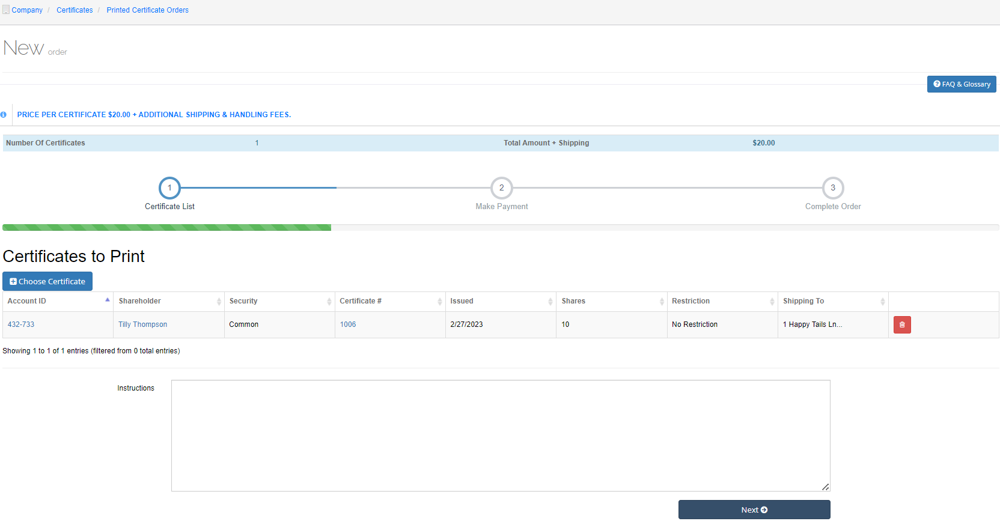
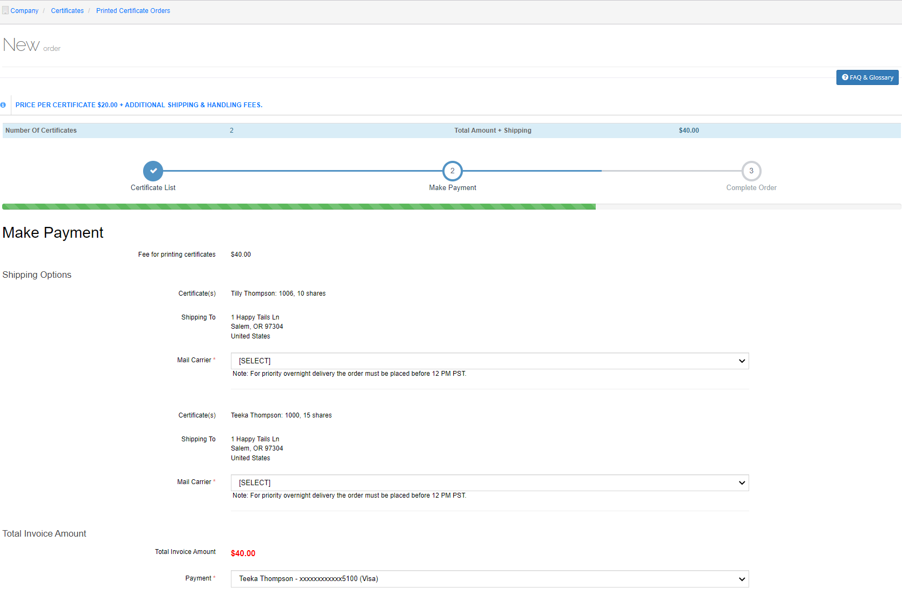

########
Services
########

This option has two additional options:

- :ref:`Proxies`, and
- :ref:`Add a New Proxy`

Proxies
=======

A Proxy allows one person to cast a ballot on behalf of another.

- From the main menu, select **Services > Proxies**.

    |nbsp| The Proxies list screen opens.

   Figure 91. Proxies list screen.

Add a New Proxy
---------------

- You can either select **Add New Proxy** on the Proxies list screen or select **+Add Proxy** from the main menu.

    |nbsp| The Add proxy screen opens and displays Step 1: Select Issuer.

.. figure:: _static/pdf_images/page_80_image_2.png
   :alt: Add proxy screen, Step 1: Select Issuer.

   Figure 92. Add proxy screen, Step 1: Select Issuer.

.. _Step 1: Select Issuer:

Step 1: Select Issuer
---------------------

- Highlight the company from the list and then scroll to the bottom of the screen and select **Continue**.

    |nbsp| The screen displays Step 2: Proxy Detail.

   Figure 93. Add proxy screen, Step 2: Proxy Detail.

Step 2: Proxy Detail
--------------------

1. If you do not want to allow web voting, deselect the **Allow Web Voting** checkbox.
2. Select the type of security from the **Security Type** drop-down list.
3. Enter the quorum percentage in the Quorum % field.

   | The quorum for transaction of a business at a meeting of shareholders of a company is:

   a. the quorum established by the memorandum or articles,
   b. if no quorum is established by the memorandum or articles, two shareholders are entitled to vote at the meeting, whether present in person or by proxy, or
   c. if the number of shareholders entitled to vote at the meeting is less than the quorum applicable to the company under paragraph a or b, all the shareholders are entitled to vote at the meeting whether present or by proxy.

4. Enter the proxy title in the Title field.
5. Click in the Record Date field and select the date from the popup calendar.
6. Click in the Meeting Date field and select the date of the meeting from the popup calendar.