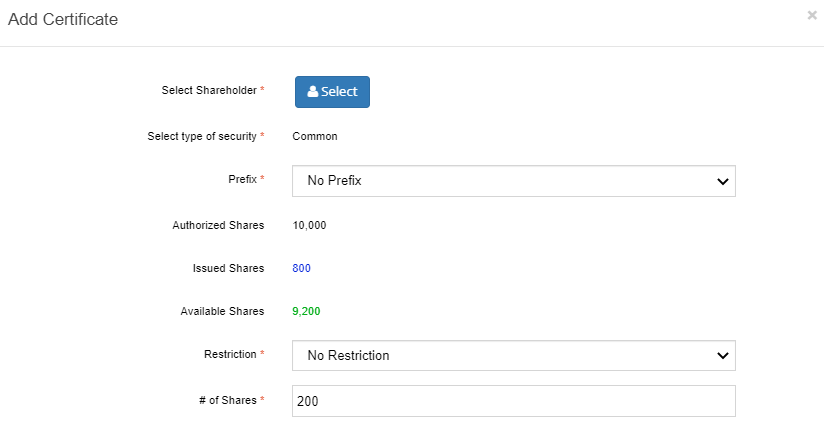
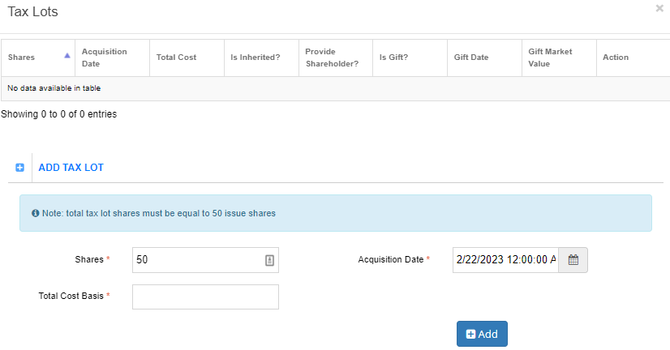

########
Transfer
########

The Transfer option has four additional options:

- Pending
- Canceled
- Rejected
- Completed

Pending
=======

Use this option to view pending transactions, as well as perform and reject transactions.

1. Select Pending from the main menu.

   | The Logged Transaction list opens and displays all pending transactions.

.. figure:: _static/pdf_images/page_46_image_1.png
   :alt: Logged Transaction list.

   Figure 49. Logged Transaction list

2. Click the folder to view the transactions details for a specific transaction type.

   | The Logged Transaction detail screen opens and displays the pending transaction.

Reject a Pending Transaction
----------------------------

1. To reject a pending transaction, select Pending from the main menu.

   | The Logged Transaction list screen opens.

2. Select the pending transaction that you want to reject.

   | The Logged Transaction detail screen opens.

.. figure:: _static/pdf_images/page_47_image_1.png
   :alt: Logged Transaction detail screen.

   Figure 50. Logged Transaction detail screen

3. Scroll down to the bottom of the screen and select Reject Transaction.

   | The Reject Transaction screen opens and displays Step 1: Certificates Posted.

*Figure 51. Reject Transaction screen.*

Step 1: Certificates Posted
---------------------------

1. Tick the Is Medallion Rejected if the rejection is stamp related.
2. If there is more than one certificate listed, deselect the certificates that you do not want to reject from the Reject column.
3. Enter the reason for the rejection in the Note field.
4. Select Next.

   | The screen displays Step 2: Reject Invoice.

Step 2: Reject Invoice
----------------------

1. Click Select in the Billing Account field.

   | The Select Billing Account popup window opens.

2. Highlight the billing account and click Select.

   | The billing account information is listed in the Reject Invoice section.

3. Select Finish.

   | The screen displays Step 3: Complete Summary.

.. figure:: _static/pdf_images/page_49_image_1.png
   :alt: Reject Transaction screen, Step 3: Complete Summary.

   Figure 53. Reject Transaction screen, Step 3: Complete Summary.

Step 3: Complete Summary

1. Select **View Invoice Detail** to view the invoice details.

   | The invoice details are displayed.

2. Select **Generate Invoice Statement** to generate the invoice statement.

   | The invoice statement is generated.

3. Select **Done**.

Rejected
========

Use this option to view rejected transactions.

1. Select **Rejected** from the main menu.

   | The Logged Transaction list opens and displays all rejected transactions.

   Figure 54. Logged Transaction list.

50 Transfer Online Confidential 2023

2. To view the rejected transaction, click the folder in the row that you want to view.

   | The Logged Transaction detail screen opens.

3. To edit the transaction, select **Edit**.

   | The transaction becomes editable.

4. To add a document, select **Add Document**. (See Upload a Document for instructions.)

   | The document upload interface is displayed.

5. To reject a transaction, see Reject a Pending Transaction.

Canceled
========

Use this option to view canceled transactions.

1. Select **Canceled** from the main menu.

   | The Logged Transaction list screen opens and displays all canceled transactions.

Completed
=========

Use this option to view completed transactions.

1. Select **Completed** from the main menu.

   | The Logged Transaction list screen opens and displays all completed transactions.

2. To view a completed transaction, click the folder in row that you want to view.

   | The Logged Transaction detail screen opens and displays the transaction information.

3. To hide the company information, click ˅ to the left of the **Edit** button.

   | The company information is hidden.

4. To unhide the information, click ˄.

   | The company information is displayed again.

   Figure 55. Logged Transaction detail screen.

51 Transfer Online Confidential 2023

Edit a Specific Transaction
---------------------------

1. To edit a specific transaction, click **Edit**.

   | Some fields become editable.

2. Edit the relevant fields and select **Save** to save the updated information.

   | The updated information is saved.

Download Transaction Invoice
----------------------------

To narrow the search criteria, use the drop-down menus located on the right side of the screen.

1. In the Transaction Summary section, select **Invoice**.

   | The invoice download option is provided.

2. Download your invoice. (See Download a Document for instructions.)

   | The invoice is downloaded.

3. To view more transaction summary information, select **View More**.

   | The Lookup > Transaction History option in the main menu opens.

4. To upload a document, select **Add Document** in the Documents section. (See Upload a Document for instructions.)

   | The document upload interface is displayed.

52 Transfer Online Confidential 2023