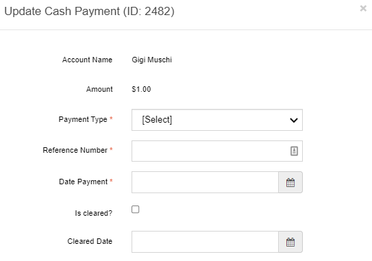

#################
Corporate Actions
#################

This option has three additional options:

- Dividend
- Forward Split
- Reverse Split

Dividend
========

Use this option to view dividend history and perform dividends.

1. Select **Dividend** from the main menu.

   | The Dividend history screen opens and displays the Dividend List.

2. To perform a dividend, select **Perform Dividend**.

   | The Perform new dividend screen opens.

.. figure:: _static/pdf_images/page_52_image_1.png
   :alt: Corporate Actions, Perform new dividend screen.

   Figure 56. Corporate Actions, Perform new dividend screen.

Note: Before you perform this transaction, make sure that you have the authority to undertake this action.

53 Transfer Online Confidential 2023

Step 1: Select Company
----------------------

- Highlight an issuer from the list and then select **Next**.

   | The screen displays Step 2: Select Dividend Details.

.. figure:: _static/pdf_images/page_53_image_1.png
   :alt: Perform new dividend screen, Step 2: Select Dividend Details.

   Figure 57. Perform new dividend screen, Step 2: Select Dividend Details.

Step 2: Select Dividend Details
-------------------------------

1. Select the type of dividend from the Dividend Type drop-down list.

   | The dividend type selection menu is displayed.

2. Select the type of security from the Security Type drop-down list.

   | The security type selection menu is displayed.

3. Select the Record Date from the popup calendar.

   | The Record Date calendar is displayed.

4. Select the Payable Date from the popup calendar.

   | The Payable Date calendar is displayed.

5. Enter how many shares to issue for every (one) share in the For Every 1 Share Issue $ field.

   | The shares to be issued are defined.

6. If a minimum amount is to be awarded to shareholders, tick the **Award minimum amount to Shareholders** checkbox.

   | Additional fields become available if the checkbox is ticked.

.. figure:: _static/pdf_images/page_54_image_1.png
   :alt: Dividend, Step 2: Select Dividend Details, Minimum Amount and Stock to Award sections.

   Figure 58. Dividend, Step 2: Select Dividend Details, Minimum Amount and Stock to Award sections.

7. If applicable, enter the numerical amount that every shareholder will receive in Every Shareholder Receives (numerical amount) field.

   | The specified amount to be awarded to each shareholder is entered.

8. Select the type of security from the Security drop-down list.

   | The security selection menu is displayed.

9. Select the appropriate prefix from the Prefix drop-down list.

   | The prefix selection is made.

10. If applicable, tick the **Retain Restrictions** checkbox.

    | A date field appears if the checkbox is ticked.

11. If applicable, select the restricted date from the Restriction Date/Adjusted Restriction Date popup calendar.

    | The restriction date is selected.

12. If applicable, upload a document in the Transaction Document section. (See Upload a Document for instructions.)

    | The document upload interface is provided.

13. Select **Next**.

    | The screen displays Step 3: Review.

   Figure 59. Perform new dividend, Step 3: Review.

Step 3: Review
--------------

1. Scroll down to the Dividend Transaction Report section and select **Download Dividend Transaction Report** to download the report.

   | The Dividend Transaction Report download option is provided.

2. Open the report that you just saved on your desktop and ensure all information is correct.

   | The report is reviewed for accuracy.

Note: If you find an error, submit a Help Desk request and one of our System Admins will contact you. (See Help Desk for more information.)

3. If the report is accurate, select **Next**.

   | The screen displays Step 4: Billing.'''

.. figure:: _static/pdf_images/page_56_image_1.png
   :alt: Perform new dividend, Step 4: Billing.

   Figure 60. Perform new dividend, Step 4: Billing.

Step 4: Billing
===============

1. If you need to select a different billing account, click **Select Account**.

   | The Select Billing Account popup window opens.

2. Highlight the company and then click **Select**.

   | The fields in the Invoice Line Items section are automatically populated.

3. If applicable, correct any fields in the Invoice Line Items section.

4. If there are any additional charges, tick the **Additional Charges** checkbox.

   | If this field is checked, two additional fields appear.

57 Transfer Online Confidential 2023

5. Enter the reason for the additional charges in the empty field box and then the amount of the fee in the **Amount** field.

6. If there is a discount or an adjustment, tick the **Discount/Adjustment** checkbox.

   | If this field is checked, two additional fields appear.

7. Enter the reason for the discount/adjustment in the empty field box and then the amount of the discount/adjustment in the **Amount** field.

8. Enter any additional comments in the **Comments** field.

9. Select **Finish**.

   | The screen displays Step 5: Complete Summary.

.. figure:: _static/pdf_images/page_57_image_1.png
   :alt: Perform new dividend, Step 5: Complete Summary.

   Figure 61. Perform new dividend, Step 5: Complete Summary.

58 Transfer Online Confidential 2023

Step 5: Complete Summary
========================

1. Validate that the information is correct.

2. Scroll down to the Summary section and download the documents that you want. (see Download a Document for instructions.)

3. Select **Complete**.

   | The Dividend history screen opens and displays the completed transaction.

View Dividend
=============

- To view the dividend history of a company, click the folder in the row that you want to view.

  | The Dividend detail screen opens and displays three or four tabs, depending on what the dividend is.

    The figure below is for a cash dividend.

.. figure:: _static/pdf_images/page_58_image_1.png
   :alt: Dividend detail screen, Information tab.

   Figure 62. Dividend detail screen, Information tab.

59 Transfer Online Confidential 2023

Information tab
---------------

This tab displays the cash dividend and invoice information. (See Figure 62.) The Cash Dividend section is read-only and cannot be edited. You can click the on the section headings to collapse the section from view.

1. To download the invoice, scroll down to the Invoice section and select **Invoice**. (See Download a Document for instructions.)

2. To view more invoice information, select **View More** located next to the Invoice button.

   | If you selected **View More**, the Invoice detail screen opens. For more information on this screen and its sections, see View an Invoice (Billing > Invoices).

Cash Disbursement tab
---------------------

This tab displays the Disbursement, ACH Files, and Wire Files sections.

Disbursement Section
--------------------

The Disbursement section allows you to download the cash disbursement report (Excel format), view account information, update a payment, and void/replace payments.

   Figure 63. Dividend detail screen, Cash Disbursement tab.

Export Excel Report
-------------------

- Select **Export Excel Report** to download the report. (See Download a Document for instructions.)

Update a Payment
----------------

1. To update a payment, select the view icon (green) in the row that you want to update.

   | The Update Cash Payment (ID: #) popup window opens.

.. figure:: _static/pdf_images/page_60_image_1.png
   :alt: Update Cash Payment popup window.

   Figure 64. Update Cash Payment popup window.

2. Select the type of payment from the Payment Type drop-down list.

3. Enter the reference number in the Reference Number field.

4. Click in the Date Payment field and select the date from the popup calendar.

5. If the payment has cleared, tick the **Is cleared** checkbox and select the date that the check cleared from the Cleared Date popup calendar.

6. Select **Save**.

   | The popup window closes, and the account item row displays the information in the Payment Reference, Payment Date, and Status columns.

Void and Replace
----------------

1. Click the void and replace icon (blue) in the row that you want to update.

   | The Replace/Transfer to screen opens.

.. figure:: _static/pdf_images/page_60_image_2.png
   :alt: Replace/Transfer to screen, Void & Replace.

   Figure 65. Replace/Transfer to screen, Void & Replace.

Click **Select Different Account** in the Replacement/Transfer To section.

   | The Select Account/Shareholder popup window opens.

Highlight the account to replace/transfer to from the list and then click **Select**.

   | The popup window closes, and the account selected is added to the Replacement/Transfer To section.

Select **Submit**.

   | The Confirmation popup dialog box opens and asks if you want to continue.

Select **OK**.

   | The Voided and Replacement Details screen displays the transaction, as shown in the figure below.

   Figure 66. Voided and Replacement Details screen, Voided and Replaced By sections.

The Dividend detail screen shows this recent transaction in the original account row. In this example Hallfork Suitemark, Inc. is voided and replaced by Minnie Van Ryder, as shown in the figure below.

.. figure:: _static/pdf_images/page_61_image_2.png
   :alt: Example of Void and Replaced disbursement.

   Figure 67. Example of Void and Replaced disbursement.

Create Group Payment
--------------------

You can group multiple payments into a single payment account.

1. Scroll down to the bottom of the Disbursement section and select **Create Group Payment**.

   | The Group Payment screen opens.

.. _group_payment_procedure:

Group Payment Procedure
-----------------------

   Figure 68. Group Payment screen.

2. Click **Select a Primary Account**.

   | The *Select Account/Shareholder* popup window opens.

3. Select the account/shareholder and click **Select**.

   | The selected account/shareholder name is added in the *Primary Account* section, and the *Choose Pending Payouts* section appears.

.. figure:: _static/pdf_images/page_62_image_2.png
   :alt: Group Payment screen, Choose Pending Payouts section.

   Figure 69. Group Payment screen, Choose Pending Payouts section.

4. Tick the checkbox in the *Selected* column for each account you want to add to the group payment.

5. Scroll to the bottom of the screen and select **Review**.

   | The *Review* section appears with the selected accounts.

.. figure:: _static/pdf_images/page_62_image_3.png
   :alt: Group Payment screen, Review section.

   Figure 70. Group Payment screen, Review section.

6. You can deselect an account by deselecting the checkbox, and/or select **Back** to go back to the *Choose Pending Payouts* list and add more accounts.

7. Select **Submit**.

   | The *Confirmation* popup dialog box appears and asks if you want to continue.

8. Select **Ok**.

   | The *Group Payment Details* screen opens and displays the primary account, summary of payouts, and the voided payouts for this transaction.

ACH Files
---------

The *ACH Files* section displays any bank payments.

- To download an ACH file, click the download icon (in *Action* column) next to the file that you want to download. (See Download a Document for instructions.)

   Figure 71. ACH Files section.

WIRE Files
----------

The *Wire Files* section displays any wire payments.

- To download a wire file, click the download icon (in *Action* column) next to the file that you want to download. (See Download a Document for instructions.)

.. figure:: _static/pdf_images/page_64_image_2.png
   :alt: Wire Files section.

   Figure 72. Wire Files section.

Documents Tab
-------------

This tab allows you to download and view, add, and delete transaction documents.

.. figure:: _static/pdf_images/page_64_image_3.png
   :alt: Dividend Detail screen, Documents tab.

   Figure 73. Dividend Detail screen, Documents tab.

Stock Distribution Tab
----------------------

This tab allows you to view the stock distribution and download the report. It is a read-only tab.

.. figure:: _static/pdf_images/page_65_image_1.png
   :alt: Dividend Detail screen, Stock Distribution tab.

   Figure 74. Dividend Detail screen, Stock Distribution tab.

.. note::

   Click **Export Excel Report** to download the report to your desktop. (See Download a Document for instructions.)

Fractional Share Cash Disbursement Tab
--------------------------------------

This tab displays the cash disbursement list and allows you to export the report, update a payment, and void and replace payments.

.. figure:: _static/pdf_images/page_66_image_1.png
   :alt: Dividend Detail screen, Fractional Share Cash Disbursement tab.

   Figure 75. Dividend Detail screen, Fractional Share Cash Disbursement tab.

Reverse Split
=============

Use this option to reduce the number of available shares without changing a shareholder's equity.

1. Select **Reverse Splits** from the main menu.

   | The *Reverse Stock Split* screen opens.

.. figure:: _static/pdf_images/page_66_image_2.png
   :alt: Corporate Actions, Reverse Stock split screen.

   Figure 76. Corporate Actions, Reverse Stock split screen.

2. To perform a reverse split, select **Perform Reverse Split**.

   | The *Perform New Reverse Split* screen opens and displays *Step 1: Select Company*.

.. figure:: _static/pdf_images/page_67_image_1.png
   :alt: Perform New Reverse Split screen, Step 1: Select Company.

   Figure 77. Perform New Reverse Split screen, Step 1: Select Company.

- Highlight the issuer from the *Select an Issuer* list and then select **Next**.

  | The screen displays *Step 2: Select Split Option*.

.. figure:: _static/pdf_images/page_67_image_2.png
   :alt: Perform New Reverse Split screen, Step 2: Select Split Option.

   Figure 78. Perform New Reverse Split screen, Step 2: Select Split Option.

Select the type of security from the *Security Type* drop-down list, select the cutoff date from the *Cutoff Date* calendar, fill in all required fields, and if applicable, select **Upload Document** and upload any relevant documents. (See Upload a Document for instructions.)

Select **Next**.

  | The screen displays *Step 3: Review*.

.. figure:: _static/pdf_images/page_69_image_1.png
   :alt: Perform new reverse split screen, Step 3: Review.

   Figure 79. Perform new reverse split screen, Step 3: Review.

Step 3: Review
--------------

1. Review the transaction information.

   | If you find an error, submit a Help Desk request, or email us and one of our System Admins will contact you.

2. Select **Download Reverse Stock Split Review** to download the reverse stock split transaction spreadsheet to your desktop.

3. Select **Next**.

   | The screen displays Step 4: Billing.

   Figure 80. Perform new reverse split screen, Step 4: Billing.

Step 4: Billing
---------------

1. To select a different billing account than the one listed, click **Select Account**.

   | The Select Billing Account popup window opens.

2. Select the appropriate billing account and then click **Select**.

   | You can also add a new billing account from the popup window. To add a new account:

   a. From the Select Billing Account popup window, select **Add New Account**.

      | The Add Billing Account popup window opens.

   Figure 81. Add Billing Account popup window.

   b. Fill out all required fields in the Account Information and Contact Information sections.

   c. Select **Save**.

      | The Add Billing Account popup closes, and the new billing account is added to the Billing Account section.

3. Enter the relevant information in the required fields of the Invoice Line Items section.

4. Tick the **Additional Charges** checkbox to add additional charges.

   | The Additional Charges and Amount fields appear.

5. If applicable, enter the reason for the charges in the **Additional Charges** field and the amount of the charge in the **Amount** field.

6. Tick the **Discount/Adjustment** checkbox to add a discount or adjustment.

   | The Discount/Adjustment and Amount fields appear.

7. If applicable, enter the reason for the discount/adjustment in the **Discount/Adjustment** field and the amount of the discount or adjustment in the **Amount** field.

8. Enter any additional information in the **Comments** field.

9. Select **Finish**.

   | The screen displays Step 5: Complete Summary.

.. figure:: _static/pdf_images/page_72_image_1.png
   :alt: Perform new reverse split screen, Step 5: Complete Summary.

   Figure 82. Perform new reverse split screen, Step 5: Complete Summary.

Step 5: Complete Summary
------------------------

1. Verify that the information is correct.

2. Scroll down the screen and select **Download Transaction Invoice** and download the transaction invoice to your desktop. (See Download a Document for instructions.)

3. Select **Download Cost Basis Report** to download the report to your desktop.

4. Select **Complete** to complete this transaction.

Forward Split
=============

Use this option to increase the number of outstanding shares that a company has available.

1. Select **Forward Split** from the main menu.

   | The Forward Stock split screen opens.

   Figure 83. Forward Stock split screen.

2. Select **Perform Forward Split**.

   | The Perform new forward split screen opens and displays Step 1: Select Company.

.. figure:: _static/pdf_images/page_73_image_2.png
   :alt: Perform new forward split screen, Step 1: Select Company.

   Figure 84. Perform new forward split screen, Step 1: Select Company.

Step 1: Select Company
----------------------

- Highlight the issuer from the Select an Issuer list and then select Next.

  | The screen displays Step 2: Select Split Option.

   Figure 85. Perform new forward split screen, Step 2: Select Split Option.

Step 2: Select Split Option
---------------------------

1. Select the type of security from the Security Type drop-down list.

   Note: Other fields may appear based on the type of security selected.

2. Enter information in the additional fields based on the security type.
3. Fill in all required fields.
4. If you do not wish to retain the prefix, deselect the Retain Prefix checkbox.

   | An additional required field appears.

5. To upload any documents, select Upload Document in the Transaction Documents section. (See Upload a Document for instructions.)

6. Select Next.

   | The screen displays Step 3: Review.

75 Transfer Online Confidential 2023

.. figure:: _static/pdf_images/page_75_image_1.png
   :alt: Perform new forward split screen, Step 3: Review.

   Figure 86. Perform new forward split screen, Step 3: Review.

Step 3: Review
--------------

1. Review the transaction information.

   If any information is incorrect, submit a Help Desk request or email us, and we will help you with your issue.

2. Select Download Forward Stock Split Review to download the forward stock split transaction spreadsheet to your desktop. (See Download a Document for instructions.)

3. Select Next.

   | The screen opens and displays Step 4: Billing.

76 Transfer Online Confidential 2023

.. figure:: _static/pdf_images/page_76_image_1.png
   :alt: Perform new forward split screen, Step 4: Billing.

   Figure 87. Perform new forward split screen, Step 4: Billing.

Step 4: Billing
---------------

1. To select a different billing account than the one listed, click Select Account.

   | The Select Billing Account popup window opens.

2. Select the appropriate billing account and then click Select.

   | The billing account is shown in the Name field of the Billing Account section.

   You can also add a new billing account from the popup window. To add a new account, do the following:

   a. From the Select Billing Account popup window, click Add New Account.

      | The Add Billing Account popup window opens.

   b. Fill out all required fields in the Account Information and Contact Information sections.

   c. Select Save.

      | The new billing account is added to the Billing Account section.

3. Fill in all required fields.
4. Tick the Additional Charges checkbox to add additional charges.

   | The Additional Charges and Amount fields appear.

5. If applicable, enter the reason for the charges in the Additional Charges field and the amount of the charge in the Amount field.

6. Tick the Discount/Adjustment checkbox to add a discount or adjustment.

   | The Discount/Adjustment and Amount fields appear.

7. If applicable, enter the reason for the discount/adjustment in the Discount/Adjustment field and the amount of the discount or adjustment in the Amount field.

8. Select Finish.

   | The screen opens and displays Step 5: Complete Summary.

77 Transfer Online Confidential 2023

   Figure 88. Perform new forward split screen, Step 5: Complete Summary.

Step 5: Complete Summary
------------------------

1. Verify that the information is correct.
2. Scroll down to the bottom of the screen and select Download Transaction Invoice and download the transaction invoice information to your desktop. (See Download a Document for instructions.)

3. Select Download Cost Basis Report to download the report to your desktop.
4. Select Complete.

78 Transfer Online Confidential 2023
